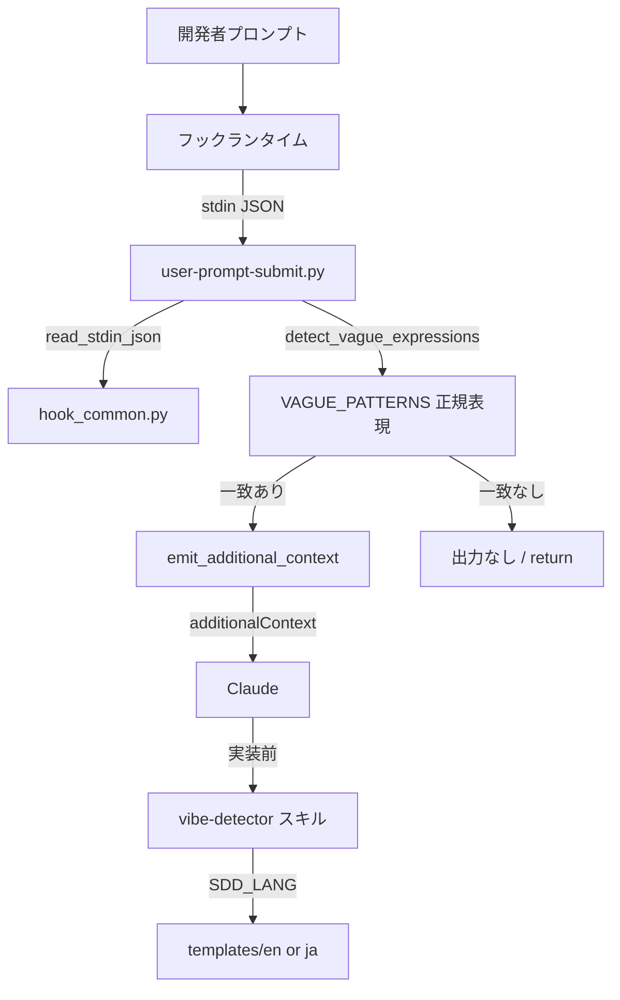

# Vibe Coding 兆候検知

**関連 Spec:** [vibe-detection_spec.md](vibe-detection_spec.md)
**関連 PRD:** [vibe-detection.md](../../requirement/quality-guardrails/vibe-detection.md)（親: [quality-guardrails](../../requirement/quality-guardrails/index.md)）
**準拠する原則:** [CONSTITUTION.md](../../CONSTITUTION.md) A-001（Skills-First）, A-002（フックとスクリプトの責務分離）, B-001, B-002, T-003（日本語出力の文字化け防止）

---

# 1. 実装ステータス

**ステータス:** 🟢 実装済み

本設計書は既存実装（`scripts/user-prompt-submit.py` および `skills/vibe-detector/`）の挙動を逆算して記述した
ものである。定量基準・トリガー方式・判定ロジックは実装コードを真実の源とする。

## 1.1. 実装進捗

| モジュール/機能                    | ステータス | 備考                                                          |
|------------------------------|--------|-------------------------------------------------------------|
| UserPromptSubmit フックスクリプト   | 🟢     | `scripts/user-prompt-submit.py`（8 パターン・日英対応）           |
| フック共通ヘルパー                  | 🟢     | `scripts/hook_common.py`（stdin 解析・additionalContext emit）  |
| フック登録                        | 🟢     | `hooks/hooks.json` の `UserPromptSubmit`                     |
| vibe-detector スキル             | 🟢     | `skills/vibe-detector/SKILL.md`（`user-invocable: false`）     |
| 日英テンプレート                   | 🟢     | `templates/{en,ja}/`（risk_report / assumed_spec ＋ fallback） |
| 回帰テスト                        | 🟢     | リポジトリルート `scripts/test-hook-scripts.sh`（日英検知・明確指示の無介入を検証。CI の `test` ジョブで実行） |

---

# 2. 設計目標

- プロンプト送信時に**軽量・決定的**に曖昧表現を検知し、応答性を阻害しない（NFR-001: 500ms 以内）
- 検知は**非ブロッキング**とし、`additionalContext` によって明確化を促すに留める（FR-003 / DC_001）
- 日英両言語の曖昧表現をパターンで網羅し、`SDD_LANG` による出力言語切り替えに対応する（FR-002 / B-002 / DC_005）
- 機械的検知（フック）と判断・対話（スキル）の**責務を分離**する（A-002）

---

# 3. 実装方式

| 領域     | 採用方式                                          | 選定理由                                                                                     |
|--------|-----------------------------------------------|------------------------------------------------------------------------------------------|
| hook   | Python 3 スクリプト（正規表現マッチング）              | 決定的・軽量な検知であり Claude の推論を要さない。A-002 に従い機械的処理をスクリプトへ委譲し 500ms 要件を満たす |
| hook   | `additionalContext` による非ブロッキング注入          | プロンプトを拒否せず AI へ促しを渡すのに適合（DC_001）。`deny` は使わない                              |
| skill  | Markdown プロンプトスキル（`user-invocable: false`） | 曖昧性の判断・リスク評価・ユーザー対話は Claude の推論が必要。A-001（Skills-First）に従いスキルとして実装 |
| 多言語   | `SDD_LANG` 環境変数 + `templates/{en,ja}/`         | B-002 の一貫性要件。フック検知パターンは日英両方を正規表現に内包し言語判定を不要にする                    |

---

# 4. アーキテクチャ

## 4.1. システム構成図



## 4.2. モジュール分割

| モジュール名                | 責務                                                                    | 依存関係                | 配置場所                                       |
|--------------------------|-----------------------------------------------------------------------|-----------------------|------------------------------------------------|
| user-prompt-submit.py    | プロンプトから曖昧表現を検知し additionalContext を emit（検知のみ・非ブロッキング） | hook_common.py, re    | `plugins/sdd-workflow/scripts/user-prompt-submit.py` |
| hook_common.py           | stdin JSON 解析・additionalContext / deny の JSON 出力共通ヘルパー         | json, sys, os         | `plugins/sdd-workflow/scripts/hook_common.py`   |
| hooks.json               | `UserPromptSubmit` イベントへのスクリプト登録                              | -                     | `plugins/sdd-workflow/hooks/hooks.json`         |
| vibe-detector SKILL.md   | 実装前の曖昧性分析・リスク判定・明確化促進（判断・対話）                       | Read/Glob/Grep/AskUserQuestion | `plugins/sdd-workflow/skills/vibe-detector/SKILL.md` |
| risk_report / assumed_spec テンプレート | リスク検出レポート・推測仕様書の出力フォーマット（日英）             | SDD_LANG              | `plugins/sdd-workflow/skills/vibe-detector/templates/{en,ja}/` |

---

# 5. データ構造

## 5.1. 検知パターン（VAGUE_PATTERNS）

**フック検知パターン**は `(label, regex)` のタプル列で、4 カテゴリ × 日英の計 8 エントリ。`re.IGNORECASE` で照合する。
（vibe-detector スキルはこの 4 カテゴリに加え、仕様欠落・スコープの不明確性も分析対象とする — spec 3.1 参照）

```python
VAGUE_PATTERNS = [
    ("subjective expression", r"いい感じ|よしなに|なんとなく|それっぽく|うまいこと|うまくやって"),
    ("subjective expression", r"\bmake it (nice|work|pretty|look good)\b|\bsomehow\b"),
    ("unclear degree", r"とりあえず動|ざっくり|適当に|少し(速く|良く)|もうちょっと"),
    ("unclear degree", r"\broughly working\b|\ba bit (faster|better)\b"),
    ("ambiguous scope / implicit assumption", r"前と同じ|いつもの|例のやつ|例の(機能|あれ)|さっきの感じ"),
    ("ambiguous scope / implicit assumption", r"\bsame as (before|last time)\b|\bas usual\b|\bthe usual\b"),
    ("ambiguous priority", r"できれば|ついでに|時間があれば|余裕があれば"),
    ("ambiguous priority", r"\bif possible\b|\bwhile you're at it\b|\bwhen you have time\b"),
]
```

| ラベル                                    | 対応 spec 用語     | 対応 spec FR | 対応 PRD    |
|-----------------------------------------|------------------|------------|-----------|
| subjective expression                   | 主観的表現         | FR-002     | FR_001_01 |
| unclear degree                          | 程度の不明確さ      | FR-002     | FR_001_01 |
| ambiguous scope / implicit assumption   | スコープ／暗黙の前提 | FR-002     | FR_001_01 |
| ambiguous priority                      | 優先度の曖昧さ      | FR-002     | FR_001_01 |

## 5.2. additionalContext 出力（emit_additional_context）

```json
{
  "hookSpecificOutput": {
    "hookEventName": "UserPromptSubmit",
    "additionalContext": "[AI-SDD] Potential Vibe Coding signals detected in the user prompt:\n- <label>: \"<matched>\"\nBefore implementing, follow the vibe-detector skill flow: assess the risk level, clarify ambiguous points with the user (or via the clarify skill), and check existing specifications under the SDD specification directory."
  }
}
```

`json.dumps(..., ensure_ascii=False)` で出力し、日本語を含む一致文字列を UTF-8 のまま保持する（T-003）。

## 5.3. リスク評価基準（vibe-detector スキル）

| レベル      | 条件                          | 対応                                      |
|-----------|-----------------------------|-------------------------------------------|
| 🔴 高      | 仕様書なし + 曖昧な指示          | 実装前に仕様書作成を必須とする                 |
| 🟡 中      | 仕様書あり + 一部曖昧          | 実装前に曖昧点を明確化                        |
| 🟢 低      | 仕様書あり + 明確な要求         | 実装開始可能                                |

---

# 6. ファイル構成

```
plugins/sdd-workflow/
├── scripts/
│   ├── user-prompt-submit.py     # UserPromptSubmit フック本体（検知ロジック）
│   └── hook_common.py            # stdin 解析・additionalContext emit 共通ヘルパー
├── hooks/
│   └── hooks.json                # UserPromptSubmit へフックを登録
└── skills/vibe-detector/
    ├── SKILL.md                  # 自動実行スキル（user-invocable: false）
    ├── references/               # detection_response_flow / prerequisites_directory_paths
    └── templates/{en,ja}/        # risk_report(.fallback) / assumed_spec(.fallback)
```

本機能はプラグインルートの `hooks.json` にフックが登録済みであり、スキルは `plugin.json` の
`hooks` フィールド経由で解決される（新規スキル追加ではないため plugin.json 変更は不要 / T-002）。

なお回帰テスト `scripts/test-hook-scripts.sh` は上記ツリー外の**リポジトリルート直下 `scripts/`** に配置され、
CI（`.github/workflows/ci.yml` の `test` ジョブ）から実行される。本設計書中の `scripts/` は文脈により
プラグイン配下（`plugins/sdd-workflow/scripts/`：フック本体）とリポジトリルート（テスト系）の 2 種を指すため注意する。

---

# 7. 非機能要件実現方針

| 要件                                | 実現方針                                                                                  |
|-----------------------------------|-----------------------------------------------------------------------------------------|
| NFR-001（500ms 以内）               | 外部プロセス・ネットワーク・LLM 呼び出しを行わず、標準ライブラリ（`re` / `json`）のみで同期処理する |
| NFR-002（クロスプラットフォーム・多言語） | POSIX 準拠の Python 3。検知は日英パターンを正規表現に内包し OS・ロケール非依存                    |
| NFR-003（フックイベント仕様準拠）      | `hookSpecificOutput.additionalContext` 形式で emit。`deny` は使わず exit code 0 で正常終了     |

---

# 8. テスト戦略

| テストレベル       | 対象                                          | カバレッジ目標                                          |
|----------------|---------------------------------------------|------------------------------------------------------|
| 回帰テスト（hook） | リポジトリルート `scripts/test-hook-scripts.sh`   | 日本語曖昧表現の検知・英語曖昧表現の検知・明確指示での無介入の 3 ケース |
| CI 検証          | `.github/workflows/ci.yml` の `test` ジョブ     | フックスクリプト回帰テストが CI で実行される                    |
| 手動検証         | デモンストレーション                              | プロンプト応答の体感遅延がない水準（NFR-001）                 |

---

# 9. 設計判断

## 9.1. 決定事項

| 決定事項           | 選択肢                              | 決定内容                        | 理由                                                                 |
|-----------------|-----------------------------------|-------------------------------|--------------------------------------------------------------------|
| 検知の実装層        | フック（Python） / スキル（LLM）       | 機械的検知はフック、判断はスキルに分離 | A-002。決定的検知を LLM に委ねるとトークン浪費・応答遅延を招く                 |
| ブロッキング可否     | deny でブロック / 非ブロッキング注入     | 非ブロッキング（additionalContext） | DC_001。プロンプト拒否は開発フローを阻害し B-001 の趣旨（明確化促進）を超える      |
| 言語判定方式        | 入力言語を判定して切替 / 日英パターン内包 | 日英を同一パターン集合に内包         | 言語判定コストを排し 500ms 要件を満たす。取りこぼしより誤検知許容の設計          |
| 検知なし時の挙動     | 常に何か出力 / 無出力                  | 一致なしは return し無出力          | FR-005。ノイズを避け明確な指示の開発フローに一切介入しない                     |
| 出力エンコーディング  | `ensure_ascii=True` / `False`      | `ensure_ascii=False`（UTF-8）    | T-003。日本語の一致文字列を additionalContext に文字化けなく含める             |

## 9.2. 未解決の課題

| 課題                             | 影響度 | 対応方針                                              |
|--------------------------------|-----|-----------------------------------------------------|
| パターンベース検知の取りこぼし・誤検知   | 中   | 意味論的解析はスコープ外。パターン拡充は将来の別 Issue で検討     |
| 曖昧表現辞書の日英以外への拡張         | 低   | 現状 EN/JA のみ対応（B-002 の対象言語）。他言語対応は将来検討     |

---

# 10. 原則準拠チェックリスト

| 原則ID  | 原則名                       | 準拠状況 | 備考                                                        |
|-------|-----------------------------|--------|-----------------------------------------------------------|
| A-001 | Skills-First                 | ✅     | 曖昧性分析は `skills/vibe-detector/` として実装（legacy commands 不使用） |
| A-002 | フックとスクリプトの責務分離       | ✅     | 機械的検知は Python フック、判断・対話はスキルに分離                    |
| B-001 | Vibe Coding 防止              | ✅     | 曖昧指示を実装前に検知し明確化を促す                                |
| B-002 | 多言語対応（EN/JA）の一貫性       | ✅     | 検知パターン日英内包・`SDD_LANG` によるテンプレート切替                |
| D-001 | Specification-Driven          | ✅     | 検知時に既存仕様確認・仕様書作成フローへ誘導                          |
| T-003 | 日本語出力の文字化け防止          | ✅     | `ensure_ascii=False` で日本語一致文字列を保持                     |
