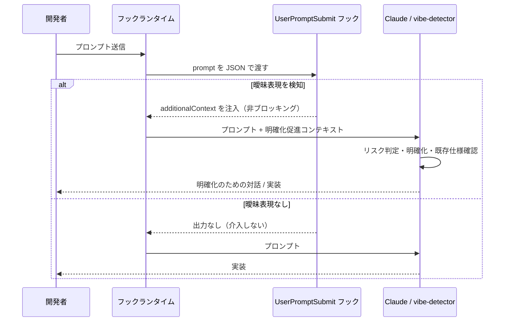

# Vibe Coding 兆候検知

**関連 Design Doc:** [vibe-detection_design.md](vibe-detection_design.md)
**関連 PRD:** [vibe-detection.md](../../requirement/quality-guardrails/vibe-detection.md)（親: [quality-guardrails](../../requirement/quality-guardrails/index.md)）
**準拠する原則:** [CONSTITUTION.md](../../CONSTITUTION.md) B-001（Vibe Coding 防止）, B-002（多言語対応の一貫性）, D-001（Specification-Driven）

---

# 1. 背景 `<MUST>`

AI 駆動開発では、ユーザーの曖昧な指示（「いい感じに」「よしなに」「somehow」等）により、AI が未定義の要求を
推測して実装してしまう **Vibe Coding 問題**が発生する。これは仕様と実装の乖離・技術的負債・設計判断の不透明化を
招き、[CONSTITUTION.md](../../CONSTITUTION.md) の最上位原則 B-001（Vibe Coding 防止）に真っ向から反する。

本機能は、開発ワークフローの最も早いタイミング（プロンプト送信時）に自動的な検知点を設け、AI が実装に着手する
前に曖昧性を可視化し、明確化のための対話を促す。品質保証を開発者の記憶や注意力に依存させず、構造的に強制する
ことを狙いとする。

# 2. 概要 `<MUST>`

本機能は、ユーザープロンプトに含まれる曖昧表現を検知し、明確化を促すコンテキストを注入する。主要な設計原則は
以下のとおり。

- **早期検知**: プロンプト送信イベントで即座に曖昧表現パターンを検知する（実装着手前）
- **非ブロッキング**: プロンプト自体は拒否せず、明確化を促す情報を AI のコンテキストに追加するに留める
  （親 PRD の DC_001「ブロッキングの最小化」に準拠）
- **日英両対応**: 日本語・英語の双方の曖昧表現をカバーする（親 PRD の DC_004・原則 B-002 に準拠）
- **二段構え**: プロンプト送信時のフックによる兆候検知（機械的・軽量）と、実装前の自動実行スキルによる
  曖昧性分析（判断・対話）の 2 層で構成する

「何を検知し、どう促すか」を定義し、正規表現パターンの具体や実行方式の詳細は
[vibe-detection_design.md](vibe-detection_design.md) に委ねる。

# 3. 要求定義 `<RECOMMENDED>`

## 3.1. 機能要件 (Functional Requirements)

| ID     | 要件                                                                     | 優先度 | 根拠（上流要求）                                          |
|--------|------------------------------------------------------------------------|-----|-----------------------------------------------------|
| FR-001 | プロンプト中の曖昧表現を検知し、明確化を促すコンテキストを注入する                 | 必須  | 子 PRD FR_001 / 親 PRD UR_002・FR_001              |
| FR-002 | 日本語・英語の曖昧表現パターンを検知する                                       | 必須  | 子 PRD FR_001_01 / 親 PRD DC_004                    |
| FR-003 | プロンプトをブロックせず、非ブロッキングで明確化促進コンテキストを注入する           | 必須  | 子 PRD FR_001_02 / 親 PRD DC_001                    |
| FR-004 | 実装前に指示の曖昧性を分析し明確化を促す（ユーザー呼び出し不可の自動実行スキル）      | 必須  | 子 PRD FR_001_03                                    |
| FR-005 | 曖昧表現を検知しない場合は何も出力せず、開発フローに介入しない                     | 必須  | 親 PRD DC_001（ブロッキングの最小化）から派生            |

曖昧表現のカテゴリは、主観的表現・程度の不明確さ・スコープ／暗黙の前提の曖昧さ・優先度の曖昧さの 4 分類とする
（各分類の具体例は「5. 用語集」および Design Doc を参照）。この 4 分類はフック（FR-002）によるパターン検知の対象であり、
実装前分析スキル（FR-004）はこれに加えて仕様欠落（要件・入出力・境界条件の未定義）やスコープの不明確性
（対象・影響範囲・完了基準の欠落）も分析対象とする。

## 3.2. 非機能要件 (Non-Functional Requirements)

| ID      | カテゴリ         | 要件                                                       | 目標値                                     |
|---------|--------------|----------------------------------------------------------|--------------------------------------------|
| NFR-001 | 性能           | フック処理は軽量でプロンプト応答性を阻害しない                     | スクリプト単体の実行時間 500ms 以内（親 PRD NFR_001） |
| NFR-002 | 互換性         | macOS / Linux で動作し、日英の言語設定に対応する                  | 親 PRD DC_004                              |
| NFR-003 | インターフェース | Claude Code フックイベント仕様・additionalContext 仕様に準拠する | 親 PRD IR_001                              |

NFR-003 について、本機能は JSON Decision Control 仕様に準拠しつつ、非ブロッキング方針（DC_001）のため
`deny` は用いず `additionalContext` のみを注入する。

# 4. 提供コンポーネント `<MUST>`

| 種別     | 配置場所                                             | 名前                    | 概要                                                                       |
|--------|--------------------------------------------------|-----------------------|--------------------------------------------------------------------------|
| hook   | `scripts/user-prompt-submit.py` + `hooks/hooks.json` | UserPromptSubmit フック | プロンプト送信時に曖昧表現パターンを検知し、明確化を促す `additionalContext` を注入する（FR-001/002/003/005） |
| skill  | `skills/vibe-detector/SKILL.md`                  | vibe-detector         | 実装前に指示の曖昧性を分析しリスクレベルを判定・明確化を促す自動実行スキル（ユーザーが直接呼び出せない）（FR-004） |

## 4.1. 入出力定義 `<OPTIONAL>`

### UserPromptSubmit フック

**入力**: フックランタイムから stdin 経由で渡される JSON。少なくとも `prompt`（ユーザー入力文字列）を含む。

**出力**: 曖昧表現を検知した場合のみ、`additionalContext` を含む JSON を標準出力に emit する。検知しない場合は
何も出力しない（FR-005）。注入するコンテキストは、検知した曖昧箇所の列挙に加え、リスク判定・明確化・既存仕様確認という
vibe-detector フローへの誘導文を含む。

```json
{
  "hookSpecificOutput": {
    "hookEventName": "UserPromptSubmit",
    "additionalContext": "[AI-SDD] Potential Vibe Coding signals detected ..."
  }
}
```

### vibe-detector スキル

**入力**: フック経由で自動起動され、ユーザー入力テキストと（存在すれば）既存仕様を分析対象とする。

**出力**: リスクレベル（🔴 高 / 🟡 中 / 🟢 低）と明確化項目を含むリスク検出レポート。出力言語は `SDD_LANG` に従う。

# 5. 用語集 `<OPTIONAL>`

| 用語                | 説明                                                                                  |
|-------------------|-------------------------------------------------------------------------------------|
| Vibe Coding       | 曖昧な指示により AI が仕様を暗黙的に推測して実装してしまう問題（CONSTITUTION.md B-001 の定義に従う） |
| 主観的表現           | 「いい感じ」「よしなに」「make it nice」「somehow」等、評価基準が主観に依存する表現            |
| 程度の不明確さ        | 「ざっくり」「もうちょっと」「a bit faster」等、目標値・程度が定量化されていない表現            |
| スコープ／暗黙の前提    | 「前と同じ」「例のやつ」「same as before」「as usual」等、参照対象が暗黙化された表現           |
| 優先度の曖昧さ        | 「できれば」「ついでに」「if possible」「when you have time」等、実施の要否が曖昧な表現       |
| additionalContext | フックが AI のコンテキストに追加情報を注入する Claude Code の仕組み                          |
| 非ブロッキング        | プロンプトやツール実行を拒否せず、警告・促しに留める動作                                       |
| 自動実行スキル        | ユーザーが直接呼び出せず（`user-invocable: false`）、特定条件で AI が自動実行するスキル        |

# 6. 使用例 `<RECOMMENDED>`

vibe-detector スキルは `user-invocable: false` のため直接呼び出せない。以下はフック連携時に想定される動作。

```
# 曖昧表現を含むプロンプト → フックが検知し明確化を促す
User: いい感じに直して
  → [AI-SDD] Potential Vibe Coding signals detected in the user prompt:
    - subjective expression: "いい感じ"
    （AI は vibe-detector フローに従い、リスク判定・明確化・既存仕様確認を行う）

# 明確な指示 → フックは何も出力せず、そのまま実装に進む
User: Add a --verbose flag to session-start.py that logs config values
  → （出力なし）
```

# 7. 振る舞い図 `<OPTIONAL>`



# 8. 制約事項 `<OPTIONAL>`

- 曖昧性検知はパターンマッチングベースであり、意味論的な曖昧性の完全検知は保証しない（パターンベース検知の
  高度化は将来検討・スコープ外）
- 検知・促しまでを責務とし、曖昧性の自動解消や実装のブロックは行わない（最終判断はユーザーに委ねる）
- ファイル編集時のガード・ドキュメント整合性チェックは本機能のスコープ外（親 PRD の他の子 PRD で扱う）

# 9. 原則との整合性 `<RECOMMENDED>`

| 原則ID  | 原則名                    | 本仕様への適用内容                                                              |
|-------|--------------------------|------------------------------------------------------------------------|
| B-001 | Vibe Coding 防止          | 曖昧指示を実装前に検知し明確化を促すことで、暗黙的な要求推測を排除する（本機能の存在意義）    |
| B-002 | 多言語対応（EN/JA）の一貫性 | 検知パターン・出力メッセージを日英両言語に対応させ、`SDD_LANG` に応じて切り替える       |
| D-001 | Specification-Driven      | 曖昧指示検知時に既存仕様の確認・仕様書作成を促し、仕様書を真実の源とするフローへ誘導する    |

---

# PRD 整合性レビュー結果

| 確認項目             | 結果                                                                     |
|--------------------|--------------------------------------------------------------------------|
| 要求カバレッジ        | 子 PRD FR_001・FR_001_01〜03 をすべて FR-001〜FR-004 でカバー（FR-005 は親 PRD DC_001 から派生した spec 固有要求） |
| 要求 ID 参照         | 各 FR に対応する子 PRD / 親 PRD の要求 ID を「根拠」列に明記                  |
| 非機能要求の反映      | 親 PRD NFR_001・IR_001・DC_001・DC_004 を NFR-001〜003 および制約事項に反映   |
| 用語整合性           | 親 PRD 用語集の「Vibe Coding」「additionalContext」「自動実行スキル」定義に統一 |
