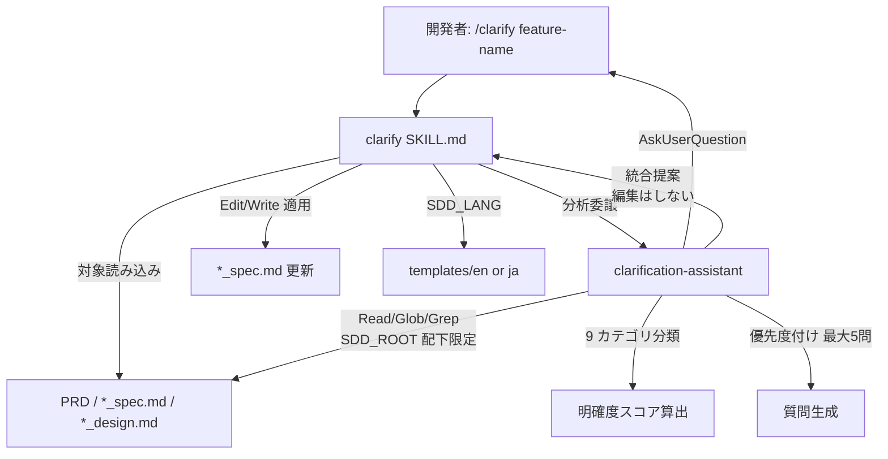

# 仕様明確化

**関連 Spec:** [clarify_spec.md](clarify_spec.md)
**関連 PRD:** [clarify.md](../../requirement/spec-design/clarify.md)（親: [spec-design](../../requirement/spec-design/index.md)）
**準拠する原則:** [CONSTITUTION.md](../../CONSTITUTION.md) A-001（Skills-First）, A-002（フックとスクリプトの責務分離）, B-001, B-002, D-001, T-002（plugin.json 登録）

---

# 1. 実装ステータス `<MUST>`

**ステータス:** 🟢 実装済み

本設計書は既存実装（`skills/clarify/` および `agents/clarification-assistant.md`）の挙動を逆算して記述したものである。
9 カテゴリ・明確度スコア算出方式・質問生成の上限・停止条件・責務分担は実装（Markdown プロンプト）を真実の源とする。

## 1.1. 実装進捗 `<OPTIONAL>`

| モジュール/機能                       | ステータス | 備考                                                                  |
|---------------------------------|--------|---------------------------------------------------------------------|
| clarify スキル                     | 🟢     | `skills/clarify/SKILL.md`（`user-invocable: true`、Bash 禁止）           |
| clarification-assistant エージェント | 🟢     | `agents/clarification-assistant.md`（`model: sonnet`、Task 不使用）      |
| 分析ロジック参照資料                   | 🟢     | `skills/clarify/references/`（9 カテゴリ・対象読み込み・検証コマンド等）        |
| 出力テンプレート                     | 🟢     | `skills/clarify/templates/{en,ja}/clarification_output.md`             |
| plugin.json 登録                   | 🟢     | `skills` はディレクトリ参照 `./skills` で自動登録、`agents` 配列に clarification-assistant を明示登録済み（T-002） |

---

# 2. 設計目標 `<MUST>`

- 対象仕様を 9 カテゴリで**網羅的**に分析し、曖昧点を漏れなく検出する（FR-001）
- 影響度・リスク・ブロッカー性の基準で質問を**最大 5 問に絞り**、ユーザー負担を抑える（FR-002 / NFR-003）
- 明確度を**定量スコア化**し、80% を実装可否判定の閾値とする（FR-003 / NFR-001）
- 分析・提案（判断）と仕様書編集（適用）の**責務を分離**し、エージェントは読み取り専用に保つ（A-002）
- 日英両言語のテンプレートで出力言語を `SDD_LANG` に従い切り替える（FR-002 / B-002 / NFR-002）

---

# 3. 実装方式 `<MUST>`

| 領域    | 採用方式                                                       | 選定理由                                                                                      |
|-------|------------------------------------------------------------|-----------------------------------------------------------------------------------------|
| skill | Markdown プロンプトスキル（`user-invocable: true`、`disallowed-tools: Bash`） | 分析・質問生成・回答統合は Claude の判断を要する。A-001（Skills-First）に従いスキルとして実装。決定的なコマンド実行は不要のため Bash を禁止 |
| agent | Markdown プロンプトエージェント（`allowed-tools: Read/Glob/Grep/AskUserQuestion`、Task 不使用） | コンテキスト独立な分析に特化。Task による再帰探索はコンテキスト爆発を招くため不使用とし、Read/Glob/Grep で必要ファイルのみ効率的に読む |
| 責務分離 | エージェントは統合**提案**まで、実際の編集はスキル（Edit/Write）が適用           | A-002。読み取り専用エージェントと編集権限を持つメインエージェントを分離し、意図しない書き込みを防ぐ                            |
| 多言語   | `SDD_LANG` 環境変数 + `templates/{en,ja}/`                       | B-002 の一貫性要件。出力言語をテンプレートで切り替える                                                    |

---

# 4. アーキテクチャ `<MUST>`

## 4.1. システム構成図



## 4.2. モジュール分割

| モジュール名                        | 責務                                                                       | 依存関係                        | 配置場所                                              |
|----------------------------------|--------------------------------------------------------------------------|-------------------------------|---------------------------------------------------|
| clarify SKILL.md                 | 対象仕様の読み込み・分析委譲・質問提示・回答統合の適用（Edit/Write）・レポート出力       | clarification-assistant, SDD_LANG | `plugins/sdd-workflow/skills/clarify/SKILL.md`      |
| clarification-assistant.md       | 9 カテゴリ分析・明確度評価・スコア算出・質問生成・統合提案の出力（読み取り専用）             | Read/Glob/Grep/AskUserQuestion | `plugins/sdd-workflow/agents/clarification-assistant.md` |
| references/                      | 9 カテゴリ定義・対象読み込みパス・検証コマンド・補完コマンドの分析ロジック参照資料            | -                             | `plugins/sdd-workflow/skills/clarify/references/`   |
| clarification_output テンプレート    | 明確化レポートの出力フォーマット（明確度スコア表・質問リスト・統合先）（日英）                | SDD_LANG                      | `plugins/sdd-workflow/skills/clarify/templates/{en,ja}/` |

---

# 5. データ構造 `<OPTIONAL>`

## 5.1. 9 カテゴリと明確度分類

分析は以下の 9 カテゴリで行い、各項目を 3 段階に分類する。

カテゴリ名は括弧内に実装（`clarification-assistant.md` / `nine_category_analysis.md`）の原語（英語名）を併記する。

| # | カテゴリ                          | 分析観点                              |
|---|-------------------------------|-------------------------------------|
| 1 | 機能範囲（Functional Scope）        | スコープの内外境界・エッジケースの網羅         |
| 2 | データモデル（Data Model）           | 型定義・必須項目・制約・データ有効期間           |
| 3 | フロー／振る舞い（Flow & Behavior）     | 状態遷移・エラーハンドリング・リトライ戦略        |
| 4 | 非機能要件（Non-Functional Requirements） | 性能目標・スケーラビリティ・セキュリティ         |
| 5 | 統合（Integrations）              | 外部システム連携・API 契約・依存関係           |
| 6 | エッジケース（Edge Cases）           | 例外処理・境界値・データ欠損時の挙動            |
| 7 | 制約（Constraints）               | 技術的制約・ビジネス制約・規制要件             |
| 8 | 用語（Terminology）               | ドメイン固有語の定義・略語・曖昧表現            |
| 9 | 完了基準（Completion Signals）      | 受け入れ基準・テストシナリオ・成功の定義         |

| 分類          | 判定基準                                | アクション          |
|-------------|-------------------------------------|----------------|
| 🟢 Clear    | 明示的な例まで含めて完全に定義されている         | なし             |
| 🟡 Partial  | 概念は存在するが詳細が欠けている              | 質問を生成         |
| 🔴 Missing  | 記載がない、または曖昧で未定義                | 質問生成を優先      |

## 5.2. 明確度スコア算出

明確度スコアは「Clear 項目数 ÷ 全項目数」を基本式とし、カテゴリ別・総合で算出する
（`references/clarification_workflow.md`：`Total score = Clear items / All items`）。
出力テンプレートではカテゴリ別に Clear/Partial/Missing の件数と総合スコアを表形式で提示する。

```
明確度スコア（総合） = Clear 項目数 / 全項目数
```

| スコア範囲       | 評価           | アクション                                    |
|-------------|--------------|------------------------------------------|
| 80% 以上      | Good         | 実装開始可能（implementation-ready）           |
| 60–79%      | Fair         | 実装前に追加質問へ回答（Partial 項目の解消を推奨）    |
| 40–59%      | Insufficient | 大幅な仕様修正が必要                            |
| 40% 未満      | Critical     | 実装を開始せず、仕様をゼロから再構築                 |

## 5.3. 質問生成フォーマット

質問は影響度・頻度・リスクを基準に最大 5 問へ絞り、以下の構造で生成する。yes/no 質問や実装詳細（設計フェーズの領域）は避ける。

```markdown
### Q{n}: {Category} - {Question Title}

**Context**: {なぜ重要か}
**Question**: {ユーザーの意思決定を促す具体的な質問}
**Examples to Consider**:
- Option A: {例}
- Option B: {例}
**Current Specification State**: Clear / Partial / Missing
```

## 5.4. 回答の統合先マッピング

エージェントが出力する統合提案は、回答種別ごとに以下のセクションを対象とする（適用はスキルが行う）。
セクション名は実装（`agents/clarification-assistant.md`）の英語名を基準とし、日本語出力時（`SDD_LANG=ja`）は対応する日本語セクションへマッピングする。

| 回答種別        | 統合先セクション（実装準拠）                          |
|--------------|-----------------------------------------------|
| データモデル関連   | `## Data Model`（日本語出力時: `## データモデル`）     |
| フロー関連       | `## Behavior`（日本語出力時: `## 振る舞い`）          |
| 非機能要件       | `## Non-Functional Requirements`（新規追加。日本語出力時: `## 非機能要件`） |
| 用語定義        | `## Glossary`（日本語出力時: `## 用語集`）           |
| エラーハンドリング | `## Error Handling`（日本語出力時: `## エラーハンドリング`） |
| 制約           | `## Constraints`（日本語出力時: `## 制約`）         |

---

# 6. ファイル構成 `<OPTIONAL>`

```
plugins/sdd-workflow/
├── skills/clarify/
│   ├── SKILL.md                        # ユーザー呼び出しスキル本体（統括・回答統合）
│   ├── references/                     # nine_category_analysis / target_specification_loading /
│   │                                   #   command_examples / verification_commands / complementary_commands
│   └── templates/{en,ja}/
│       └── clarification_output.md     # 明確化レポート出力フォーマット
├── agents/
│   ├── clarification-assistant.md      # 分析エージェント（読み取り専用・統合提案）
│   ├── references/clarification_workflow.md   # 分析→回答→再評価のワークフロー
│   └── examples/                       # clarification_assistant_usage / clarification_questions
└── .claude-plugin/plugin.json          # skills は "./skills" 参照で自動登録、agents 配列に clarification-assistant を明示登録（T-002）
```

clarify スキルと clarification-assistant エージェントはいずれも実装・登録済みであり、本設計書は逆算文書である。
新規追加ではないため plugin.json の変更は発生しない（既存登録の維持を確認する）。

---

# 7. 非機能要件実現方針 `<OPTIONAL>`

| 要件                          | 実現方針                                                                          |
|-----------------------------|-------------------------------------------------------------------------------|
| NFR-001（明確度 80% 判定）       | 9 カテゴリの Clear/Partial/Missing 集計から総合スコアを算出し、80% を実装可否の閾値とする      |
| NFR-002（多言語・言語一貫性）      | `SDD_LANG` に応じ `templates/{en,ja}/` を切り替え。日英で同等構成のテンプレートを維持（B-002） |
| NFR-003（最大 5 問）           | 停止条件と質問選定基準（影響度・リスク・ブロッカー）で 1 回の提示を 5 問以内に制限                  |

---

# 8. テスト戦略 `<OPTIONAL>`

| テストレベル     | 対象                                       | カバレッジ目標                                              |
|--------------|------------------------------------------|--------------------------------------------------------|
| 構文検証        | `skills/clarify/`・`agents/clarification-assistant.md` | plugin-lint（プロンプト Markdown 構文・命名規則）が通ること           |
| 手動検証        | デモンストレーション                            | 9 カテゴリ分析・スコア算出・質問生成・回答統合が一連で機能すること（FR-001〜004） |
| 整合性確認      | 統合後の `*_spec.md`                          | `/check-spec {feature-name} --full` で更新後仕様の整合性を確認     |

---

# 9. 設計判断 `<MUST>`

## 9.1. 決定事項

| 決定事項              | 選択肢                                | 決定内容                              | 理由                                                                 |
|--------------------|-------------------------------------|-------------------------------------|--------------------------------------------------------------------|
| 分析の実装層          | スキル単体 / スキル + 分析エージェント        | スキル + clarification-assistant エージェント | 分析をコンテキスト独立なエージェントへ委譲し、メインのコンテキストを節約する           |
| エージェントのツール権限  | Task 含む / 読み取り系のみ                | Read/Glob/Grep/AskUserQuestion（Task 不使用） | Task による再帰探索はコンテキスト爆発リスク。決定的な分析には不要                   |
| 編集の責務            | エージェントが直接編集 / スキルが適用          | エージェントは提案のみ、スキルが Edit/Write を適用 | A-002。読み取り専用エージェントと編集権限を分離し、意図しない書き込みを防ぐ            |
| 実装可否の閾値        | 固定 80% / 可変                        | 80% を implementation-ready の閾値      | 親 PRD NFR_001・B-001。基準未満は追加明確化を推奨し Vibe Coding を防ぐ         |
| 質問数の上限          | 無制限 / 最大 5 問                      | 1 回の提示を最大 5 問に制限                | ユーザーの回答負担を抑え、高影響度の質問に集中させる（NFR-003）                     |
| 探索スコープ          | プロジェクト全体 / SDD_ROOT 配下限定         | `SDD_ROOT`（既定 `.sdd/`）配下に限定       | 対象外ファイルの走査によるノイズ・コンテキスト浪費を防ぐ                            |

## 9.2. 未解決の課題 `<OPTIONAL>`

| 課題                                | 影響度 | 対応方針                                                    |
|-----------------------------------|-----|-----------------------------------------------------------|
| 明確度スコアの重み付け（Partial の扱い）の統一 | 中   | 基本式は Clear/全項目。Partial の重み付けは出力例に依存があり将来明文化を検討 |
| 分析品質の基盤モデル依存              | 中   | プロンプト・9 カテゴリ定義を精緻化。意味論的分析の限界はスコープ外           |

---

# 10. 原則準拠チェックリスト `<RECOMMENDED>`

| 原則ID  | 原則名                       | 準拠状況 | 備考                                                            |
|-------|-----------------------------|--------|---------------------------------------------------------------|
| A-001 | Skills-First                 | ✅     | `skills/clarify/` として実装（legacy commands 不使用）              |
| A-002 | フックとスクリプトの責務分離       | ✅     | 分析・提案はエージェント、編集適用はスキルに分離                          |
| B-001 | Vibe Coding 防止              | ✅     | 実装前に曖昧点を洗い出し、基準未満では実装を推奨しない                     |
| B-002 | 多言語対応（EN/JA）の一貫性       | ✅     | `templates/{en,ja}/` と `SDD_LANG` による出力言語切り替え              |
| D-001 | Specification-Driven          | ✅     | 仕様書を真実の源とし、回答統合で明確度を高めるフローへ誘導                  |
| T-002 | plugin.json 登録の徹底         | ✅     | clarify スキル・clarification-assistant エージェントとも登録済み          |
| T-003 | 日本語出力の文字化け防止          | ✅     | 日本語テンプレート・本設計書に U+FFFD / mojibake を含めない                |
