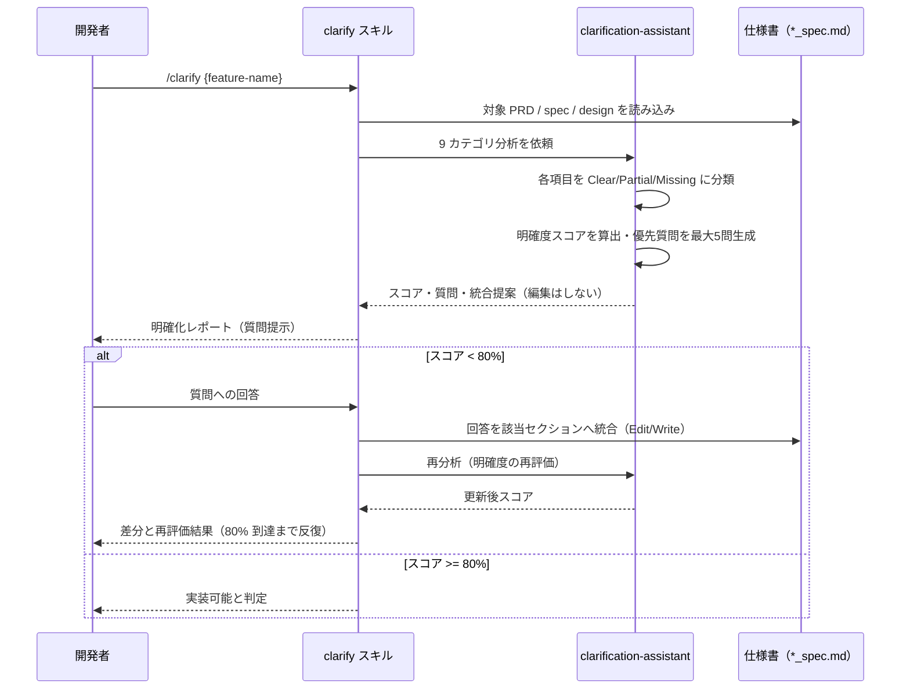

# 仕様明確化

**関連 Design Doc:** [clarify_design.md](clarify_design.md)
**関連 PRD:** [clarify.md](../../requirement/spec-design/clarify.md)（親: [spec-design](../../requirement/spec-design/index.md)）
**準拠する原則:** [CONSTITUTION.md](../../CONSTITUTION.md) B-001（Vibe Coding 防止）, B-002（多言語対応の一貫性）, D-001（Specification-Driven）

---

# 1. 背景

AI 駆動開発では、仕様やユーザー要件に曖昧点・未定義点が残ったまま実装に着手すると、AI が不足情報を推測で埋めてしまい、
仕様と実装の乖離・手戻り・暗黙の前提による誤解を招く。これは [CONSTITUTION.md](../../CONSTITUTION.md) の
最上位原則 B-001（Vibe Coding 防止）に反する。

本機能は、AI-SDD の Specify フェーズにおいて、実装着手前に対象仕様（またはユーザー要件）の曖昧点を
**体系的かつ網羅的に**洗い出し、優先度付きの質問と回答統合を通じて、実装可能な明確度へ到達させる。
品質保証を開発者の記憶や注意力に依存させず、9 カテゴリの構造化された観点と定量的な明確度スコアで担保することを狙いとする。

# 2. 概要

本機能は、対象仕様を 9 カテゴリの観点で分析し、曖昧点から優先度付きの明確化質問を生成し、
ユーザー回答を仕様書へ統合して明確度を高める。主要な設計原則は以下のとおり。

- **体系的分析**: 機能範囲・データモデル・フロー・非機能・統合・エッジケース・制約・用語・完了基準の 9 カテゴリで、
  各項目を 3 段階（🟢 Clear / 🟡 Partial / 🔴 Missing）に分類する
- **高影響度の質問生成**: 影響度・リスク・ブロッカー性を基準に、ユーザー負担を抑えて最大 5 問に絞る
- **定量的な実装可否判定**: 明確度スコアを算出し、80% 以上を実装可能（implementation-ready）と判定する
  （親 PRD NFR_001）。基準未満では実装への進行ではなく追加の明確化を推奨する（B-001）
- **回答統合と再評価**: ユーザー回答を仕様書の該当セクションへ統合し、明確度を再評価する反復ループを構成する

「何を分析し、どう明確化を促すか」を定義し、質問生成・スコア算出・回答統合の具体的な実行方式は
[clarify_design.md](clarify_design.md) に委ねる。

# 3. 要求定義

## 3.1. 機能要件 (Functional Requirements)

| ID     | 要件                                                                       | 優先度 | 根拠（上流要求）                              |
|--------|--------------------------------------------------------------------------|-----|-----------------------------------------|
| FR-001 | 対象仕様（またはユーザー要件）を 9 カテゴリで分析し、曖昧点・未定義点を 3 段階で分類する      | 必須  | 子 PRD FR_001_01 / 親 PRD UR_002・FR_002 |
| FR-002 | 曖昧点から影響度・リスク・ブロッカー性を基準に優先度付き明確化質問を最大 5 問生成する          | 必須  | 子 PRD FR_001_02                        |
| FR-003 | 明確度スコアを算出し、80% 以上を実装可能と判定する                              | 必須  | 子 PRD FR_001_03 / 親 PRD NFR_001       |
| FR-004 | ユーザー回答を仕様書の該当セクションへ統合し、明確度を再評価する                       | 必須  | 子 PRD FR_001_04                        |
| FR-005 | 明確度が基準未満の場合、実装への進行ではなく追加の明確化を推奨する                     | 必須  | 親 PRD NFR_001 / B-001                  |

FR-001 の 9 カテゴリは、機能範囲・データモデル・フロー／振る舞い・非機能要件・統合・エッジケース・制約・用語・完了基準とする
（各カテゴリの分析観点は「5. 用語集」および Design Doc を参照）。FR-002 の質問は yes/no ではなく具体的な意思決定を促す形式とし、
既に明確な項目や実装詳細（設計フェーズの領域）は問わない。

## 3.2. 非機能要件 (Non-Functional Requirements)

| ID      | カテゴリ         | 要件                                                          | 目標値                                |
|---------|--------------|-------------------------------------------------------------|--------------------------------------|
| NFR-001 | 判定基準         | 明確度をスコアとして定量化し、実装可否の判定に用いる                    | 実装可能の閾値 80%（親 PRD NFR_001）     |
| NFR-002 | 多言語         | 出力言語を `SDD_LANG` に従い切り替え、単一文書内で混在させない             | en / ja（親 PRD DC_002 / 原則 B-002） |
| NFR-003 | ユーザビリティ    | 1 回の分析で提示する質問数を制限し、ユーザーの回答負担を抑える              | 最大 5 問                            |

# 4. 提供コンポーネント

| 種別    | 配置場所                                | 名前                     | 概要                                                                             |
|-------|-------------------------------------|------------------------|--------------------------------------------------------------------------------|
| skill | `skills/clarify/SKILL.md`           | clarify                | 対象仕様を読み込み、9 カテゴリ分析・質問生成・回答統合を統括するユーザー呼び出しスキル（FR-001〜005） |
| agent | `agents/clarification-assistant.md` | clarification-assistant | 9 カテゴリ分析・明確度評価・質問生成・統合提案を行う分析エージェント（読み取り系ツールのみ）（FR-001〜003） |

責務分担の要点として、clarification-assistant エージェントは**分析と統合提案の出力**までを担い、仕様書への実際の編集は行わない。
仕様書の更新（Edit/Write）は clarify スキル（メインエージェント）が担う。この分離は「4.1. 入出力定義」および Design Doc で詳述する。

## 4.1. 入出力定義

### clarify スキル

**入力**:

| 引数            | 必須 | 説明                                                          |
|---------------|----|-------------------------------------------------------------|
| `feature-name` | 必須 | 対象機能名またはパス（例: `user-auth`, `auth/user-login`）             |
| `--interactive` | 任意 | 対話モード（質問を 1 問ずつ提示）                                     |
| `--categories`  | 任意 | 分析対象カテゴリを絞る（カンマ区切り。例: `flow,integrations,edge-cases`） |
| `--detail`      | 任意 | 出力詳細度（`minimal` = 上位 3 問 / `standard` = 上位 5 問 / `comprehensive` = 全件） |
| `--integrate`   | 任意 | ユーザー回答を受け取り仕様書へ段階的に統合し差分を提示する                    |

フラット構造・階層構造の双方に対応し、対象機能に対応する PRD・`*_spec.md`・`*_design.md`（存在するもの）を読み込む。

**出力**: 明確度スコア（カテゴリ別 Clear/Partial/Missing 集計と総合スコア）、Missing/Partial 項目の列挙、
優先質問リスト（最大 5 問）、回答の統合先提案、および実装可否判定を含む明確化レポート。出力言語は `SDD_LANG` に従う。

### clarification-assistant エージェント

**入力**: 対象ファイルパス（省略時はユーザーからの新規要件を受領）と `--interactive` オプション。
探索は `SDD_ROOT`（既定 `.sdd/`）配下に限定する。

**出力**: 明確度スコア、カテゴリ別評価、優先質問リスト、および回答ごとの統合提案（対象ファイル・対象セクション・提案内容）。
実際の編集は行わず、提案の出力までを責務とする。

# 5. 用語集

| 用語            | 説明                                                                                            |
|---------------|-----------------------------------------------------------------------------------------------|
| 9 カテゴリ分析     | 機能範囲・データモデル・フロー／振る舞い・非機能要件・統合・エッジケース・制約・用語・完了基準の観点による曖昧点分析 |
| 明確度スコア      | 仕様の曖昧さの少なさを定量化した指標。総合スコア = Clear 項目数 / 全項目数（Partial は分子に含めない）。80% 以上で実装可能（implementation-ready）と判定する |
| Clear（🟢）    | 明示的な例まで含めて完全に定義されている項目                                                            |
| Partial（🟡）  | 概念は存在するが詳細が欠けている項目（補足が必要）                                                        |
| Missing（🔴）  | 仕様に記載がない、または曖昧で未定義の項目（実装前に必ず明確化が必要）                                       |
| 優先質問        | 影響度・リスク・ブロッカー性を基準に選定した、明確化のための高影響度の質問（最大 5 問）                          |
| 統合提案        | ユーザー回答を仕様書のどのセクションにどう反映するかを示した提案（対象ファイル・セクション・内容）                  |
| 実装可否判定      | 明確度スコアに基づき、実装開始が可能か追加の明確化が必要かを判定すること                                     |

# 6. 使用例

```
/clarify user-auth                                  # フラット構造の仕様を 9 カテゴリで分析
/clarify auth/user-login                            # 階層構造（親機能配下の子機能）を分析
/clarify user-auth --interactive                    # 質問を 1 問ずつ提示する対話モード
/clarify user-auth --categories flow,edge-cases     # 特定カテゴリに絞って分析
/clarify user-auth --integrate                      # 回答を受け取り仕様書へ統合し差分を提示
```

# 7. 振る舞い図



# 8. 制約事項

- 分析・質問生成の品質は基盤モデル（Claude）の推論能力に依存する（親 PRD 5.1 の技術的制約）
- 低リスク・低影響度の項目に残る一部の曖昧さは許容する（すべての曖昧性の解消を強制しない）
- 明確度が基準未満の仕様で実装へ進むことを推奨してはならない（B-001 / 親 PRD B-001 原則）
- 仕様書・設計書の生成そのもの（兄弟機能 generate-spec）、品質レビュー（兄弟機能 spec-review）、
  およびプロンプト曖昧性の自動検知（quality-guardrails カテゴリの vibe-detector）は本機能のスコープ外

# 9. 原則との整合性

| 原則ID  | 原則名                    | 本仕様への適用内容                                                                 |
|-------|--------------------------|--------------------------------------------------------------------------------|
| B-001 | Vibe Coding 防止          | 実装前に曖昧点を体系的に洗い出し、明確度が基準未満なら実装を推奨しないことで暗黙の推測を排除する |
| B-002 | 多言語対応（EN/JA）の一貫性 | 分析レポート・質問テンプレートを日英両言語に対応させ、`SDD_LANG` に応じて切り替える          |
| D-001 | Specification-Driven      | 仕様書を真実の源とし、回答を仕様書へ統合して明確度を高めるフローへ誘導する                    |

---

# PRD 整合性レビュー結果

| 確認項目        | 結果                                                                              |
|--------------|---------------------------------------------------------------------------------|
| 要求カバレッジ   | 子 PRD FR_001_01〜04 を FR-001〜FR-004 でカバー（FR-005 は親 PRD NFR_001・B-001 から派生した spec 固有要求） |
| 要求 ID 参照    | 各 FR に対応する子 PRD / 親 PRD の要求 ID を「根拠」列に明記                            |
| 非機能要求の反映 | 親 PRD NFR_001 を NFR-001・FR-003・FR-005 に、DC_002 を NFR-002 に反映              |
| 用語整合性      | 親 PRD 用語集の「明確度スコア」「9 カテゴリ分析」定義に統一                                |
