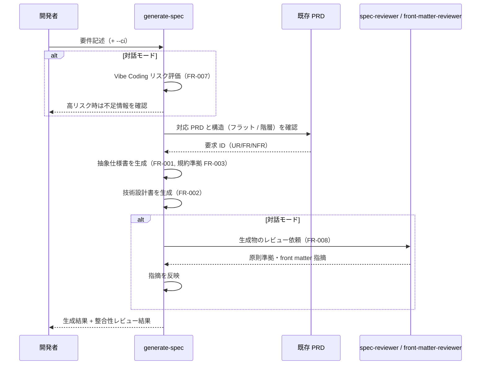

# 仕様書・設計書生成

**関連 Design Doc:** [generate-spec_design.md](generate-spec_design.md)
**関連 PRD:** [generate-spec.md](../../requirement/spec-design/generate-spec.md)（親: [spec-design](../../requirement/spec-design/index.md)）
**準拠する原則:** [CONSTITUTION.md](../../CONSTITUTION.md) B-001（Vibe Coding 防止）, B-002（多言語対応の一貫性）, A-001（Skills-First）, D-001（Specification-Driven）, D-002（ファイル命名規則の厳守）

---

# 1. 背景 `<MUST>`

AI-SDD ワークフローでは、PRD（何を・なぜ）から抽象仕様書（`*_spec.md`: 何を）と技術設計書
（`*_design.md`: どのように）へ段階的に具体化することで、AI 実装者へのガードレールを構築する。
この Specify / Plan フェーズの成果物が存在しなければ、AI は未定義の要求を推測して実装する
Vibe Coding 問題（[CONSTITUTION.md](../../CONSTITUTION.md) B-001）に陥る。

本機能は、開発者の入力内容（PRD・要件記述）から 2 層のドキュメントを生成し、抽象度を分離した
真実の源（Single Source of Truth）を構築する。仕様書・設計書の生成を開発者の手作業に依存させず、
命名規則・テンプレート・front matter への準拠を含めて一貫した品質で提供することを狙いとする。

# 2. 概要 `<MUST>`

本機能は、入力内容から抽象仕様書と技術設計書を生成し、`specification` ディレクトリに保存する。
主要な設計原則は以下のとおり。

- **段階的な具体化**: 「何を作るか」の抽象仕様書と「どのように実現するか」の技術設計書を、抽象度を
  分離した 2 層で生成する（親 PRD UR_001・DC_001 に準拠）
- **上流トレーサビリティ**: 対応する PRD が存在する場合、その要求 ID（UR/FR/NFR）を仕様書に参照し、
  PRD → spec → design の依存方向を保つ（親 PRD IR_001）
- **規約準拠**: 命名規則（`_spec.md` / `_design.md` サフィックス必須）・テンプレート構造・
  front matter スキーマへの準拠を生成物に強制する（親 PRD IR_001 / 原則 D-002）
- **構造追従**: 対応する PRD の構造（フラット / 階層）に追従して出力先を決定する
- **言語の一貫性**: 生成物の言語は `SDD_LANG` 環境変数に従い、単一ドキュメント内で混在させない
  （親 PRD DC_002 / 原則 B-002）
- **Vibe Coding 防止との連携**: 生成前に入力の曖昧性を評価し、生成後に外部レビューエージェントで
  整合を確認するオーケストレーションを担う

「何を生成し、どの規約に準拠するか」を定義し、テンプレートの前処理方式・生成フローの実行手順・
front matter の具体スキーマの詳細は [generate-spec_design.md](generate-spec_design.md) に委ねる。

# 3. 要求定義 `<RECOMMENDED>`

## 3.1. 機能要件 (Functional Requirements)

| ID     | 要件                                                                          | 優先度 | 根拠（上流要求）                                     |
|--------|-------------------------------------------------------------------------------|-----|--------------------------------------------------|
| FR-001 | 入力内容（PRD・要件記述）から抽象仕様書（`{feature-name}_spec.md`）を生成し保存する          | 必須  | 子 PRD FR_001 / 親 PRD UR_001・FR_001         |
| FR-002 | 抽象仕様書を入力として技術設計書（`{feature-name}_design.md`）を生成し保存する            | 必須  | 子 PRD FR_001 / 親 PRD UR_001・FR_001         |
| FR-003 | 生成物を命名規則（`_spec` / `_design` サフィックス必須）・テンプレート構造・front matter スキーマに準拠させる | 必須  | 子 PRD IR_001 / 親 PRD IR_001                 |
| FR-004 | 対応する PRD の構造（フラット / 階層）に追従して出力先パスと front matter の `id` を決定する      | 必須  | 子 PRD FR_001 / 親 PRD IR_001                 |
| FR-005 | PRD が存在する場合、生成時に要求 ID（UR/FR/NFR）を仕様書に参照付与し、要求カバレッジを確認する       | 必須  | 親 PRD UR_001・IR_001                          |
| FR-006 | 抽象仕様書に技術詳細を含めず、技術設計書に設計判断の理由を明示し、抽象度を分離する               | 必須  | 子 PRD DC_001 / 親 PRD DC_001                  |
| FR-007 | 生成前に入力の曖昧性（Vibe Coding リスク）を評価し、高リスク時は生成前に不足情報を確認する         | 必須  | 親 PRD B-001（CONSTITUTION）から派生            |
| FR-008 | 生成後に外部レビューエージェント（spec-reviewer / front-matter-reviewer）を呼び出し、原則準拠・front matter を検証して指摘を反映する | 必須  | 親 PRD IR_001（検証） |
| FR-009 | 非対話（CI）モードでは曖昧性評価・レビューを省略し、既存ファイルの上書きを自動承認し、Design Doc を常に生成する（生成省略の確認を行わない） | 任意  | 運用要求（自動化）から派生                          |

FR-005 は生成時の PRD 整合（要求カバレッジ確認・要求 ID 参照付与）を担い、FR-008 は生成後に外部エージェントで
原則・front matter を検証する責務であり、両者は目的が異なる。FR-007・FR-008 は生成の前後に位置する連携責務であり、
曖昧性評価そのものは vibe-detector、品質レビューそのものは spec-review 機能が正典として扱う
（本機能はそれらを呼び出すオーケストレーションを担う）。

## 3.2. 非機能要件 (Non-Functional Requirements) `<OPTIONAL>`

| ID      | カテゴリ         | 要件                                                            | 目標値 / 根拠                                   |
|---------|--------------|-----------------------------------------------------------------|-----------------------------------------------|
| NFR-001 | 一貫性          | 生成物の言語は `SDD_LANG`（en / ja）に従い、単一文書内で混在させない      | 言語混在ゼロ（親 PRD DC_002 / 原則 B-002）        |
| NFR-002 | インターフェース  | 命名規則・テンプレート・front matter スキーマに準拠する                    | レビューで違反ゼロ（親 PRD IR_001）                |
| NFR-003 | 移植性          | Claude Code のスキル機構上で動作し、macOS / Linux で前処理が実行できる      | 標準ライブラリのみで前処理成功（親 PRD 制約 5.1）    |

# 4. 提供コンポーネント `<MUST>`

| 種別    | 配置場所                              | 名前            | 概要                                                                     |
|-------|-----------------------------------|---------------|------------------------------------------------------------------------|
| skill | `skills/generate-spec/SKILL.md`   | generate-spec | 入力内容から抽象仕様書・技術設計書を生成する user-invocable スキル（FR-001〜FR-009） |

本機能が呼び出す `spec-reviewer` / `front-matter-reviewer` エージェント（FR-008）は spec-review 機能・
front-matter 検証機能が正典として提供するコンポーネントであり、本機能はそれらを連携利用する。

## 4.1. 入出力定義 `<OPTIONAL>`

### generate-spec スキル

**入力**:

- 要件記述テキスト（必須）。機能名を記述から抽出・推論する
- `--ci` フラグ（任意）。CI / 非対話モードを指定する（FR-009）
- 環境変数 `SDD_LANG`（出力言語）・`SDD_ROOT` / `SDD_SPECIFICATION_PATH`（出力先の解決）

**出力**:

- `{feature-name}_spec.md`（抽象仕様書）と `{feature-name}_design.md`（技術設計書）。
  出力先はフラット / 階層の構造に従う
- 生成結果と整合性レビュー結果を含むレポート（出力言語は `SDD_LANG` に従う）

front matter の共通・種別固有フィールドの構造例（詳細スキーマは Design Doc を参照）:

```yaml
# spec
id: "spec-{parent}-{feature-name}"   # 階層構造の場合はパスを含める
type: "spec"
sdd-phase: "specify"
depends-on: ["prd-{parent}-{feature-name}"]   # 上流方向のみ

# design
id: "design-{parent}-{feature-name}"
type: "design"
sdd-phase: "plan"
impl-status: "not-implemented"
depends-on: ["spec-{parent}-{feature-name}"]   # 上流方向のみ
```

# 5. 用語集 `<OPTIONAL>`

| 用語        | 説明                                                                                |
|-----------|-------------------------------------------------------------------------------------|
| 抽象仕様書    | `{name}_spec.md`。「何を作るか」を技術詳細抜きで定義する Specify フェーズの成果物              |
| 技術設計書    | `{name}_design.md`。「どのように実現するか」と設計判断の理由を定義する Plan フェーズの成果物     |
| フラット構造   | `specification/{name}_spec.md` のように親ディレクトリを持たない小〜中規模向けの配置          |
| 階層構造     | `specification/{parent}/{name}_spec.md` のように親機能ディレクトリ配下に配置する中〜大規模向けの配置 |
| 要求カバレッジ | PRD の全要求 ID（UR/FR/NFR）のうち、仕様書で対応が確認できる要求の割合                        |
| Vibe Coding | 曖昧な指示により AI が仕様を暗黙的に推測して実装してしまう問題（CONSTITUTION.md B-001 の定義に従う） |

# 6. 使用例 `<RECOMMENDED>`

```
# 要件記述から spec / design を生成（対話モード）
/generate-spec ユーザーログイン機能。メールとパスワードで認証しセッションを発行する
  → user-login_spec.md と user-login_design.md を生成
    （生成前に曖昧性を確認し、生成後に spec-reviewer / front-matter-reviewer で検証）

# CI / 非対話モード（曖昧性評価・レビューを省略し上書きを自動承認）
/generate-spec ユーザーログイン機能 --ci
```

# 7. 振る舞い図 `<OPTIONAL>`



# 8. 制約事項 `<OPTIONAL>`

- 本機能は Claude Code のスキル機構上で動作し、生成品質は基盤モデルの能力に依存する（親 PRD 制約 5.1）
- 生成前の仕様明確化（clarify）・生成後の品質レビュー本体（spec-review）・既存実装からの逆算
  （plan-refactor）は本機能のスコープ外であり、兄弟機能が扱う（子 PRD スコープ外）
- PRD 自体の生成は prd-generation カテゴリのスコープ外とする（子 PRD スコープ外）
- 抽象仕様書には技術的実装詳細（アーキテクチャ・技術スタック・API 定義・スキーマ）を含めない（DC_001）

# 9. 原則との整合性 `<RECOMMENDED>`

| 原則ID  | 原則名                    | 本仕様への適用内容                                                              |
|-------|--------------------------|------------------------------------------------------------------------|
| B-001 | Vibe Coding 防止          | 生成前に入力の曖昧性を評価し、仕様書を真実の源として構築することで暗黙的な要求推測を排除する  |
| B-002 | 多言語対応（EN/JA）の一貫性 | 生成物の言語を `SDD_LANG` に従わせ、単一ドキュメント内で言語を混在させない（NFR-001）    |
| A-001 | Skills-First              | 本機能を legacy commands ではなく `skills/generate-spec/` として提供する          |
| D-001 | Specification-Driven      | 実装前に spec / design を生成し、Specify → Plan のフローを支える中核機能とする        |
| D-002 | ファイル命名規則の厳守       | 生成物に `_spec` / `_design` サフィックスと命名規則表への準拠を強制する（FR-003）      |

---

# PRD 整合性レビュー結果

| 確認項目          | 結果                                                                                       |
|-----------------|------------------------------------------------------------------------------------------|
| 要求カバレッジ     | 子 PRD FR_001 とそのサブ範囲（spec 生成・design 生成・規約準拠）を FR-001〜FR-004・FR-006 でカバー |
| 要求 ID 参照      | 各 FR に対応する子 PRD / 親 PRD の要求 ID を「根拠」列に明記                                       |
| 非機能要求の反映   | 親 PRD IR_001・DC_001・DC_002 を FR-003・FR-006 および NFR-001〜002 に反映                       |
| 用語整合性        | 親 PRD 用語集の「抽象仕様書」「技術設計書」定義に統一。「フラット / 階層構造」は CLAUDE.md の定義に整合  |
| スコープ整合      | 親 PRD NFR_001（明確度スコア）は clarify 機能の要求のため本仕様の対象外とし、意図的に非カバーとした    |
