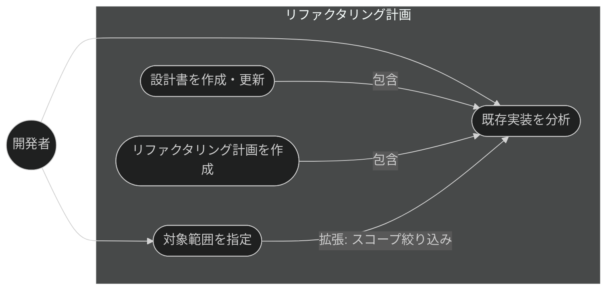
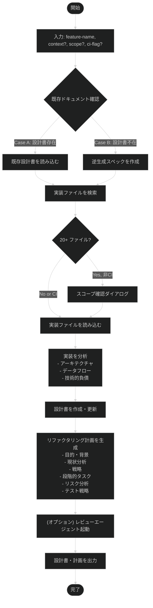

# リファクタリング計画 - 抽象仕様書

**関連 Design Doc:** [plan-refactor_design.md](plan-refactor_design.md)
**関連 PRD:** [../requirement/spec-design/plan-refactor.md](../requirement/spec-design/plan-refactor.md)
**親 PRD:** [../requirement/spec-design/index.md](../requirement/spec-design/index.md)

---

# 1. 背景

仕様書が存在しない既存機能に対しても、実装コードの分析から設計書を逆算・整備し、リファクタリング計画を立案できることが求められている。これにより、既存実装の設計意図を文書化し、改善戦略を体系的に立案することが可能になる。

# 2. 概要

本機能は、既存実装の技術詳細を分析し、設計書の作成・更新とリファクタリング計画の立案を行う。
開発者が対象機能を指定し、任意で改善目標を入力することで、以下を実現する：

- **既存実装の分析**: 実装コードから技術スタック・アーキテクチャ・データフロー・アルゴリズムを抽出
- **設計書の作成・更新**: 実装を正確に記述した技術設計書を作成、または既存設計書を更新
- **リファクタリング計画の立案**: 技術的負債を特定し、改善戦略・段階的実装計画を提案

---

# 3. 要求定義

## 3.1. 機能要件 (Functional Requirements)

| ID     | 要件 | 優先度 | 根拠 |
|--------|------|------|------|
| FR-001 | 既存実装を分析し、実装に基づく技術設計書を作成・更新する | 必須 | **PRD FR_001** を実装。親 PRD UR_004 から派生。仕様書が存在しない機能にも対応する必要がある |
| FR-002 | 作成・更新された設計書をベースに、リファクタリング計画を立案する | 必須 | **PRD FR_001** を実装。親 PRD UR_004。改善戦略・段階的タスク・リスク分析を含める |
| FR-003 | 分析対象をディレクトリ指定で絞り込める（スコープ指定） | オプション | 大規模プロジェクトで不要なファイルを除外するため |
| FR-004 | 開発者が改善目標を入力し、目標に沿った計画を立案できる | オプション | より焦点を絞ったリファクタリング計画の実現 |

## 3.2. 非機能要件 (Non-Functional Requirements)

| ID      | カテゴリ | 要件 | 目標値 |
|---------|------|------|------|
| NFR-001 | 言語対応 | 生成される設計書・計画の言語が `SDD_LANG` 環境変数に従う | EN/JA 両言語対応 |
| NFR-002 | 命名規則準拠 | 生成される設計書は `{name}_design.md` サフィックスとテンプレート構造に準拠 | 親 PRD IR_001 |
| NFR-003 | スケーラビリティ | 大規模実装（20+ ファイル）の場合、確認ダイアログを表示し対話的に絞り込み可能 | ユーザー体験向上 |

---

# 4. 提供コンポーネント

本機能は Claude Code プラグイン「sdd-workflow」のスキルとして提供される。

| 種別 | 配置場所 | 名前 | 概要 |
|-----|------|------|------|
| skill | `plugins/sdd-workflow/skills/plan-refactor/` | `/plan-refactor` | 既存実装を分析し、設計書とリファクタリング計画を作成 |

## 4.1. 入出力定義

### 入力パラメータ

```
/plan-refactor <feature-name> [context] [--scope=<dir>] [--ci]
```

| パラメータ | 型 | 必須 | 説明 |
|-----------|-----|------|------|
| `feature-name` | string | ✓ | 対象機能の識別子（ファイル名またはパス） |
| `context` | string | - | 改善目標・意図（例: "無限スクロール化してパフォーマンス改善"） |
| `--scope=<dir>` | string | - | ファイル検索のスコープ（例: `src/components/`） |
| `--ci` | flag | - | CI/自動実行モード（ユーザー確認を省略） |

### 出力

| 出力物 | 形式 | 説明 |
|-------|-----|------|
| 技術設計書 | `.sdd/specification/{category}/{feature-name}_design.md` | 既存実装に基づく設計書。新規作成または既存を更新 |
| リファクタリング計画 | 設計書内の "## リファクタリング計画" セクション | 改善戦略・段階的タスク・リスク分析・テスト戦略を含む |

---

# 5. 用語集

| 用語 | 説明 |
|-----|------|
| **逆生成（reverse engineering）** | 実装コードから仕様・設計書を抽出し、文書化するプロセス |
| **技術的負債** | 改善が必要な実装上の問題（密結合・コード重複・テストカバレッジ不足など） |
| **リファクタリング計画** | 技術的負債を解消するための改善戦略・段階的実装タスク・リスク評価 |
| **スコープ指定** | 分析対象を特定のディレクトリに限定し、不要なファイルを除外する機能 |

---

# 6. 使用例

```bash
# 基本的な使用（自動分析）
/plan-refactor user-list

# 改善目標を指定（焦点を絞ったリファクタリング計画）
/plan-refactor user-list "無限スクロール化してパフォーマンス改善"

# スコープを限定
/plan-refactor checkout-flow --scope=src/components/checkout

# 複合形式
/plan-refactor auth-module "依存性注入を導入してテスト容易性を向上" --scope=src/services/auth
```

---

# 7. 振る舞い図

## 7.1. ユースケース図



## 7.2. フロー図



---

# 8. 制約事項

- **技術的制約**: 実装分析は静的なコード読解に基づき、実行時挙動の解析は含まない
- **スコープ**: リファクタリング計画の作成は、設計書の作成・更新と同時に行われ、設計書の別ファイルでは管理されない
- **言語**: 出力は `SDD_LANG` に従い、ドキュメント内で言語を混在させない
- **命名規則**: 生成される設計書は必ず `_design.md` サフィックスを含み、DESIGN_DOC_TEMPLATE.md に準拠する

---

# 9. 原則との整合性

| 原則ID | 原則名 | 本仕様への適用内容 |
|-------|-----|-----------|
| A-001 | Skills-First | `/plan-refactor` をスキルとして実装し、Claude Code プラグインの標準機構で起動可能にする（セクション 4） |
| A-002 | フックとスクリプトの責務分離 | ファイル検索・既存ドキュメント確認を Bash スクリプト化し、エージェント起動時に活用（セクション 2） |
| B-001 | Vibe Coding 防止 | 既存実装を正確に分析し、文書化することで、設計の意図を明確化し、改善判断の根拠を強化する |
| B-002 | 多言語対応の一貫性 | 生成物の言語は SDD_LANG に従い、テンプレート・出力は EN/JA 両言語で同等の構成を維持 |
| D-001 | 抽象度の分離 | 技術設計書には実装詳細（アーキテクチャ・技術スタック・アルゴリズム）を記述し、設計判断の理由を明示 |
| D-002 | 設計判断の透明性 | リファクタリング計画に改善戦略・選択肢・トレードオフを明示し、判断根拠を記録 |
| D-003 | ドキュメント永続性ルール | 技術的負債分析をリファクタリング計画に統合し、知見を永続化する（セクション 5） |

---

# トレーサビリティ表

## PRD 要件への対応

| PRD要件 | 本仕様への対応 | 実装箇所 |
|---------|-----------|---------|
| UR_004: 既存実装から設計書を整備しリファクタリングを計画できる | FR-001, FR-002 による完全対応 | 4. 提供コンポーネント |
| FR_004: 既存実装を分析し設計書とリファクタリング計画を作成する | FR-001, FR-002 による完全対応 | 4. 提供コンポーネント |
| IR_001: 命名規則・テンプレート・front matter への準拠 | FR-001 で設計書生成時に強制 | 4.1. 入出力定義 |
| DC_001: 抽象度の分離 | 設計書に技術詳細を含め、仕様との分離を保証 | 8. 制約事項 |
| DC_002: 言語の一貫性 | NFR-001 で SDD_LANG に従う | 3.2. 非機能要件 |
| 子 PRD FR_001（scope 指定によるスコープ絞り込み） | FR-003 による対応 | 3.1. 機能要件 / 4.1. 入出力定義 |
| 子 PRD FR_001（context/改善目標の入力） | FR-004 による対応 | 3.1. 機能要件 / 4.1. 入出力定義 |
| 子 PRD FR_001（20+ ファイル時の確認ダイアログ） | NFR-003 による対応 | 3.2. 非機能要件 / 7.2. フロー図 |
