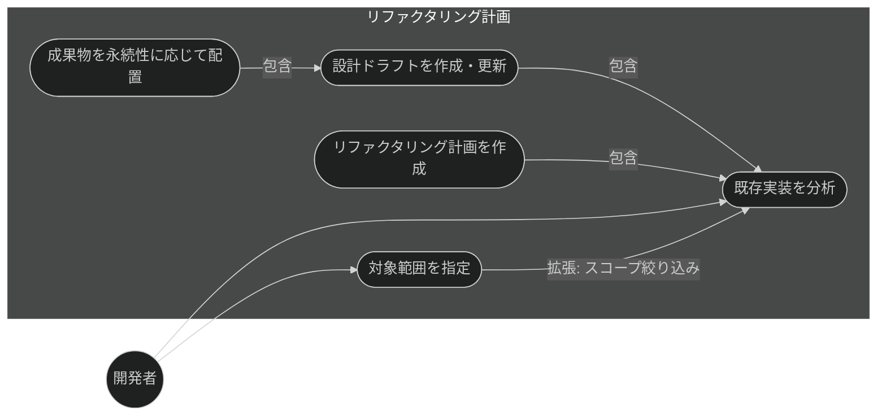
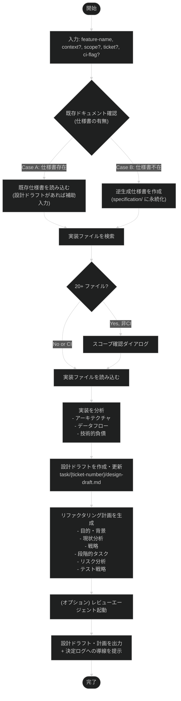

# リファクタリング計画 - 抽象仕様書

**関連 Design Doc:** [plan-refactor_design.md](plan-refactor_design.md)（本リポジトリは `.sdd/` 全体の v5.0.0 レイアウト移行が未了のため、自プロジェクトの設計書はまだ `specification/` 配下に永続化されている）
**関連 PRD:** [plan-refactor.md](../../requirement/spec-design/plan-refactor.md)
**親 PRD:** [spec-design](../../requirement/spec-design/index.md)

---

# 1. 背景

仕様書が存在しない既存機能に対しても、実装コードの分析から仕様書・設計を逆算・整備し、リファクタリング計画を立案できることが求められている。これにより、既存実装の設計意図を文書化し、改善戦略を体系的に立案することが可能になる。

技術設計書は永続文書ではなくチケット単位の一時ドラフト（`task/{ticket-number}/design-draft.md`）であり、実装完了後に破棄され、確定した決定のみが決定ログ（`adr/{feature-name}.md`）に永続化される。本機能の成果物もこのライフサイクルに従う。

# 2. 概要

本機能は、既存実装の技術詳細を分析し、設計ドラフトの作成・更新とリファクタリング計画の立案を行う。
開発者が対象機能を指定し、任意で改善目標を入力することで、以下を実現する：

- **既存実装の分析**: 実装コードから技術スタック・アーキテクチャ・データフロー・アルゴリズムを抽出
- **設計ドラフトの作成・更新**: 実装を正確に記述した設計ドラフトを作成、または既存ドラフトを更新
- **リファクタリング計画の立案**: 技術的負債を特定し、改善戦略・段階的実装計画を提案
- **成果物の永続性の書き分け**: 逆生成仕様書は永続文書、設計とリファクタリング計画は一時ドラフト

---

# 3. 要求定義

## 3.1. 機能要件 (Functional Requirements)

| ID     | 要件 | 優先度 | 根拠 |
|--------|------|------|------|
| FR-001 | 既存実装を分析し、実装に基づく設計ドラフトを作成・更新する | 必須 | **PRD FR_001** を実装。親 PRD UR_004 から派生。仕様書が存在しない機能にも対応する必要がある |
| FR-002 | 作成・更新された設計ドラフトをベースに、リファクタリング計画を立案する | 必須 | **PRD FR_001** を実装。親 PRD UR_004。改善戦略・段階的タスク・リスク分析を含める |
| FR-003 | 分析対象をディレクトリ指定で絞り込める（スコープ指定） | オプション | 大規模プロジェクトで不要なファイルを除外するため |
| FR-004 | 開発者が改善目標を入力し、目標に沿った計画を立案できる | オプション | より焦点を絞ったリファクタリング計画の実現 |
| FR-005 | 既存ドキュメントの有無判定を仕様書の有無で行い、サフィックス有無の両方を検出する | 必須 | **PRD FR_001**（成果物の配置と永続性）を実装。技術設計書は永続文書ではないため、判定基準に使えない |
| FR-006 | 逆生成仕様書を永続文書、逆生成設計とリファクタリング計画を一時ドラフトとして書き分ける | 必須 | **PRD FR_001**（成果物の配置と永続性）を実装。永続文書として設計書を作らない方針に整合させる |
| FR-007 | リファクタリング計画で確定した決定を決定ログへ永続化する導線を提示する | 必須 | **PRD FR_001**（成果物の配置と永続性）を実装。一時ドラフト破棄時に決定が失われることを防ぐ。統合処理自体は task-cleanup が担う |

## 3.2. 非機能要件 (Non-Functional Requirements)

| ID      | カテゴリ | 要件 | 目標値 |
|---------|------|------|------|
| NFR-001 | 言語対応 | 生成される設計書・計画の言語が `SDD_LANG` 環境変数に従う | EN/JA 両言語対応 |
| NFR-002 | 命名規則準拠 | 逆生成仕様書は仕様書ディレクトリの命名規則（`_spec` サフィックスは任意）、設計ドラフトは `design-draft.md` 固定名とテンプレート構造に準拠 | 親 PRD IR_001 |
| NFR-003 | スケーラビリティ | 大規模実装（20+ ファイル）の場合、確認ダイアログを表示し対話的に絞り込み可能 | ユーザー体験向上 |

---

# 4. 提供コンポーネント

本機能は Claude Code プラグイン「sdd-workflow」のスキルとして提供される。

| 種別 | 配置場所 | 名前 | 概要 |
|-----|------|------|------|
| skill | `plugins/sdd-workflow/skills/plan-refactor/` | `/plan-refactor` | 既存実装を分析し、設計書とリファクタリング計画を作成 |

## 4.1. 入出力定義

### 入力パラメータ

```
/plan-refactor <feature-name> [context] [--scope=<dir>] [--ticket=<number>] [--ci]
```

| パラメータ | 型 | 必須 | 説明 |
|-----------|-----|------|------|
| `feature-name` | string | ✓ | 対象機能の識別子（ファイル名またはパス） |
| `context` | string | - | 改善目標・意図（例: "無限スクロール化してパフォーマンス改善"） |
| `--scope=<dir>` | string | - | ファイル検索のスコープ（例: `src/components/`） |
| `--ticket=<number>` | string | - | 設計ドラフトの配置先を決めるチケット番号。非対話モード（`--ci`）では必須。省略時は対話的に確認 |
| `--ci` | flag | - | CI/自動実行モード（ユーザー確認を省略） |

### 出力

| 出力物 | 形式 | 説明 |
|-------|-----|------|
| 設計ドラフト | `.sdd/task/{ticket-number}/design-draft.md` | 既存実装に基づく設計ドラフト。新規作成または既存を更新。一時文書（実装完了後に破棄） |
| 逆生成仕様書 | `.sdd/specification/{category}/{feature-name}_spec.md` | Case B（仕様書不在）のみ。実装から逆生成した永続文書 |
| リファクタリング計画 | 設計ドラフト内の "## リファクタリング計画" セクション | 改善戦略・段階的タスク・リスク分析・テスト戦略を含む |
| 決定ログへの導線 | 次のステップの案内 | 計画で確定した決定を `.sdd/adr/{feature-name}.md` へ統合する手順（task-cleanup 機能が実行） |

---

# 5. 用語集

| 用語 | 説明 |
|-----|------|
| **逆生成（reverse engineering）** | 実装コードから仕様・設計書を抽出し、文書化するプロセス |
| **技術的負債** | 改善が必要な実装上の問題（密結合・コード重複・テストカバレッジ不足など） |
| **リファクタリング計画** | 技術的負債を解消するための改善戦略・段階的実装タスク・リスク評価 |
| **スコープ指定** | 分析対象を特定のディレクトリに限定し、不要なファイルを除外する機能 |
| **設計ドラフト** | `task/{ticket-number}/design-draft.md`。技術設計を記述する一時文書で、実装完了後に破棄される |
| **決定ログ（ADR）** | `adr/{feature-name}.md`。設計ドラフト破棄時に決定とその根拠を追記保存する永続文書 |

---

# 6. 使用例

```bash
# 基本的な使用（自動分析）
/plan-refactor user-list

# 改善目標を指定（焦点を絞ったリファクタリング計画）
/plan-refactor user-list "無限スクロール化してパフォーマンス改善"

# スコープを限定
/plan-refactor checkout-flow --scope=src/components/checkout

# 設計ドラフトの配置先をチケット番号で明示
/plan-refactor user-list --ticket=91

# 複合形式
/plan-refactor auth-module "依存性注入を導入してテスト容易性を向上" --scope=src/services/auth --ticket=91
```

---

# 7. 振る舞い図

## 7.1. ユースケース図


```mermaid
%%{init: {'theme': 'dark'}}%%
flowchart LR
    Developer((開発者))

    subgraph PlanRefactor["リファクタリング計画"]
        AnalyzeImpl([既存実装を分析])
        CreateDraft([設計ドラフトを作成・更新])
        CreatePlan([リファクタリング計画を作成])
        SpecifyScope([対象範囲を指定])
        PlaceArtifacts([成果物を永続性に応じて配置])
    end

    Developer --> AnalyzeImpl
    Developer --> SpecifyScope
    CreateDraft -->|包含| AnalyzeImpl
    CreatePlan -->|包含| AnalyzeImpl
    SpecifyScope -->|拡張: スコープ絞り込み| AnalyzeImpl
    PlaceArtifacts -->|包含| CreateDraft
```

## 7.2. フロー図


```mermaid
%%{init: {'theme': 'dark'}}%%
flowchart TD
    Start([開始]) --> Input["入力: feature-name, context?, scope?, ticket?, ci-flag?"]
    Input --> ScanExist{"既存ドキュメント確認<br/>(仕様書の有無)"}

    ScanExist -->|"Case A: 仕様書存在"| CaseA["既存仕様書を読み込む<br/>(設計ドラフトがあれば補助入力)"]
    ScanExist -->|"Case B: 仕様書不在"| CaseB["逆生成仕様書を作成<br/>(specification/ に永続化)"]

    CaseA --> FindImpl["実装ファイルを検索"]
    CaseB --> FindImpl

    FindImpl --> LargeImpl{"20+ ファイル?"}
    LargeImpl -->|Yes, 非CI| AskScope["スコープ確認ダイアログ"]
    LargeImpl -->|No or CI| ReadImpl["実装ファイルを読み込む"]
    AskScope --> ReadImpl

    ReadImpl --> Analyze["実装を分析<br/>- アーキテクチャ<br/>- データフロー<br/>- 技術的負債"]

    Analyze --> UpdateDraft["設計ドラフトを作成・更新<br/>task/{ticket-number}/design-draft.md"]
    UpdateDraft --> CreatePlan["リファクタリング計画を生成<br/>- 目的・背景<br/>- 現状分析<br/>- 戦略<br/>- 段階的タスク<br/>- リスク分析<br/>- テスト戦略"]

    CreatePlan --> Review["(オプション) レビューエージェント起動"]
    Review --> Output["設計ドラフト・計画を出力<br/>+ 決定ログへの導線を提示"]
    Output --> End([完了])
```

---

# 8. 制約事項

- **技術的制約**: 実装分析は静的なコード読解に基づき、実行時挙動の解析は含まない
- **スコープ**: リファクタリング計画の作成は、設計ドラフトの作成・更新と同時に行われ、別ファイルでは管理されない
- **言語**: 出力は `SDD_LANG` に従い、ドキュメント内で言語を混在させない
- **命名規則**: 設計ドラフトは `task/{ticket-number}/design-draft.md` の固定名で配置し、DESIGN_DOC_TEMPLATE.md に準拠する。逆生成仕様書は仕様書ディレクトリの命名規則に従う（`_spec` サフィックスは任意）
- **永続性**: `specification/` 配下に永続的な技術設計書を作成しない。設計ドラフトは実装完了後に破棄される前提で扱う

---

# 9. 原則との整合性

| 原則ID | 原則名 | 本仕様への適用内容 |
|-------|-----|-----------|
| A-001 | Skills-First | `/plan-refactor` をスキルとして実装し、Claude Code プラグインの標準機構で起動可能にする（セクション 4） |
| A-002 | フックとスクリプトの責務分離 | ファイル検索・既存ドキュメント確認を Python スクリプト化し、エージェント起動時に活用（セクション 2） |
| B-001 | Vibe Coding 防止 | 既存実装を正確に分析し、文書化することで、設計の意図を明確化し、改善判断の根拠を強化する |
| B-002 | 多言語対応の一貫性 | 生成物の言語は SDD_LANG に従い、テンプレート・出力は EN/JA 両言語で同等の構成を維持 |
| D-001 | Specification-Driven | 仕様書が存在しない既存機能に対し、実装から設計書を逆生成して事後整備することで、仕様を真実の源に近づける（フロー図 Case B の逆生成） |
| D-002 | ファイル命名規則の厳守 | 設計ドラフトは `design-draft.md` 固定名、逆生成仕様書は仕様書ディレクトリの命名規則に準拠する（NFR-002, セクション 8） |
| D-003 | ドキュメント永続性ルールの遵守 | 逆生成仕様書は永続文書、設計ドラフトは一時文書として書き分け、計画で確定した決定は決定ログへ統合する（FR-006, FR-007, セクション 8） |

---

# トレーサビリティ表

## PRD 要件への対応

| PRD要件 | 出典 | 本仕様への対応 | 実装箇所 |
|---------|------|-----------|---------|
| UR_004: 既存実装から設計を整備しリファクタリングを計画できる | 親PRD [index.md](../../requirement/spec-design/index.md) | FR-001, FR-002 による完全対応 | 4. 提供コンポーネント |
| FR_001: 既存実装を分析し設計ドラフトとリファクタリング計画を作成する（親PRD集約図では FR_004: RefactorPlanning） | 子PRD [plan-refactor.md](../../requirement/spec-design/plan-refactor.md) | FR-001, FR-002 による完全対応 | 4. 提供コンポーネント |
| FR_001「成果物の配置と永続性」: 逆生成成果物を永続性に応じて書き分ける | 子PRD [plan-refactor.md](../../requirement/spec-design/plan-refactor.md) | FR-005, FR-006, FR-007 による完全対応 | 4.1. 入出力定義, 8. 制約事項 |
| IR_001: 命名規則・テンプレート・front matter への準拠 | 親PRD [index.md](../../requirement/spec-design/index.md) | FR-001, FR-006 で生成時に強制 | 4.1. 入出力定義 |
| DC_001: 抽象度の分離 | 親PRD [index.md](../../requirement/spec-design/index.md) | 設計ドラフトに技術詳細を含め、仕様との分離を保証 | 8. 制約事項 |
| DC_002: 言語の一貫性 | 親PRD [index.md](../../requirement/spec-design/index.md) | NFR-001 で SDD_LANG に従う | 3.2. 非機能要件 |
