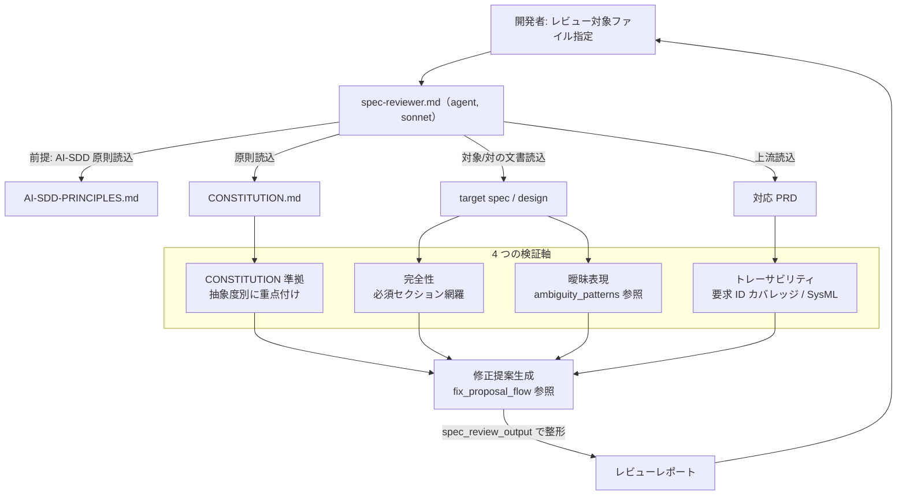

# 仕様・設計レビュー

**関連 Spec:** [spec-review_spec.md](spec-review_spec.md)
**関連 PRD:** [spec-review.md](../../requirement/spec-design/spec-review.md)（親: [spec-design](../../requirement/spec-design/index.md)）
**準拠する原則:** [CONSTITUTION.md](../../CONSTITUTION.md) B-001（Vibe Coding防止）, D-001（Specification-Driven）, D-002（ファイル命名規則の厳守）, T-002（plugin.json登録の徹底）, T-003（日本語出力の文字化け防止）

---

# 1. 実装ステータス `<MUST>`

**ステータス:** 🟢 実装済み

本設計書は既存実装（`agents/spec-reviewer.md`）の挙動を逆算して記述したものである。
レビュー観点・トリガー方式・トレーサビリティ判定ロジック・修正提案フローは実装（Markdown
プロンプトエージェント）を真実の源とする。

## 1.1. 実装進捗 `<OPTIONAL>`

| モジュール/機能             | ステータス | 備考                                                              |
|--------------------------|--------|-----------------------------------------------------------------|
| spec-reviewer エージェント本体 | 🟢     | `agents/spec-reviewer.md`（model: sonnet、Read/Glob/Grep/AskUserQuestion） |
| レビュー出力テンプレート        | 🟢     | `agents/templates/{en,ja}/spec_review_output.md`                  |
| 曖昧表現パターン定義          | 🟢     | `agents/references/ambiguity_patterns.md`                         |
| 修正提案フロー定義           | 🟢     | `agents/references/fix_proposal_flow.md`                          |
| SysML / リンク規約参照       | 🟢     | `agents/references/`（mermaid / sysml / document_link_convention 等） |
| plugin.json 登録           | 🟢     | `.claude-plugin/plugin.json` の `agents` に登録済み（T-002）           |

---

# 2. 設計目標 `<MUST>`

- 抽象仕様書・技術設計書の品質を、CONSTITUTION 準拠・完全性・曖昧表現・トレーサビリティの
  4 軸で検証し、優先度付きの修正提案を出力する（FR-001〜FR-006）
- 抽象度に応じて原則の重点を切り替える（spec はアーキテクチャ・開発手法原則、design は技術制約・
  アーキテクチャ原則を重点検証）
- 複数の関連文書（CONSTITUTION / PRD / spec / design）を横断参照するトレーサビリティ検証を、
  コンテキスト効率を保ちながら実行する
- CONSTITUTION.md 不在時も原則チェックのみスキップして他検証を継続する（グレースフルな縮退）
- レビュー出力言語を `SDD_LANG` に従わせ、日本語出力の文字化けを防止する（NFR-003 / B-002 / T-003）

---

# 3. 実装方式 `<MUST>`

| 領域            | 採用方式                                                | 選定理由                                                                     |
|---------------|-------------------------------------------------------|----------------------------------------------------------------------------|
| agent          | Markdown プロンプトエージェント（`model: sonnet`）           | 文書横断の分析・原則解釈・トレーサビリティ判定は Claude の推論を要する。宣言的コンポーネントとして agent 実装 |
| ツール構成        | `Read` / `Glob` / `Grep` / `AskUserQuestion`（Task 不使用） | 関連文書を効率的に特定・読込。Task による再帰探索はコンテキスト爆発を招くため使用しない（責務を自己完結） |
| 出力フォーマット     | `templates/{en,ja}/spec_review_output.md`              | B-002 の多言語一貫性。`SDD_LANG` で言語別テンプレートを選択                          |
| 曖昧表現・修正提案   | `references/` に外部化                                    | パターン定義・修正提案フローをプロンプト本体から分離し、追加・改訂を容易にする（NFR-002）        |
| パス解決         | `SDD_*` 環境変数 →`.sdd-config.json`→ 既定値               | フラット / 階層の両構造で上流 PRD・spec を解決する                                   |

## 3.1. Task ツールを使わない設計判断

spec-reviewer は他のサブエージェントへ委譲せず、`Read` / `Glob` / `Grep` で必要ファイルを
自ら特定・読込する。文書レベルのトレーサビリティチェック（PRD ↔ spec、spec ↔ design）は
複数の関連文書の読込を伴うため、Task ツールでの再帰探索はコンテキストを急増させる。
探索範囲は `${SDD_ROOT}`（既定 `.sdd/`）配下に限定し、コンテキスト効率を優先する。

---

# 4. アーキテクチャ `<MUST>`

## 4.1. システム構成図



`CONSTITUTION.md` が存在しない場合は C1 をスキップし、その旨をレポートに明記して C2〜C4 を継続する。

## 4.2. モジュール分割

| モジュール名              | 責務                                                             | 依存関係                              | 配置場所                                             |
|------------------------|----------------------------------------------------------------|-------------------------------------|----------------------------------------------------|
| spec-reviewer.md        | 4 検証軸の実行・修正提案生成のオーケストレーション                       | AI-SDD-PRINCIPLES, CONSTITUTION, PRD, spec/design | `plugins/sdd-workflow/agents/spec-reviewer.md`       |
| spec_review_output.md   | レビュー結果レポートの言語別テンプレート                              | SDD_LANG                            | `plugins/sdd-workflow/agents/templates/{en,ja}/`     |
| ambiguity_patterns.md   | 検出対象の曖昧表現パターンと欠落しやすい情報の定義                       | -                                   | `plugins/sdd-workflow/agents/references/`            |
| fix_proposal_flow.md    | 原則違反検出時の修正提案生成フロー（提案可能 / 不可能ケース）              | -                                   | `plugins/sdd-workflow/agents/references/`            |
| SysML / リンク規約参照     | mermaid_notation_rules / sysml_requirements_theory / document_link_convention 等 | -                    | `plugins/sdd-workflow/agents/references/`            |
| front-matter-reviewer（外部） | front matter の形式・依存方向・id 一意性の検証（本機能は委譲）           | Read/Glob/Grep                      | `plugins/sdd-workflow/agents/front-matter-reviewer.md` |

---

# 5. データ構造 `<OPTIONAL>`

## 5.1. レビューレポートの構成

spec-reviewer は構造化 JSON を返すのではなく、`spec_review_output.md` テンプレートに従った
Markdown レポートを出力する。レポートは以下の要素で構成される。

| 要素                | 内容                                                              |
|-------------------|-----------------------------------------------------------------|
| CONSTITUTION 準拠評価 | 抽象度別の重点原則に対する準拠状況（準拠 / 部分準拠 / 非準拠）。不在時はスキップ表示 |
| 完全性チェック        | テンプレート必須セクションの網羅状況・欠落セクション一覧                       |
| 曖昧表現の指摘        | 検出箇所・該当表現・具体化の提案                                          |
| トレーサビリティ結果    | 要求 ID ごとのカバレッジ分類とカバレッジ率（80% 閾値との比較）                  |
| 修正提案サマリー      | 優先度付きの修正提案（提案可能ケースのみ。意図変更を要する場合は手動修正を推奨）      |

## 5.2. トレーサビリティのカバレッジ分類

| 記号 | 分類          | 判定基準                                        |
|:--:|:------------|:----------------------------------------------|
| 🟢 | Covered       | 対応する実装方針・機能要件が下流文書に明記されている        |
| 🟡 | Partially     | 関連する記述はあるが要求を完全にはカバーしていない          |
| 🔴 | Not Covered   | 対応する記述が見つからない                            |

カバレッジ率 = `(Covered + Partially) / 要求総数 × 100%`。80% 未満で警告を出す。

---

# 6. ファイル構成 `<OPTIONAL>`

```
plugins/sdd-workflow/
├── agents/
│   ├── spec-reviewer.md                       # 本機能の中核エージェント（model: sonnet）
│   ├── front-matter-reviewer.md               # front matter 検証（外部委譲先）
│   ├── templates/{en,ja}/
│   │   └── spec_review_output.md              # レビュー結果レポートテンプレート
│   ├── references/
│   │   ├── ambiguity_patterns.md              # 曖昧表現パターン
│   │   ├── fix_proposal_flow.md               # 修正提案フロー
│   │   ├── document_link_convention.md        # リンク規約
│   │   ├── mermaid_notation_rules.md          # SysML / mermaid 記法検証
│   │   ├── sysml_requirements_theory.md
│   │   └── validation_severity_levels.md      # 重要度（must/recommend/nits）定義
│   └── examples/
│       └── spec_reviewer_usage.md             # 利用例
└── .claude-plugin/plugin.json                 # agents に spec-reviewer を登録（T-002）
```

レビュー対象は本プラグイン外の対象プロジェクトの `${SDD_SPECIFICATION_PATH}`（既定 `.sdd/specification/`）配下の文書である。

---

# 7. 非機能要件実現方針 `<OPTIONAL>`

| 要件                          | 実現方針                                                              |
|-----------------------------|---------------------------------------------------------------------|
| NFR-001（修正提案の常時提示）      | 出力テンプレートに修正提案セクションを常設し、`fix_proposal_flow.md` に沿って生成 |
| NFR-002（パターン・フローの外部化） | 曖昧表現パターン・修正提案フロー・重要度定義を `references/` に分離して保守       |
| NFR-003 / B-002（多言語対応）     | `SDD_LANG` に従い `templates/{en,ja}/spec_review_output.md` を選択       |
| T-003（文字化け防止）            | 日本語出力で UTF-8 を維持し、mojibake / U+FFFD の混入を出力前に確認           |

---

# 8. テスト戦略 `<OPTIONAL>`

| テストレベル      | 対象                                        | 検証方法                                        |
|---------------|-------------------------------------------|-----------------------------------------------|
| 手動検証（デモ）   | 既存 spec / design のレビュー                 | 指摘の妥当性・カバレッジ率・修正提案の具体性を確認（PRD の verifymethod: demonstration） |
| 静的検査         | プロンプトファイルの構文・命名                    | リポジトリの `plugin-lint`（CI の `plugin-lint` ジョブ）  |
| リグレッション    | 既知の違反を含むサンプル spec/design の再レビュー   | CONSTITUTION 違反・曖昧表現・セクション欠落が検出されること   |

本機能は入力依存の文書分析であり自動ユニットテストは持たない。品質はデモンストレーション検証で担保する。

---

# 9. 設計判断 `<MUST>`

## 9.1. 決定事項

| 決定事項              | 選択肢                                | 決定内容                          | 理由                                                                     |
|--------------------|-----------------------------------------|----------------------------------|--------------------------------------------------------------------------|
| 実装形態             | skill / agent                            | agent                             | レビューは対話補助を伴う文書横断分析であり、宣言的なサブエージェントが適する           |
| モデル               | Haiku / Sonnet / Opus                    | Sonnet                            | 原則解釈・複数文書のトレーサビリティ判定という多段階分析に必要な推論能力を確保          |
| サブエージェント委譲    | Task で再帰探索 / 自己完結                  | 自己完結（Task 不使用）              | 文書レベルのトレーサビリティ検証で Task 再帰探索はコンテキストを急増させるため           |
| front matter 検証     | 本機能で実施 / front-matter-reviewer へ委譲 | front-matter-reviewer へ委譲       | front matter の形式・依存方向・id 一意性は独立責務。重複を避け専用エージェントに委譲     |
| 修正提案のスコープ      | 全指摘を提案 / 意図変更なしに限定            | 意図変更を伴わない範囲に限定          | アーキテクチャ再設計・技術選定変更・ビジネスロジック変更は手動修正 / ユーザー確認を推奨（B-001） |
| 出力エンコーディング    | ASCII エスケープ / UTF-8                   | UTF-8 を維持                       | T-003。日本語レビュー出力の文字化けを防止する                                     |

## 9.2. 未解決の課題 `<OPTIONAL>`

| 課題                                    | 影響度 | 対応方針                                                        |
|---------------------------------------|-----|-----------------------------------------------------------------|
| レビュー品質が基盤モデルの能力に依存する        | 中   | プロンプトと `references/` の継続改善で担保。将来のモデル更新で改善        |
| generate-spec からの生成後レビュー連携との責務境界 | 低   | 本機能はレビュー本体を正典とし、generate-spec 側は呼び出し（オーケストレーション）のみを担う |

---

# 10. 原則準拠チェックリスト `<RECOMMENDED>`

| 原則ID  | 原則名                    | 準拠状況 | 備考                                                          |
|-------|--------------------------|--------|-------------------------------------------------------------|
| B-001 | Vibe Coding防止            | ✅     | 曖昧表現検出により不明確な記述を実装前に検出                        |
| B-002 | 多言語対応（EN/JA）の一貫性    | ✅     | `SDD_LANG` + `templates/{en,ja}/spec_review_output.md`         |
| D-001 | Specification-Driven       | ✅     | 仕様書・設計書の品質を検証し仕様駆動フローの品質ゲートを担う           |
| D-002 | ファイル命名規則の厳守         | ✅     | トレーサビリティ検証で `_spec` / `_design` サフィックスと構造を前提に上流解決 |
| T-002 | plugin.json 登録の徹底       | ✅     | `agents` に spec-reviewer を登録済み                            |
| T-003 | 日本語出力の文字化け防止        | ✅     | レビュー出力の UTF-8 維持・mojibake / U+FFFD の混入を出力前に確認     |

**原則から逸脱する場合**: 理由を「9.1. 決定事項」に明記し、CONSTITUTION.md の例外プロセスに従うこと。

---

# トレーサビリティ表

Spec の要求が本 Design で確実に詳細化されていることを確認：

| Spec 要求ID | 要求内容                              | Design セクション                | カバー状況 |
|:-----------|:------------------------------------|:------------------------------|:------:|
| FR-001      | CONSTITUTION.md 準拠の検証             | 4.1（C1）/ 3. 実装方式          | 🟢     |
| FR-002      | 必須セクション欠落の検出               | 4.1（C2）/ 5.1 完全性チェック    | 🟢     |
| FR-003      | 曖昧表現の検出・具体化                  | 4.1（C3）/ 6. ambiguity_patterns | 🟢     |
| FR-004      | PRD ↔ spec ↔ design トレーサビリティ検証 | 4.1（C4）/ 5.2 カバレッジ分類     | 🟢     |
| FR-005      | SysML 記法の妥当性検証                 | 4.2 SysML 参照 / 6. references   | 🟢     |
| FR-006      | 優先度付き修正提案のレポート出力         | 5.1 修正提案サマリー / 9.1        | 🟢     |
| NFR-001     | 修正提案の常時提示                     | 7. 非機能要件実現方針            | 🟢     |
| NFR-002     | パターン・フローの外部化               | 4.2 / 6. ファイル構成           | 🟢     |
| NFR-003     | 多言語対応                            | 7. 非機能要件実現方針            | 🟢     |

**カバレッジ: 100%**
