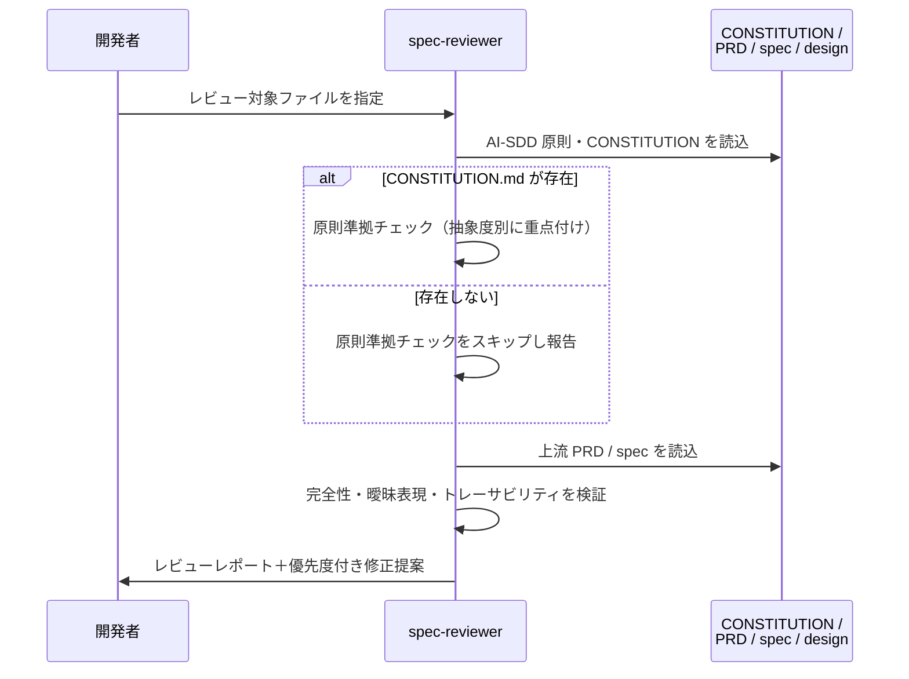

# 仕様・設計レビュー

**関連 Design Doc:** [spec-review_design.md](spec-review_design.md)
**関連 PRD:** [spec-review.md](../../requirement/spec-design/spec-review.md)（親: [spec-design](../../requirement/spec-design/index.md)）
**準拠する原則:** [CONSTITUTION.md](../../CONSTITUTION.md) B-001（Vibe Coding防止）, D-001（Specification-Driven）, D-002（ファイル命名規則の厳守）

---

# 1. 背景

AI-SDD ワークフローでは、PRD から抽象仕様書（`*_spec.md`）・技術設計書（`*_design.md`）へ段階的に
具体化することで AI 実装者へのガードレールを構築する。生成・更新された仕様書・設計書の品質が
低ければ、下流の実装品質も損なわれる。

本機能は、生成・更新された仕様書・設計書に対し、プロジェクト原則（CONSTITUTION）への準拠・
曖昧表現の有無・必須セクションの網羅性・上流ドキュメントとのトレーサビリティを検証し、
修正提案を生成する。これにより、実装フェーズに進む前にドキュメント品質を担保する。
[spec-review.md](../../requirement/spec-design/spec-review.md) の FR_001 を具体化する。

---

# 2. 概要

本機能は、レビュー対象の仕様書（`*_spec.md`）または技術設計書（`*_design.md`）を入力として、
以下 4 つの検証軸から品質を評価し、優先度付きの修正提案を含むレビューレポートを出力する。

## 2.1. 検証の 4 つの軸

| 検証軸               | 検証内容                                              | 対象         |
|:------------------|:----------------------------------------------------|:-----------|
| **CONSTITUTION準拠** | プロジェクト原則（B/A/D/T 系）への準拠を検証             | spec / design |
| **完全性**           | テンプレートの必須セクションが網羅されているかを検証         | spec / design |
| **曖昧表現**         | 実装可能性を減じる不明確な記述を検出                       | spec / design |
| **トレーサビリティ**   | PRD ↔ spec ↔ design の上流要求カバレッジと SysML 妥当性を検証 | spec / design |

## 2.2. 主要な設計原則

- **抽象度に応じた原則の使い分け**: 抽象仕様書（`*_spec.md`）はアーキテクチャ・開発手法原則を、
  技術設計書（`*_design.md`）は技術制約・アーキテクチャ原則を重点的に検証する
- **上流ドキュメントの優先**: PRD → spec → design の順で整合性を確認し、上流との不整合を優先的に指摘する
- **建設的なフィードバック**: 指摘の列挙に留まらず、意図を変えない範囲での具体的な修正提案を提示する
- **CONSTITUTION 不在時のグレースフルな縮退**: CONSTITUTION.md が存在しない場合は原則準拠チェックを
  スキップし、その旨を報告したうえで他の検証を継続する

---

# 3. 要求定義

## 3.1. 機能要件

| ID     | 要件                                                       | 優先度 | 根拠                                        |
|--------|:---------------------------------------------------------|:---:|:------------------------------------------|
| FR-001 | CONSTITUTION.md の原則への準拠を検証する                     | 必須 | プロジェクト原則違反を検出し実装品質を担保（B-001） |
| FR-002 | テンプレートの必須セクション欠落を検出する                    | 必須 | テンプレート準拠性を確認（D-002）             |
| FR-003 | 曖昧表現を検出し具体化を促す                                | 必須 | Vibe Coding を予防（B-001）                 |
| FR-004 | PRD ↔ spec ↔ design のトレーサビリティを検証する            | 必須 | 要求カバレッジを確認                         |
| FR-005 | SysML 記法（要求図・ユースケース図）の妥当性を検証する         | 必須 | 上流 PRD の記法整合を確認                    |
| FR-006 | 検証結果と優先度付き修正提案をレビューレポートとして出力する    | 必須 | 結果の可視化と対応優先順位の明確化            |

## 3.2. 非機能要件

| ID      | カテゴリ  | 要件                                                       | 目標値       |
|---------|:-------|:---------------------------------------------------------|:-----------|
| NFR-001 | 使いやすさ | レビュー結果を修正提案付きでレポートとして提示する              | 常に修正提案を含む |
| NFR-002 | 保守性   | 曖昧表現パターン・修正提案フローを参照ドキュメントとして外部化する | 参照ファイルで管理 |
| NFR-003 | 多言語対応 | レビュー出力言語を `SDD_LANG` に従わせる                     | EN / JA 一貫 |

---

# 4. 提供コンポーネント

本機能が提供するプラグインコンポーネント：

| 種別     | 配置場所                                       | 名前            | 概要                                          |
|:-------|:---------------------------------------------|:--------------|:--------------------------------------------|
| agent    | `agents/spec-reviewer.md`                    | spec-reviewer | `*_spec.md` / `*_design.md` の品質・原則準拠をレビューし修正提案を生成 |
| template | `agents/templates/{en,ja}/spec_review_output.md` | spec_review_output | レビュー結果レポートの出力フォーマット           |
| reference | `agents/references/ambiguity_patterns.md`   | ambiguity_patterns | 検出対象の曖昧表現パターンと欠落しやすい情報の定義 |
| reference | `agents/references/fix_proposal_flow.md`    | fix_proposal_flow | 原則違反検出時の修正提案生成フロー              |

> **スコープ注記**: front matter の形式・依存方向・id 一意性の検証は `front-matter-reviewer` エージェント
> （別機能）が担う。実装コードと設計書の整合性チェックは quality-guardrails カテゴリの `check-spec` が担う。
> 本機能はレビュー時にこれらを併用しうるが、それらの実装自体は本機能のスコープ外である。

## 4.1. 入出力定義

### spec-reviewer エージェント

| パラメータ         | 必須 | 説明                                                          |
|:---------------|:--:|:------------------------------------------------------------|
| ターゲットファイルパス | 必須 | `.sdd/specification/{feature}_spec.md` または `{feature}_design.md` |
| `--summary`     | 任意 | check-spec から呼び出される際の簡潔出力モード                     |

**出力**: レビュー結果レポート（CONSTITUTION 準拠評価、完全性チェック、曖昧表現の指摘、
トレーサビリティチェック結果、修正提案サマリー）を `SDD_LANG` に従った言語で出力する。

---

# 5. 用語集

| 用語                 | 説明                                                          |
|:-------------------|:------------------------------------------------------------|
| **CONSTITUTION**    | プロジェクト原則を定義したドキュメント（`.sdd/CONSTITUTION.md`）  |
| **曖昧表現**         | 実装可能性を減じる不明確な記述（「〜のような」「適切に」等）        |
| **トレーサビリティ** | PRD ↔ spec ↔ design 間の要求カバレッジ関係                    |
| **カバレッジ**       | 上流ドキュメントの要求 ID が下流でどれだけ扱われているかの割合     |
| **修正提案**         | レビュー指摘に対する、意図を変えない範囲での具体的な修正方法の提示 |

---

# 6. 使用例

```bash
# 抽象仕様書をレビューする
/sdd-workflow:spec-reviewer .sdd/specification/spec-design/clarify_spec.md

# 技術設計書をレビューする
/sdd-workflow:spec-reviewer .sdd/specification/spec-design/clarify_design.md

# check-spec から簡潔出力モードで呼び出す
/sdd-workflow:spec-reviewer .sdd/specification/auth/user-login_design.md --summary
```

期待される動作: CONSTITUTION.md と対象ファイル・上流ドキュメントを読み込み、4 つの検証軸で
評価したうえで、修正提案を含むレビューレポートをターミナルに出力する。

---

# 7. 振る舞い図

## 7.1. レビュー処理フロー



---

# 8. 制約事項

## 8.1. 機能的制約

- CONSTITUTION.md が存在しない場合、原則準拠チェックはスキップされ、その旨がレポートに明記される
- トレーサビリティ検証は、上流ドキュメントが front matter の `depends-on` または本文リンクで
  参照可能な場合に機能する
- 曖昧表現検出は `references/ambiguity_patterns.md` で定義されたパターンに基づく

## 8.2. 設計的制約

- 抽象仕様書のレビューではアーキテクチャ・開発手法原則を、技術設計書のレビューでは技術制約・
  アーキテクチャ原則を重点的に検証し、抽象度に応じて評価観点を変える
- 修正提案は「意図の変更を伴わない」範囲に限定する。アーキテクチャの再設計・技術選定の変更・
  ビジネスロジックの変更を要する場合は、手動修正またはユーザー確認を推奨する

---

# 9. 原則との整合性

| 原則ID  | 原則名                    | 本仕様への適用内容                                       |
|:------|:-------------------------|:------------------------------------------------------|
| B-001 | Vibe Coding防止           | 曖昧表現検出により、不明確な記述を実装前に検出・具体化を促す |
| D-001 | Specification-Driven      | 仕様書・設計書の品質を検証し、仕様駆動フローの品質ゲートを担う |
| D-002 | ファイル命名規則の厳守       | トレーサビリティ検証で `_spec` / `_design` サフィックスと構造を前提に上流を解決 |

---

# トレーサビリティ表

PRD の要求が本 Spec で確実にカバーされていることを確認：

| PRD 要求ID    | 出典        | 要求内容                                | Spec セクション            | カバー状況 |
|:------------|:----------|:--------------------------------------|:-----------------------|:------:|
| FR_001       | 子PRD       | 仕様・設計レビュー（品質と原則準拠の検証・修正提案） | 2. 概要 / 3.1 全 FR      | 🟢     |
| UR_003       | 親PRD index | 仕様・設計の品質保証                       | 1. 背景 / 2. 概要        | 🟢     |
| IR_001       | 親PRD index | 命名規則・テンプレート・front matter への準拠検証 | 3.1 FR-002 / 4. スコープ注記 | 🟢     |
| DC_001       | 親PRD index | 抽象度の分離（spec/design の観点別レビュー）    | 2.2 / 8.2 設計的制約     | 🟢     |

**カバレッジ: 100%**（子PRD の FR_001 は 6 つの機能要件に具体化して網羅）
