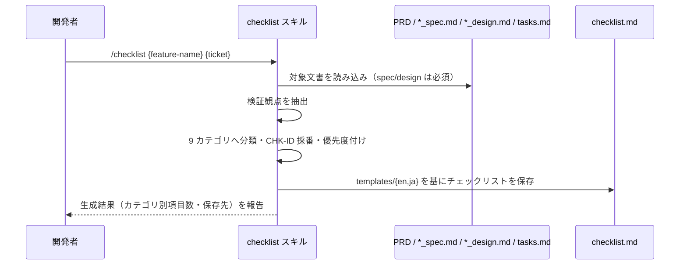

# チェックリスト生成

**関連 Design Doc:** [checklist-generation_design.md](checklist-generation_design.md)
**関連 PRD:** [checklist-generation.md](../../requirement/task-implementation/checklist-generation.md)（親: [task-implementation](../../requirement/task-implementation/index.md)）
**準拠する原則:** [CONSTITUTION.md](../../CONSTITUTION.md) B-001（Vibe Coding 防止）, B-002（多言語対応の一貫性）, D-001（Specification-Driven）, D-002（ファイル命名規則の厳守）

---

# 1. 背景

AI-SDD ワークフローでは、実装が仕様（真実の源）にトレースされていることを体系的に検証する必要がある。
検証観点を開発者の記憶や注意力に依存させると、要求の見落とし・品質のばらつきが生じ、
[CONSTITUTION.md](../../CONSTITUTION.md) の最上位原則 B-001（Vibe Coding 防止）に反する。

本機能は、仕様書・設計書・タスク分解の成果物から、構造化 ID とカテゴリを持つ品質保証チェックリストを
生成することで、検証観点を仕様から機械的に導出する。生成物はチェックリスト自動検証
（[run-checklist.md](../../requirement/task-implementation/run-checklist.md)）の入力となり、
実装品質の体系的な検証（親 PRD UR_003）を支える。

# 2. 概要

本機能は、対象機能の PRD・抽象仕様書（`*_spec.md`）・技術設計書（`*_design.md`）・タスク分解（tasks.md）を
読み込み、各文書から検証可能な観点を抽出して、構造化 ID・カテゴリ・優先度を持つチェックリストを生成する。
主要な設計原則は以下のとおり。

- **仕様からの導出**: チェックリスト項目は仕様・設計・タスクから抽出するものであり、AI が発明しない（B-001）
- **構造化 ID とカテゴリ**: 9 カテゴリに分類し、各項目へ `CHK-{category}{nn}` 形式の一意 ID を付与する
- **優先度付け**: 各項目を P1（マージ前必須）／P2（マージ前推奨）／P3（任意）に分類する
- **多言語対応**: 出力言語を `SDD_LANG` に従い切り替え、単一文書内で混在させない（B-002）

「何を抽出し、どのような構造でチェックリストを生成するか」を定義し、抽出ロジック・ID 採番方式・
テンプレート統合の具体的な実行方式は [checklist-generation_design.md](checklist-generation_design.md) に委ねる。

# 3. 要求定義

## 3.1. 機能要件 (Functional Requirements)

| ID     | 要件                                                                       | 優先度 | 根拠（上流要求）                     |
|--------|--------------------------------------------------------------------------|-----|-----------------------------------|
| FR-001 | PRD・`*_spec.md`・`*_design.md`・tasks.md から検証可能な観点を抽出する          | 必須  | 子 PRD FR_001 / 親 PRD UR_003     |
| FR-002 | 抽出した観点を 9 カテゴリに分類し、`CHK-{category}{nn}` 形式の構造化 ID を付与する | 必須  | 子 PRD FR_001                     |
| FR-003 | 各項目に優先度（P1/P2/P3）を付与する                                          | 必須  | 子 PRD FR_001                     |
| FR-004 | 生成したチェックリストを task ディレクトリ配下の `checklist.md` に保存する         | 必須  | 親 PRD IR_001                     |
| FR-005 | 既存チェックリストの更新（`--update`）で完了状態を保持しつつ差分を反映する          | 任意  | 子 PRD FR_001（保守利用）          |

抽出元のうち `*_spec.md` / `*_design.md` は必須、PRD と tasks.md は存在する場合に読み込む。
FR-002 の 9 カテゴリは、要求レビュー・仕様レビュー・設計レビュー・実装レビュー・テストレビュー・
ドキュメントレビュー・セキュリティレビュー・パフォーマンスレビュー・デプロイレビューとする（「5. 用語集」参照）。

## 3.2. 非機能要件 (Non-Functional Requirements)

| ID      | カテゴリ    | 要件                                                    | 目標値                          |
|---------|----------|-------------------------------------------------------|--------------------------------|
| NFR-001 | 一貫性    | ID（`CHK-101` 等）は更新をまたいで安定的に維持される              | 更新後も同一項目の ID を保持       |
| NFR-002 | 多言語    | 出力言語を `SDD_LANG` に従い切り替え、単一文書内で混在させない      | en / ja（原則 B-002）            |
| NFR-003 | 命名規則  | 入出力パスは AI-SDD 命名規則（`_spec` / `_design` サフィックス）に従う | requirement 無サフィックス（D-002） |

# 4. 提供コンポーネント

| 種別    | 配置場所                        | 名前        | 概要                                                                   |
|-------|-----------------------------|-----------|----------------------------------------------------------------------|
| skill | `skills/checklist/SKILL.md` | checklist | 仕様・設計・タスクを読み込み、構造化 ID つき品質チェックリストを生成するユーザー呼び出しスキル（FR-001〜005） |
| template | `skills/checklist/templates/{en,ja}/checklist_template.md` | checklist_template | チェックリスト出力の基底テンプレート（日英）（NFR-002） |

## 4.1. 入出力定義

### checklist スキル

**入力**:

| 引数            | 必須 | 説明                                                          |
|---------------|----|-------------------------------------------------------------|
| `feature-name` | 必須 | 対象機能名またはパス（例: `user-auth`, `auth/user-login`）             |
| `ticket-number` | 任意 | 出力ディレクトリ名。省略時は `feature-name` を使用                       |
| `--update`      | 任意 | 既存チェックリストを更新し、完了状態を保持したまま差分を反映する               |
| `--export`      | 任意 | `github-issues` / `csv` 形式でエクスポートする                      |

フラット構造・階層構造の双方に対応し、対象機能に対応する PRD・`*_spec.md`・`*_design.md`・tasks.md
（存在するもの）を読み込む。

**出力**: 9 カテゴリに分類された構造化 ID（`CHK-{category}{nn}`）・優先度（P1/P2/P3）・完了基準を持つ
チェックリスト文書。保存先は `${SDD_TASK_PATH}/{ticket}/checklist.md`。出力言語は `SDD_LANG` に従う。

# 5. 用語集

| 用語            | 説明                                                                                |
|---------------|-----------------------------------------------------------------------------------|
| 構造化 ID       | チェックリスト項目に付与する一意な識別子。`CHK-{category}{nn}` 形式（例: `CHK-101`）でカテゴリと連番から構成 |
| 9 カテゴリ       | 要求・仕様・設計・実装・テスト・ドキュメント・セキュリティ・パフォーマンス・デプロイの各レビュー観点               |
| 優先度（P1/P2/P3） | P1=マージ前必須 / P2=マージ前推奨 / P3=任意（nice to have）の 3 段階                          |
| チェックリスト      | 検証観点を項目化し完了状態を追跡する文書（`checklist.md`）                                       |
| 完了基準         | 各チェックリスト項目が満たされたと判定できる条件                                                   |

# 6. 使用例

```
/checklist user-auth TICKET-123               # 標準利用（ticket ディレクトリ指定）
/checklist task-management                    # feature 名を ticket ディレクトリとして使用
/checklist auth/user-login TICKET-789         # 階層構造の子機能を対象
/checklist user-auth TICKET-123 --update      # 既存チェックリストを更新（完了状態を保持）
/checklist user-auth TICKET-123 --export csv  # CSV としてエクスポート
```

# 7. 振る舞い図



# 8. 制約事項

- チェックリスト項目は仕様・設計・タスクから抽出するものであり、AI が発明してはならない（B-001）
- 一部の項目は手動検証を要する（すべてを自動検証できるわけではない）
- チェックリスト項目の自動検証は本機能のスコープ外
  （[run-checklist.md](../../requirement/task-implementation/run-checklist.md) で扱う）
- タスク分解・TDD 実装そのものは本機能のスコープ外
  （[task-breakdown.md](../../requirement/task-implementation/task-breakdown.md) /
  [implement.md](../../requirement/task-implementation/implement.md) で扱う）

# 9. 原則との整合性

| 原則ID  | 原則名                    | 本仕様への適用内容                                                       |
|-------|--------------------------|----------------------------------------------------------------------|
| B-001 | Vibe Coding 防止          | チェックリスト項目を仕様・設計から機械的に導出し、検証観点を暗黙の推測に委ねない          |
| B-002 | 多言語対応（EN/JA）の一貫性 | `templates/{en,ja}/` と `SDD_LANG` により出力言語を一貫して切り替える           |
| D-001 | Specification-Driven      | 仕様書・設計書を真実の源とし、そこから検証観点を抽出する                          |
| D-002 | ファイル命名規則の厳守      | requirement は無サフィックス、specification は `_spec`/`_design` を前提に入力を解決 |
