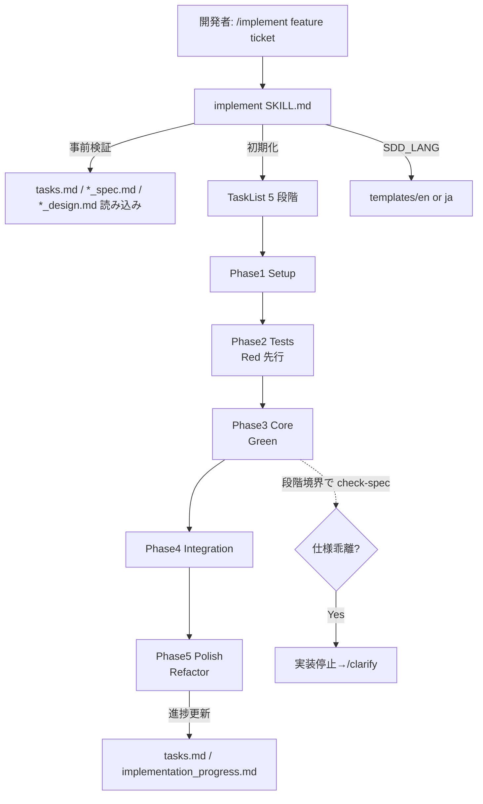

# TDD 実装

**関連 Spec:** [implement_spec.md](implement_spec.md)
**関連 PRD:** [implement.md](../../requirement/task-implementation/implement.md)（親: [task-implementation](../../requirement/task-implementation/index.md)）
**準拠する原則:** [CONSTITUTION.md](../../CONSTITUTION.md) A-001（Skills-First）, B-001, B-002, D-001, T-002（plugin.json 登録）, T-003（文字化け防止）

---

# 1. 実装ステータス

**ステータス:** 🟢 実装済み

本設計書は既存実装（`skills/implement/`）の挙動を逆算して記述したものである。
5 段階の構成・TDD サイクル・進捗管理（TaskList）・実行モード・入出力パス・テンプレート群は
実装（Markdown プロンプトおよび `references/` / `templates/{en,ja}/`）を真実の源とする。

> **逆算記述の経緯（正当化）**: implement スキルは AI-SDD ワークフローの初期構築時に実装が先行し、
> 本 spec/design はその後に機能仕様を明文化した逆算記述である。D-001（Specification-Driven）の原則に対し、
> 実装先行という経緯を [CONSTITUTION.md](../../CONSTITUTION.md) の例外プロセス（文書化・正当化・レビュー・追跡）
> に沿って本節に記録する。今後の変更は本 spec/design を真実の源として Specify → Plan → Tasks → Implement の
> フローに従う。

## 1.1. 実装進捗

| モジュール/機能         | ステータス | 備考                                                                 |
|----------------------|--------|----------------------------------------------------------------------|
| implement スキル       | 🟢     | `skills/implement/SKILL.md`（`user-invocable: true`、Bash・TaskList 系ツール使用可） |
| 段階・TDD 参照資料      | 🟢     | `skills/implement/references/`（five_phases_overview / tdd_principles / commit_strategy / test_types / tasklist_error_handling） |
| 出力テンプレート        | 🟢     | `skills/implement/templates/{en,ja}/`（phase_rules / tdd_cycle / phase_progress_tracking / continuous_verification / 各エラー等） |
| 実行モード例           | 🟢     | `skills/implement/examples/`（option_continue / option_phase_skip / option_dry_run / 各出力例） |
| plugin.json 登録       | 🟢     | `skills` はディレクトリ参照 `./skills` で自動登録（T-002）                    |

---

# 2. 設計目標

- 5 段階（Setup → Tests → Core → Integration → Polish）を**順序制約付き**で実行する（FR-001〜006）
- テスト（Tests）を実装（Core）より**先に強制**し、テストのない実装を排除する（FR-003 / DC_001）
- 各段階・各タスクの進捗を **TaskList で可視化**し、逐次更新する（FR-007 / NFR-003）
- 段階境界で **仕様との乖離を検出**し、乖離時は実装を止めて明確化を促す（FR-008 / B-001）
- 出力言語を `SDD_LANG` に従い切り替える（B-002 / NFR-002）

---

# 3. 実装方式

| 領域     | 採用方式                                                              | 選定理由                                                                          |
|--------|-------------------------------------------------------------------|-----------------------------------------------------------------------------|
| skill  | Markdown プロンプトスキル（`user-invocable: true`）                      | 実装は Claude の判断・生成を要する。A-001（Skills-First）に従いスキルとして実装             |
| ツール   | `Read/Write/Edit/Glob/Grep/Bash/AskUserQuestion/TaskCreate/TaskUpdate/TaskList/TaskGet` | テスト実行に Bash、進捗可視化に TaskList、曖昧時の確認に AskUserQuestion が必要             |
| 進捗管理 | TaskList（利用不可環境は Markdown フォールバック）                          | 5 段階の複数ステップ作業を `/tasks`・`Ctrl+T` で可視化（NFR-003）。エラー処理は references に定義 |
| 段階制御 | 5 段階を references/templates で定義し順序を強制                          | テストファースト（DC_001）を段階順序として担保。段階規則は `templates/{en,ja}/phase_rules.md` |
| 多言語   | `SDD_LANG` 環境変数 + `templates/{en,ja}/`                            | B-002 の一貫性要件。段階規則・TDD サイクル・エラー等をテンプレートで切り替える                   |

---

# 4. アーキテクチャ

## 4.1. システム構成図



## 4.2. モジュール分割

| モジュール名             | 責務                                                          | 依存関係            | 配置場所                                              |
|------------------------|-------------------------------------------------------------|-------------------|---------------------------------------------------|
| implement SKILL.md     | 事前検証・TaskList 初期化・5 段階実行・進捗更新・完了検証・報告          | SDD_LANG, SDD_*, TaskList | `plugins/sdd-workflow/skills/implement/SKILL.md`    |
| references/            | 5 段階概要・TDD 原則・コミット戦略・テスト種別・TaskList エラー処理       | -                 | `plugins/sdd-workflow/skills/implement/references/` |
| templates/{en,ja}/     | 段階規則・TDD サイクル・進捗追跡・継続検証・最終検証・各エラーの出力雛形      | SDD_LANG          | `plugins/sdd-workflow/skills/implement/templates/{en,ja}/` |
| examples/              | 入力形式・各実行モード・各段階/タスク完了出力の例                        | -                 | `plugins/sdd-workflow/skills/implement/examples/`   |

---

# 5. データ構造

## 5.1. 5 段階の定義（実装準拠）

`references/five_phases_overview.md` に基づく。

| 段階 | 段階名（実装原語）           | 目的                        | TDD アプローチ                        |
|:----|:-------------------------|:--------------------------|:------------------------------------|
| 1   | Setup (Foundation)       | ディレクトリ構造・型定義        | テスト環境を整備                        |
| 2   | Tests (Test-First)       | テストケース作成（Red）         | 失敗するテストを先に書く                 |
| 3   | Core (Core Implementation) | 主要機能の実装（Green）        | テストを通過する実装                     |
| 4   | Integration              | モジュール統合（Green）         | 統合テストを先に書いてから実装             |
| 5   | Polish (Finishing)       | リファクタ・ドキュメント（Refactor） | テストを維持しながらコードを改善            |

## 5.2. 実装ログ front matter（概念）

```yaml
id: "impl-{feature-name}"       # 階層時: "impl-{parent}-{feature-name}"
type: "implementation-log"
status: "in-progress"            # 完了時 "completed"
sdd-phase: "implement"
depends-on: ["design-{feature-name}"]
ticket: "{ticket-number}"
completed: ""                    # 完了時 "YYYY-MM-DD"
implementer: "{name}"
```

---

# 6. ファイル構成

```
plugins/sdd-workflow/
├── skills/implement/
│   ├── SKILL.md                             # ユーザー呼び出しスキル本体
│   ├── references/                          # five_phases_overview / tdd_principles /
│   │                                        #   commit_strategy / test_types / tasklist_error_handling
│   ├── templates/{en,ja}/                   # phase_rules / tdd_cycle / phase_progress_tracking /
│   │                                        #   continuous_verification / final_verification_checklist /
│   │                                        #   error_test_failure / error_spec_inconsistency ほか
│   └── examples/                            # input_format / option_* / output_* 各例
└── .claude-plugin/plugin.json               # skills は "./skills" 参照で自動登録（T-002）
```

implement スキルは実装・登録済みであり、本設計書は逆算文書である。
新規追加ではないため plugin.json の変更は発生しない（既存登録の維持を確認する）。

---

# 7. 非機能要件実現方針

| 要件                        | 実現方針                                                                      |
|---------------------------|------------------------------------------------------------------------------|
| NFR-001（トレーサビリティ）    | tasks.md の各タスクを段階へ対応づけ、段階境界で `/check-spec` を実行して乖離を早期検知     |
| NFR-002（多言語・一貫性）      | `SDD_LANG` に応じ `templates/{en,ja}/` を切り替え。日英で同等構成を維持（B-002）        |
| NFR-003（可視性）           | TaskList で 5 段階を管理し `/tasks`・`Ctrl+T` で可視化。利用不可時は Markdown で代替表示   |

---

# 8. テスト戦略

| テストレベル | 対象                            | カバレッジ目標                                        |
|:----------|:------------------------------|:----------------------------------------------------|
| 構文検証    | `skills/implement/`            | plugin-lint（プロンプト Markdown 構文・命名規則）が通ること      |
| 手動検証    | デモンストレーション                | 5 段階が順序どおり進み進捗が逐次更新されること（FR-001〜007）        |
| 整合性確認  | 段階境界                        | `/check-spec {feature}` で仕様との乖離が検出できること（FR-008） |

---

# 9. 設計判断

## 9.1. 決定事項

| 決定事項            | 選択肢                        | 決定内容                              | 理由                                                          |
|-------------------|-----------------------------|-------------------------------------|---------------------------------------------------------------|
| テスト先行の担保     | 推奨に留める / 段階順序で強制      | Tests を Core より前段に固定           | 順序を段階として固定し、テストのない実装への進行を防ぐ（DC_001）           |
| 進捗管理手段         | Markdown のみ / TaskList      | TaskList（利用不可時 Markdown 代替）    | 5 段階の複数ステップを可視化しユーザーが進捗を追跡できる（NFR-003）         |
| Bash 権限          | 禁止 / 許可                    | 許可                                 | テスト実行・型チェック等の検証コマンドに Bash が必要                       |
| 乖離検出の位置       | 完了後のみ / 段階境界           | 段階境界で check-spec を推奨            | 早期に乖離を検知し手戻りを抑える（FR-008 / B-001）                       |
| 実行モード          | 単一モードのみ / 複数モード        | continue / phase-skip / dry-run を提供 | 中断再開・特定段階着手・非破壊シミュレーションの実運用ニーズに対応             |

## 9.2. 未解決の課題

| 課題                                | 影響度 | 対応方針                                              |
|-----------------------------------|-----|-------------------------------------------------------|
| phase-skip 使用時のテスト先行担保の弱まり | 中   | 慎重使用を明記。スキップ時は前段の完了確認を促す                  |
| 実装品質の基盤モデル依存              | 中   | TDD 原則・段階規則テンプレートを精緻化。品質退行は CI テストで検知     |

---

# 10. 原則準拠チェックリスト

| 原則ID  | 原則名                    | 準拠状況 | 備考                                                       |
|-------|--------------------------|--------|------------------------------------------------------------|
| A-001 | Skills-First              | ✅     | `skills/implement/` として実装（legacy commands 不使用）        |
| B-001 | Vibe Coding 防止          | ✅     | 段階境界で乖離検出、曖昧時は実装停止し明確化を促す                    |
| B-002 | 多言語対応（EN/JA）の一貫性 | ✅     | `templates/{en,ja}/` と `SDD_LANG` による出力言語切り替え          |
| D-001 | Specification-Driven      | ✅     | tasks.md・設計書・仕様を真実の源として実装を進める                    |
| T-002 | plugin.json 登録の徹底     | ✅     | `./skills` 参照で自動登録済み                                   |
| T-003 | 日本語出力の文字化け防止     | ✅     | 日本語テンプレート・本設計書に U+FFFD / mojibake を含めない            |

**原則から逸脱する場合**: 理由を「9.1. 決定事項」に明記し、CONSTITUTION.md の例外プロセスに従うこと。
