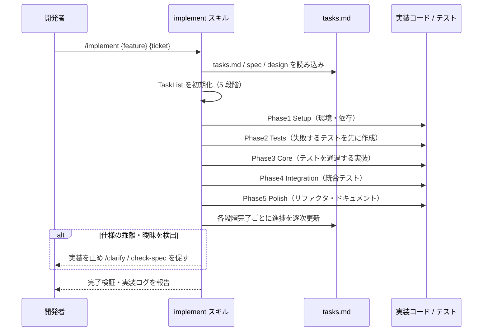

# TDD 実装

**関連 Design Doc:** [implement_design.md](implement_design.md)
**関連 PRD:** [implement.md](../../requirement/task-implementation/implement.md)（親: [task-implementation](../../requirement/task-implementation/index.md)）
**準拠する原則:** [CONSTITUTION.md](../../CONSTITUTION.md) B-001（Vibe Coding 防止）, B-002（多言語対応の一貫性）, D-001（Specification-Driven）

---

# 1. 背景

AI-SDD ワークフローの Implement フェーズでは、実装が常に仕様（真実の源）にトレースされ、
テストによって裏付けられている状態を保つ必要がある（親 PRD UR_002）。
テストのない実装や、仕様にない機能の推測実装を許容すると、
[CONSTITUTION.md](../../CONSTITUTION.md) の最上位原則 B-001（Vibe Coding 防止）に反する。

本機能は、タスク分解の成果物 tasks.md を入力とし、5 段階の TDD プロセス
（Setup → Tests → Core → Integration → Polish）に沿って段階的に実装を進める。
各段階の完了に応じてチェックリスト進捗を逐次更新し、実装のトレーサビリティを維持する。

# 2. 概要

本機能は、tasks.md のタスクを 5 段階の TDD プロセスで実装し、各段階の完了時にチェックリスト進捗を
更新する。主要な設計原則は以下のとおり。

- **テストファースト**: 実装（Core 段階）に先立ちテスト（Tests 段階）を作成する順序を強制する（親 PRD DC_001）
- **段階的実装**: Setup → Tests → Core → Integration → Polish の 5 段階を順に進める
- **進捗の逐次更新**: 各タスク・各段階の完了をタスク管理（TaskList）とチェックリストへ反映する
- **仕様準拠の維持**: 段階境界で仕様との乖離を検出し、乖離時は実装を止めて明確化を促す（B-001 / D-001）

「どの段階で何を実施し、どのようにトレーサビリティを保つか」を定義し、TDD サイクルの具体的な手順・
進捗管理の実行方式・エラー処理は [implement_design.md](implement_design.md) に委ねる。

# 3. 要求定義

## 3.1. 機能要件 (Functional Requirements)

| ID     | 要件                                                                      | 優先度 | 根拠（上流要求）                       |
|--------|-------------------------------------------------------------------------|-----|--------------------------------------|
| FR-001 | tasks.md を入力とし、5 段階の TDD プロセスで段階的に実装する                        | 必須  | 子 PRD FR_001 / 親 PRD UR_002       |
| FR-002 | Setup 段階で実装環境・依存関係をセットアップする                                    | 必須  | 子 PRD FR_001_01                    |
| FR-003 | Tests 段階で仕様に基づくテストを実装より先に作成する                                | 必須  | 子 PRD FR_001_02 / 親 PRD DC_001    |
| FR-004 | Core 段階でテストを通過するコア機能を実装する                                     | 必須  | 子 PRD FR_001_03                    |
| FR-005 | Integration 段階で既存コードと統合し統合テストを通過させる                          | 必須  | 子 PRD FR_001_04                    |
| FR-006 | Polish 段階でリファクタリング・ドキュメント整備を行う                              | 必須  | 子 PRD FR_001_05                    |
| FR-007 | 各段階・各タスクの完了に応じてチェックリスト進捗を逐次更新する                         | 必須  | 子 PRD FR_001 / 親 PRD UR_002       |
| FR-008 | 仕様が曖昧・多義的な場合は実装を止め、明確化（`/clarify`）を促す                       | 必須  | 親 PRD B-001                        |

FR-003 のテストファーストは順序制約であり、テストのない Core 段階への進行を許容しない（親 PRD DC_001）。
継続実行（continue）・段階スキップ（phase skip）・ドライラン（dry run）の実行モードを提供する。

## 3.2. 非機能要件 (Non-Functional Requirements)

| ID      | カテゴリ      | 要件                                                     | 目標値                          |
|---------|------------|--------------------------------------------------------|--------------------------------|
| NFR-001 | トレーサビリティ | 実装が tasks.md・設計書・仕様に常にトレースされる状態を保つ           | 各タスクにテスト／検証手順が対応       |
| NFR-002 | 多言語      | 出力言語を `SDD_LANG` に従い切り替え、単一文書内で混在させない         | en / ja（原則 B-002）            |
| NFR-003 | 可視性      | 5 段階の進捗を TaskList で可視化する（利用不可環境は Markdown で代替） | `/tasks` / `Ctrl+T` で確認可能   |

# 4. 提供コンポーネント

| 種別    | 配置場所                       | 名前      | 概要                                                                     |
|-------|----------------------------|---------|------------------------------------------------------------------------|
| skill | `skills/implement/SKILL.md` | implement | tasks.md を入力に 5 段階 TDD で実装し進捗を更新するユーザー呼び出しスキル（FR-001〜008） |
| template | `skills/implement/templates/{en,ja}/` | implement templates | 段階規則・TDD サイクル・進捗追跡・検証・エラー等の出力テンプレート群（日英）（NFR-002） |

## 4.1. 入出力定義

### implement スキル

**入力**:

| 引数            | 必須 | 説明                                                          |
|---------------|----|-------------------------------------------------------------|
| `feature-name` | 必須 | 対象機能名またはパス（例: `user-auth`, `auth/user-login`）             |
| `ticket-number` | 任意 | タスクディレクトリ名。省略時は `feature-name` を使用                     |
| `--continue`    | 任意 | 中断した実装を再開する（continue モード）                             |
| `--phase`       | 任意 | 特定段階へスキップする（phase skip モード。慎重に使用）                   |
| `--dry-run`     | 任意 | 変更を加えず実装をシミュレートする（dry run モード）                     |

前提として `tasks.md`・`*_design.md`・`*_spec.md` が存在すること。

**出力**: 実装コード（TDD サイクルに基づく）、更新された tasks.md 進捗、実装ログ
（`implementation_progress.md` / front matter 付き実装ログ）。出力言語は `SDD_LANG` に従う。

# 5. 用語集

| 用語            | 説明                                                                             |
|---------------|--------------------------------------------------------------------------------|
| TDD 5 段階      | Setup → Tests → Core → Integration → Polish の段階的実装プロセス                       |
| テストファースト   | 実装（Core）より先にテスト（Tests）を作成する順序制約（親 PRD DC_001）                       |
| RED-GREEN-REFACTOR | 失敗するテストを書き（Red）、通過させ（Green）、改善する（Refactor）TDD サイクル               |
| チェックリスト進捗  | tasks.md 内の各タスク完了状態。段階完了に応じて逐次更新される                                 |
| continue モード | 中断した実装を進捗ログから再開するモード                                                  |

# 6. 使用例

```
/implement user-auth TICKET-123               # tasks.md に基づき 5 段階 TDD で実装
/implement task-management                    # feature 名を ticket ディレクトリとして使用
/implement user-auth TICKET-123 --continue    # 中断した実装を再開
/implement user-auth TICKET-123 --phase core  # Core 段階へスキップ（慎重に使用）
/implement user-auth TICKET-123 --dry-run     # 変更せず実装をシミュレート
```

# 7. 振る舞い図



# 8. 制約事項

- テストのない実装段階への進行を許容してはならない（親 PRD DC_001 / テストファースト）
- 仕様・設計に定義のない機能を推測により追加してはならない（B-001）
- タスク分解そのもの、チェックリストの生成・自動検証、実装完了後のタスクログ整理は本機能のスコープ外
  （[task-breakdown.md](../../requirement/task-implementation/task-breakdown.md) /
  [checklist-generation.md](../../requirement/task-implementation/checklist-generation.md) /
  [run-checklist.md](../../requirement/task-implementation/run-checklist.md) /
  [task-cleanup.md](../../requirement/task-implementation/task-cleanup.md) で扱う）
- バージョン管理操作（コミット・PR 作成等）はプロジェクト運用・他ツールに委ねる
- 実装品質は基盤モデルの能力および仕様書・設計書の明確度に依存する

# 9. 原則との整合性

| 原則ID  | 原則名                    | 本仕様への適用内容                                                       |
|-------|--------------------------|----------------------------------------------------------------------|
| B-001 | Vibe Coding 防止          | 仕様の曖昧・多義を検出したら実装を止め明確化を促し、推測実装を排除する               |
| B-002 | 多言語対応（EN/JA）の一貫性 | 段階規則・TDD サイクル等のテンプレートを日英で維持し `SDD_LANG` で切り替える         |
| D-001 | Specification-Driven      | tasks.md・設計書・仕様を真実の源とし、実装を常にトレース可能に保つ                   |
