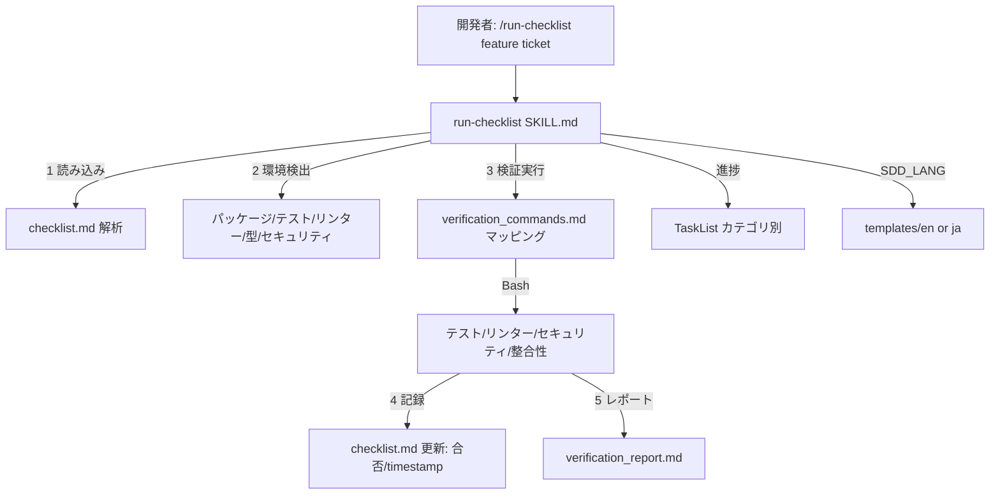

# チェックリスト自動検証

**関連 Spec:** [run-checklist_spec.md](run-checklist_spec.md)
**関連 PRD:** [run-checklist.md](../../requirement/task-implementation/run-checklist.md)（親: [task-implementation](../../requirement/task-implementation/index.md)）
**準拠する原則:** [CONSTITUTION.md](../../CONSTITUTION.md) A-001（Skills-First）, A-002（責務分離）, B-001, B-002, D-001, T-002（plugin.json 登録）, T-003（文字化け防止）

---

# 1. 実装ステータス

**ステータス:** 🟢 実装済み

本設計書は既存実装（`skills/run-checklist/`）の挙動を逆算して記述したものである。
処理フロー（読み込み → 環境検出 → 検証実行 → 結果記録 → レポート生成）・カテゴリ別自動検証度・
実行モデル（`agent: haiku`）・入出力パス・テンプレート群は実装（Markdown プロンプトおよび
`references/verification_commands.md` / `templates/{en,ja}/`）を真実の源とする。

> **逆算記述の経緯（正当化）**: run-checklist スキルは AI-SDD ワークフローの初期構築時に実装が先行し、
> 本 spec/design はその後に機能仕様を明文化した逆算記述である。D-001（Specification-Driven）の原則に対し、
> 実装先行という経緯を [CONSTITUTION.md](../../CONSTITUTION.md) の例外プロセス（文書化・正当化・レビュー・追跡）
> に沿って本節に記録する。今後の変更は本 spec/design を真実の源として Specify → Plan → Tasks → Implement の
> フローに従う。

## 1.1. 実装進捗

| モジュール/機能          | ステータス | 備考                                                                |
|-----------------------|--------|---------------------------------------------------------------------|
| run-checklist スキル     | 🟢     | `skills/run-checklist/SKILL.md`（`user-invocable: true`、`agent: haiku`、Bash・TaskList 系ツール使用可） |
| 検証コマンドマッピング     | 🟢     | `skills/run-checklist/references/verification_commands.md`             |
| 出力テンプレート         | 🟢     | `skills/run-checklist/templates/{en,ja}/`（result_format / report_format / tasklist_patterns） |
| plugin.json 登録         | 🟢     | `skills` はディレクトリ参照 `./skills` で自動登録（T-002）                  |

---

# 2. 設計目標

- `checklist.md` を解析し CHK-ID・優先度・検証コマンドを**確実に抽出**する（FR-001）
- 対象プロジェクトの環境を**検出**し、導入済みツールでのみ検証を実行する（FR-002 / NFR-003）
- カテゴリ別の**自動検証度**に応じて検証手段を選ぶ（FR-003）
- あるテストが失敗しても**継続**し、結果を記録する（NFR-001）
- 検証結果を **checklist.md と verification_report.md へ記録**する（FR-004）
- 出力言語を `SDD_LANG` に従い切り替える（B-002 / NFR-002）

---

# 3. 実装方式

| 領域     | 採用方式                                                              | 選定理由                                                                          |
|--------|-------------------------------------------------------------------|-----------------------------------------------------------------------------|
| skill  | Markdown プロンプトスキル（`user-invocable: true`、`agent: haiku`）        | 検証実行はコマンド駆動で判断が比較的定型。軽量モデル（haiku）でコスト効率よく実行。A-001 に従いスキルとして実装 |
| ツール   | `Read/Write/Edit/Glob/Grep/Bash/TaskCreate/TaskUpdate/TaskList/TaskGet` | テスト・リンター・セキュリティ実行に Bash、検証進捗の可視化に TaskList が必要                 |
| コマンド解決 | `references/verification_commands.md` のマッピング表              | 検証コマンドを参照資料に外出しし、決定的なマッピングと保守性を確保（A-002）                    |
| 検証度制御 | CHK-ID カテゴリごとに Yes/Partial を判定                              | 自動化可能な範囲を明示し、Partial 項目は補助手段（型チェック・整合性チェック等）に委ねる            |
| 多言語   | `SDD_LANG` 環境変数 + `templates/{en,ja}/`                            | B-002 の一貫性要件。結果・レポート形式をテンプレートで切り替える                              |

---

# 4. アーキテクチャ

## 4.1. システム構成図



## 4.2. モジュール分割

| モジュール名                | 責務                                                          | 依存関係            | 配置場所                                                |
|--------------------------|-------------------------------------------------------------|-------------------|-----------------------------------------------------|
| run-checklist SKILL.md   | 読み込み・環境検出・検証実行・結果記録・レポート生成・報告               | SDD_LANG, SDD_*, TaskList | `plugins/sdd-workflow/skills/run-checklist/SKILL.md`  |
| verification_commands    | カテゴリ別検証コマンドのマッピング表                                 | -                 | `plugins/sdd-workflow/skills/run-checklist/references/` |
| templates/{en,ja}/       | 検証結果・レポート・TaskList パターンの出力雛形（日英）                 | SDD_LANG          | `plugins/sdd-workflow/skills/run-checklist/templates/{en,ja}/` |

---

# 5. データ構造

## 5.1. カテゴリ別自動検証度（実装準拠）

| カテゴリ（CHK-xxx）      | 自動検証度 | 検証手段                              |
|:----------------------|:--------|:------------------------------------|
| Requirements (1xx)    | Partial | `/check-spec` による仕様整合性チェック     |
| Specification (2xx)   | Partial | 型チェック・API シグネチャ検証             |
| Design (3xx)          | Partial | 依存関係分析・アーキテクチャチェック         |
| Implementation (4xx)  | Yes     | リンター・静的解析                        |
| Testing (5xx)         | Yes     | テスト実行・カバレッジ測定                  |
| Documentation (6xx)   | Partial | ドキュメントカバレッジツール               |
| Security (7xx)        | Yes     | セキュリティスキャナー・audit コマンド       |
| Performance (8xx)     | Partial | ベンチマークツール（設定時）                |
| Deployment (9xx)      | Partial | 設定検証                                |

## 5.2. 環境検出対象（実装準拠）

| 検出対象           | 判定方法                                    |
|:-----------------|:------------------------------------------|
| パッケージマネージャ  | `package.json` / `Cargo.toml` 等の存在確認     |
| テストフレームワーク  | 設定ファイル解析（jest / pytest 等）             |
| リンター           | `.eslintrc` / `ruff.toml` 等の存在確認         |
| 型チェッカー        | `tsconfig.json` / `mypy.ini` 等の存在確認      |
| セキュリティスキャナー | audit コマンドの利用可否                        |

## 5.3. 検証結果ブロック（概念）

```markdown
- [x] CHK-501: {項目タイトル} [P1]
  - Status: PASS | FAIL | SKIPPED
  - Verified: {timestamp}
  - Command: `{実行コマンド}`
  - Output: {出力要約}   # SKIPPED 時は理由と導入提案
```

---

# 6. ファイル構成

```
plugins/sdd-workflow/
├── skills/run-checklist/
│   ├── SKILL.md                                # ユーザー呼び出しスキル本体（agent: haiku）
│   ├── references/verification_commands.md     # カテゴリ別検証コマンドマッピング
│   └── templates/{en,ja}/                      # result_format / report_format / tasklist_patterns
└── .claude-plugin/plugin.json                  # skills は "./skills" 参照で自動登録（T-002）
```

run-checklist スキルは実装・登録済みであり、本設計書は逆算文書である。
新規追加ではないため plugin.json の変更は発生しない（既存登録の維持を確認する）。

---

# 7. 非機能要件実現方針

| 要件                       | 実現方針                                                                       |
|--------------------------|------------------------------------------------------------------------------|
| NFR-001（堅牢性）          | テスト失敗時は失敗詳細を記録し、他カテゴリの検証を継続する（result_format の失敗詳細形式）     |
| NFR-002（多言語・一貫性）    | `SDD_LANG` に応じ `templates/{en,ja}/` を切り替え。日英で同等構成を維持（B-002）        |
| NFR-003（環境非依存性）     | 未導入ツールは `Status: SKIPPED`（理由・導入提案付き）で記録し、異常終了させない             |

---

# 8. テスト戦略

| テストレベル | 対象                              | カバレッジ目標                                       |
|:----------|:--------------------------------|:---------------------------------------------------|
| 構文検証    | `skills/run-checklist/`          | plugin-lint（プロンプト Markdown 構文・命名規則）が通ること       |
| 手動検証    | デモンストレーション                  | checklist 解析・環境検出・検証実行・結果記録が機能すること（FR-001〜004） |
| 整合性確認  | 更新後の `checklist.md`・レポート    | CHK-ID ごとに合否・SKIPPED が正しく記録されること                 |

---

# 9. 設計判断

## 9.1. 決定事項

| 決定事項            | 選択肢                        | 決定内容                              | 理由                                                          |
|-------------------|-----------------------------|-------------------------------------|---------------------------------------------------------------|
| 実行モデル          | 既定モデル / haiku            | `agent: haiku`                       | 検証はコマンド駆動で判断が比較的定型。軽量モデルでコスト効率を優先            |
| 検証コマンド定義     | SKILL.md 内に直書き / 参照外出し | `references/verification_commands.md` へ外出し | マッピングの決定性・保守性を確保し SKILL.md を簡潔に保つ（A-002）           |
| 失敗時の挙動         | 即中断 / 継続                 | 継続（失敗を記録して次へ）              | 1 項目の失敗で全体を止めず、全体の品質状況を把握する（NFR-001）             |
| 未導入ツールの扱い    | エラー / SKIPPED             | SKIPPED（理由・導入提案付き）           | 環境依存を許容し、対象プロジェクトのツール構成に依存しない（NFR-003）         |
| 進捗管理手段         | なし / TaskList               | TaskList でカテゴリ別に管理             | 検証カテゴリごとの進捗を可視化する                                    |

## 9.2. 未解決の課題

| 課題                                   | 影響度 | 対応方針                                          |
|--------------------------------------|-----|---------------------------------------------------|
| Partial カテゴリの自動化度の向上           | 中   | 型チェック・整合性チェックの適用範囲を拡充。意味論的検証は限界あり     |
| セキュリティスキャナーの追加セットアップ依存    | 低   | npm audit / safety 等の前提を明記し SKIPPED で握りつぶさない  |

---

# 10. 原則準拠チェックリスト

| 原則ID  | 原則名                    | 準拠状況 | 備考                                                       |
|-------|--------------------------|--------|------------------------------------------------------------|
| A-001 | Skills-First              | ✅     | `skills/run-checklist/` として実装（legacy commands 不使用）     |
| A-002 | フックとスクリプトの責務分離   | ✅     | 検証コマンドマッピングを references に外出しし決定性を確保            |
| B-001 | Vibe Coding 防止          | ✅     | 品質判定を客観的な検証結果で行い主観依存を排除                       |
| B-002 | 多言語対応（EN/JA）の一貫性 | ✅     | `templates/{en,ja}/` と `SDD_LANG` による出力言語切り替え          |
| D-001 | Specification-Driven      | ✅     | 仕様由来のチェックリストを検証対象とし仕様準拠を検証                   |
| T-002 | plugin.json 登録の徹底     | ✅     | `./skills` 参照で自動登録済み                                   |
| T-003 | 日本語出力の文字化け防止     | ✅     | 日本語テンプレート・本設計書に U+FFFD / mojibake を含めない            |

**原則から逸脱する場合**: 理由を「9.1. 決定事項」に明記し、CONSTITUTION.md の例外プロセスに従うこと。
