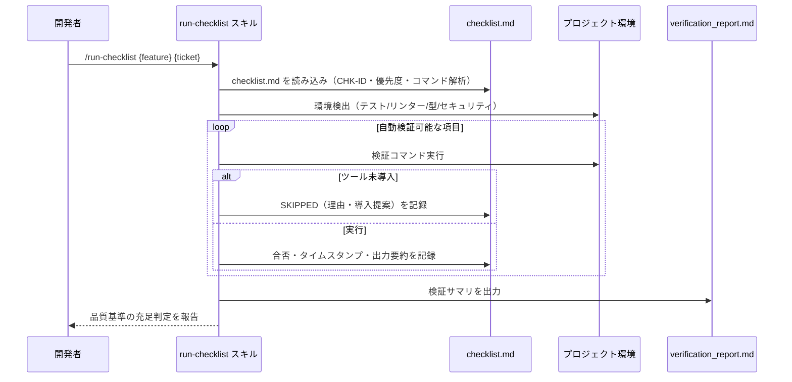

# チェックリスト自動検証

**関連 Design Doc:** [run-checklist_design.md](run-checklist_design.md)
**関連 PRD:** [run-checklist.md](../../requirement/task-implementation/run-checklist.md)（親: [task-implementation](../../requirement/task-implementation/index.md)）
**準拠する原則:** [CONSTITUTION.md](../../CONSTITUTION.md) B-001（Vibe Coding 防止）, B-002（多言語対応の一貫性）, D-001（Specification-Driven）

---

# 1. 背景

チェックリスト生成（[checklist-generation.md](../../requirement/task-implementation/checklist-generation.md)）が
出力した検証観点は、実際に検証されて初めて品質保証の価値を持つ。検証を手作業に委ねると、
実行漏れ・結果の記録漏れが生じ、実装品質の体系的な検証（親 PRD UR_003）が損なわれる。

本機能は、生成済みチェックリスト項目を、テスト実行・リンター・セキュリティスキャナー・
仕様整合性チェックにより自動検証し、品質基準の充足を判定して検証結果（合否・根拠）を記録する。

# 2. 概要

本機能は、`checklist.md` を読み込み、対象プロジェクトの環境（パッケージマネージャ・テストフレームワーク・
リンター・型チェッカー・セキュリティスキャナー）を検出したうえで、自動検証可能な項目に対して検証コマンドを
実行し、結果をチェックリストと検証レポートへ記録する。主要な設計原則は以下のとおり。

- **カテゴリ別の自動検証度**: CHK-ID のカテゴリに応じて自動検証可否（Yes / Partial）を判定する
- **環境依存の明示**: 検証ツールは対象プロジェクトに導入済みのものに依存し、本機能はツール自体を提供しない
- **結果の記録**: 合否・タイムスタンプ・コマンド出力要約をチェックリストへ反映し、レポートを生成する
- **失敗時の継続**: あるテストが失敗しても記録して他の検証を継続し、未導入ツールは SKIPPED として記録する

「何を検証し、結果をどう記録・判定するか」を定義し、環境検出・コマンドマッピング・進捗管理の具体的な実行方式は
[run-checklist_design.md](run-checklist_design.md) に委ねる。

# 3. 要求定義

## 3.1. 機能要件 (Functional Requirements)

| ID     | 要件                                                                        | 優先度 | 根拠（上流要求）                       |
|--------|---------------------------------------------------------------------------|-----|--------------------------------------|
| FR-001 | `checklist.md` を読み込み、CHK-ID・優先度・検証コマンドを解析する                   | 必須  | 子 PRD FR_001 / 親 PRD UR_003       |
| FR-002 | 対象プロジェクトの環境（テスト・リンター・型・セキュリティ）を検出する                    | 必須  | 子 PRD FR_001 / 親 PRD 5.1 技術的制約 |
| FR-003 | 自動検証可能な項目に対しテスト・リンター・セキュリティ・仕様整合性チェックを実行する         | 必須  | 子 PRD FR_001                        |
| FR-004 | 品質基準の充足を判定し、検証結果（合否・根拠）をチェックリストとレポートへ記録する            | 必須  | 子 PRD FR_001 / 親 PRD UR_003       |
| FR-005 | カテゴリ（`--category`）・優先度（`--priority`）で検証対象を絞り込む                  | 任意  | 子 PRD FR_001（運用利便）            |

FR-003 のカテゴリ別自動検証度は、実装（4xx）・テスト（5xx）・セキュリティ（7xx）を Yes、
要求（1xx）・仕様（2xx）・設計（3xx）・ドキュメント（6xx）・パフォーマンス（8xx）・デプロイ（9xx）を
Partial として扱う（詳細は Design Doc）。

## 3.2. 非機能要件 (Non-Functional Requirements)

| ID      | カテゴリ      | 要件                                                       | 目標値                          |
|---------|------------|----------------------------------------------------------|--------------------------------|
| NFR-001 | 堅牢性      | あるテストが失敗しても記録して他の検証を継続する                    | 失敗で全体停止しない               |
| NFR-002 | 多言語      | 出力言語を `SDD_LANG` に従い切り替え、単一文書内で混在させない         | en / ja（原則 B-002）            |
| NFR-003 | 環境非依存性 | 未導入ツールは `SKIPPED`（理由・導入提案付き）として記録する           | ツール未導入で異常終了しない        |

# 4. 提供コンポーネント

| 種別    | 配置場所                          | 名前          | 概要                                                                   |
|-------|-------------------------------|-------------|----------------------------------------------------------------------|
| skill | `skills/run-checklist/SKILL.md` | run-checklist | `checklist.md` を読み込み検証コマンドを実行し結果を記録するユーザー呼び出しスキル（FR-001〜005） |
| reference | `skills/run-checklist/references/verification_commands.md` | verification_commands | 検証コマンドマッピング表 |
| template | `skills/run-checklist/templates/{en,ja}/` | run-checklist templates | 結果・レポート・TaskList パターンの出力テンプレート（日英）（NFR-002） |

## 4.1. 入出力定義

### run-checklist スキル

**入力**:

| 引数            | 必須 | 説明                                                          |
|---------------|----|-------------------------------------------------------------|
| `feature-name` | 必須 | 対象機能名またはパス（例: `user-auth`, `auth/user-login`）             |
| `ticket-number` | 任意 | タスクディレクトリ名。省略時は `feature-name` を使用                     |
| `--category`    | 任意 | 特定カテゴリのみ検証（例: `--category testing`）                      |
| `--priority`    | 任意 | 特定優先度のみ検証（例: `--priority P1`）                            |

前提として `${SDD_TASK_PATH}/{ticket}/checklist.md` が存在すること。

**出力**: 検証状態を反映して更新された `checklist.md`（`[x]`/`[ ]`・タイムスタンプ・出力要約）と、
`verification_report.md`（検証サマリ）。出力言語は `SDD_LANG` に従う。

# 5. 用語集

| 用語            | 説明                                                                             |
|---------------|--------------------------------------------------------------------------------|
| 自動検証可否      | CHK-ID のカテゴリごとに定めた、自動検証が可能（Yes）か部分的（Partial）かの区分            |
| 検証コマンド      | チェックリスト項目のコードブロックから抽出する、実行対象のテスト・リンター等のコマンド         |
| SKIPPED       | 検証ツールが未導入のためスキップした状態。理由と導入提案を併記する                          |
| 検証レポート      | 検証結果のサマリを記録する文書（`verification_report.md`）                            |
| 品質基準の充足判定  | 検証結果に基づき、実装が品質基準を満たすか（合否）を判定すること                            |

# 6. 使用例

```
/run-checklist user-auth TICKET-123                      # checklist.md 全項目を自動検証
/run-checklist user-auth                                 # feature 名を ticket ディレクトリとして使用
/run-checklist user-auth TICKET-123 --category testing   # テストカテゴリのみ検証
/run-checklist user-auth TICKET-123 --priority P1        # P1 項目のみ検証（コミット前の簡易確認）
```

# 7. 振る舞い図



# 8. 制約事項

- 検証に用いるテスト・リンター・セキュリティスキャナーは対象プロジェクト導入済みツールに依存する
  （本機能はツール自体を提供しない。親 PRD 5.1 技術的制約）
- すべてのチェックリスト項目を自動検証できるわけではなく、一部は手動検証を要する
- チェックリストの生成そのもの、TDD 実装そのもの、実装と設計書の乖離検出は本機能のスコープ外
  （[checklist-generation.md](../../requirement/task-implementation/checklist-generation.md) /
  [implement.md](../../requirement/task-implementation/implement.md) /
  quality-guardrails カテゴリの check-spec で扱う）
- CI 環境でのテスト実行基盤の提供は対象プロジェクトの CI 構成に委ねる

# 9. 原則との整合性

| 原則ID  | 原則名                    | 本仕様への適用内容                                                       |
|-------|--------------------------|----------------------------------------------------------------------|
| B-001 | Vibe Coding 防止          | 品質基準の充足を客観的な検証結果（合否・根拠）で判定し、主観的判断への依存を排除する    |
| B-002 | 多言語対応（EN/JA）の一貫性 | 結果・レポートテンプレートを日英で維持し `SDD_LANG` で切り替える                    |
| D-001 | Specification-Driven      | 仕様から生成されたチェックリストを検証対象とし、実装の仕様準拠を検証する               |
