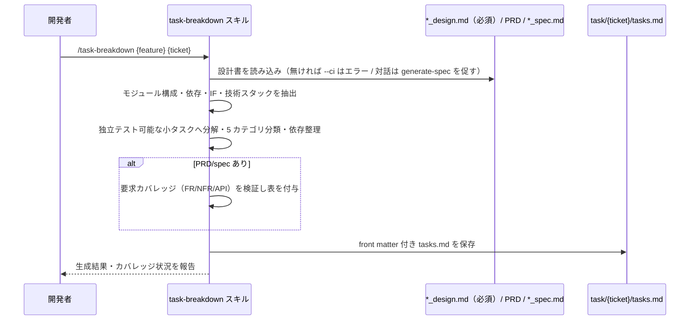

# タスク分解

**関連 Design Doc:** [task-breakdown_design.md](task-breakdown_design.md)
**関連 PRD:** [task-breakdown.md](../../requirement/task-implementation/task-breakdown.md)（親: [task-implementation](../../requirement/task-implementation/index.md)）
**準拠する原則:** [CONSTITUTION.md](../../CONSTITUTION.md) B-001（Vibe Coding 防止）, B-002（多言語対応の一貫性）, D-001（Specification-Driven）, D-002（ファイル命名規則の厳守）

---

# 1. 背景

AI-SDD ワークフローの Tasks フェーズでは、技術設計書を実装可能な単位へ分解する必要がある。
分解の粒度や独立性が曖昧なままだと、実装（Implement）フェーズで手戻りや依存の錯綜が生じ、
設計から実装への段階的進行（親 PRD UR_001）が損なわれる。

本機能は、技術設計書（`*_design.md`）を分析し、独立してテスト可能な小タスクの一覧（tasks.md）を生成して、
チケット番号に対応する task ディレクトリへ保存する。tasks.md は後続の TDD 実装
（[implement.md](../../requirement/task-implementation/implement.md)）の入力となる。

# 2. 概要

本機能は、対象機能の技術設計書を中心に PRD・抽象仕様書を読み込み、モジュール構成・依存関係・
インターフェース・技術スタックを抽出して、独立テスト可能な小タスクの一覧を生成する。
主要な設計原則は以下のとおり。

- **独立性**: 各タスクは他タスクに依存せず実装でき、並行作業が可能な粒度に分解する（親 PRD NFR_001）
- **テスト可能性**: 各タスクに明確な完了基準を与え、独立してテストできるようにする
- **適切な粒度**: 1 タスク = 数時間〜1 日で完了できる大きさとする
- **要求カバレッジ**: PRD/spec が存在する場合、FR-xxx・NFR-xxx・API がタスクで網羅されるか検証する

「何を分析し、どのようなタスク一覧を生成するか」を定義し、抽出手順・タスク分類・依存整理・
front matter 生成の具体的な実行方式は [task-breakdown_design.md](task-breakdown_design.md) に委ねる。

# 3. 要求定義

## 3.1. 機能要件 (Functional Requirements)

| ID     | 要件                                                                       | 優先度 | 根拠（上流要求）                       |
|--------|--------------------------------------------------------------------------|-----|--------------------------------------|
| FR-001 | 技術設計書（`*_design.md`）を分析し、モジュール構成・依存・IF・技術スタックを抽出する   | 必須  | 子 PRD FR_001 / 親 PRD UR_001       |
| FR-002 | 独立してテスト可能な小タスクの一覧（tasks.md）を生成する                            | 必須  | 子 PRD FR_001 / 親 PRD NFR_001      |
| FR-003 | タスクをカテゴリ（Foundation/Core/Integration/Testing/Finishing）へ分類する      | 必須  | 子 PRD FR_001                        |
| FR-004 | tasks.md を `task/{ticket-number}/` 配下に front matter 付きで保存する           | 必須  | 親 PRD IR_001                        |
| FR-005 | PRD/spec が存在する場合、要求カバレッジ（FR/NFR/API）を検証し表を付与する             | 必須  | 子 PRD FR_001 / 親 PRD UR_001       |

FR-002 の粒度は独立テスト可能性を満たすこと（親 PRD NFR_001）。設計書が存在しない場合、CI モード（`--ci`）では
エラー終了し、対話モードでは `/generate-spec` による作成を促す。

## 3.2. 非機能要件 (Non-Functional Requirements)

| ID      | カテゴリ      | 要件                                                       | 目標値                          |
|---------|------------|----------------------------------------------------------|--------------------------------|
| NFR-001 | 粒度        | 各タスクが独立してテスト可能であり、他タスクの未完了に依存しない        | 完了判定手順が各タスクに対応       |
| NFR-002 | 多言語      | 出力言語を `SDD_LANG` に従い切り替え、単一文書内で混在させない         | en / ja（原則 B-002）            |
| NFR-003 | 命名規則    | 入出力パスは AI-SDD 命名規則（`_spec`/`_design`）・front matter スキーマに従う | requirement 無サフィックス（D-002） |

# 4. 提供コンポーネント

| 種別    | 配置場所                            | 名前           | 概要                                                                   |
|-------|---------------------------------|--------------|----------------------------------------------------------------------|
| skill | `skills/task-breakdown/SKILL.md`  | task-breakdown | 技術設計書を分析し独立テスト可能な小タスク一覧を生成するユーザー呼び出しスキル（FR-001〜005） |
| template | `skills/task-breakdown/templates/{en,ja}/breakdown_output.md` | breakdown_output | タスク一覧出力の基底テンプレート（日英）（NFR-002） |

## 4.1. 入出力定義

### task-breakdown スキル

**入力**:

| 引数            | 必須 | 説明                                                          |
|---------------|----|-------------------------------------------------------------|
| `feature-name` | 必須 | 対象機能名またはパス（例: `user-auth`, `auth/user-login`）。設計書パスをここから解決 |
| `ticket-number` | 任意 | 出力ディレクトリ名（例: `TICKET-123`）                             |
| `--ci`          | 任意 | CI / 非対話モード。設計書が無い場合はプロンプトせずエラー終了する            |

フラット構造・階層構造の双方に対応し、`*_design.md` を必須、PRD・`*_spec.md` を存在時に読み込む。

**出力**: 5 カテゴリ（Foundation / Core / Integration / Testing / Finishing）に分類され、依存関係図と
完了基準を持つ tasks.md。PRD/spec が存在する場合は要求カバレッジ表を付与する。保存先は
`${SDD_TASK_PATH}/{ticket}/tasks.md`。出力言語は `SDD_LANG` に従う。

**Serena MCP 連携（任意）**: `serena` が `.mcp.json` に設定され対象言語の Language Server が対応する場合、
影響範囲分析・依存自動検出等でタスク分解精度を高める。未設定でも設計書に基づき分解を行う。

# 5. 用語集

| 用語            | 説明                                                                             |
|---------------|--------------------------------------------------------------------------------|
| tasks.md      | タスク分解の成果物。チェックリスト形式のタスク一覧                                          |
| 独立テスト可能性  | 各タスクが他タスクの成果物を前提とせず単独で完了・検証できる性質（親 PRD NFR_001）             |
| タスクカテゴリ    | Foundation（前提）/ Core（主要）/ Integration（連携）/ Testing（テスト）/ Finishing（仕上げ） |
| 要求カバレッジ    | PRD/spec の FR-xxx・NFR-xxx・API がタスクで網羅されているかの対応関係                        |
| task ディレクトリ | `task/{ticket-number}/` 配下の一時作業領域。tasks.md を保存する                          |

# 6. 使用例

```
/task-breakdown user-auth                       # フラット構造の設計書を分解
/task-breakdown task-management TICKET-123       # ticket ディレクトリを指定
/task-breakdown auth/user-login                  # 階層構造の子機能を分解
/task-breakdown auth/user-login TICKET-123       # 階層構造 + ticket 指定
/task-breakdown user-auth --ci                   # CI モード（設計書欠如でエラー終了）
```

# 7. 振る舞い図



# 8. 制約事項

- 技術設計書なしでのタスク分解を避ける（設計書を入力の前提とする / D-001）
- タスクが大きすぎる場合はさらに分解し、依存を無視した実装順序を避ける
- 完了基準は具体的で検証可能とする（NFR_001）
- 分解されたタスクの実装、チェックリストの生成・検証、実装完了後のタスクログ整理、
  技術設計書そのものの生成は本機能のスコープ外
  （[implement.md](../../requirement/task-implementation/implement.md) /
  [checklist-generation.md](../../requirement/task-implementation/checklist-generation.md) /
  [run-checklist.md](../../requirement/task-implementation/run-checklist.md) /
  [task-cleanup.md](../../requirement/task-implementation/task-cleanup.md) / spec-design カテゴリで扱う）
- チケット番号の採番規則はプロジェクト運用に委ねる

# 9. 原則との整合性

| 原則ID  | 原則名                    | 本仕様への適用内容                                                       |
|-------|--------------------------|----------------------------------------------------------------------|
| B-001 | Vibe Coding 防止          | 設計書を入力の前提とし、設計にないタスクの推測生成を避け要求カバレッジで検証する       |
| B-002 | 多言語対応（EN/JA）の一貫性 | 出力テンプレートを日英で維持し `SDD_LANG` で切り替える                            |
| D-001 | Specification-Driven      | 技術設計書を真実の源として分析し、独立テスト可能なタスクへ落とす                     |
| D-002 | ファイル命名規則の厳守      | 入出力で requirement 無サフィックス／spec・design サフィックス・task front matter を厳守 |
