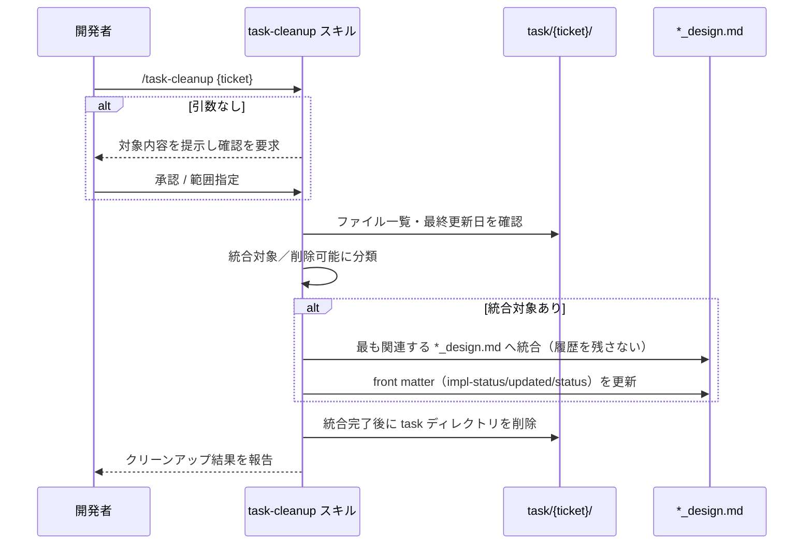

# タスククリーンアップ

**関連 Design Doc:** [task-cleanup_design.md](task-cleanup_design.md)
**関連 PRD:** [task-cleanup.md](../../requirement/task-implementation/task-cleanup.md)（親: [task-implementation](../../requirement/task-implementation/index.md)）
**準拠する原則:** [CONSTITUTION.md](../../CONSTITUTION.md) B-002（多言語対応の一貫性）, D-001（Specification-Driven）, D-003（ドキュメント永続性ルールの遵守）

---

# 1. 背景

AI-SDD ワークフローでは `task/` を一時ディレクトリとして扱い、実装完了後に削除する（D-003 原則）。
しかしタスクログには実装過程で得られた設計判断・トレードオフといった価値ある知見が含まれる。
これらを統合せずに削除すると設計知見が失われ、設計知見の永続化（親 PRD UR_004）が損なわれる。

本機能は、タスクログ内の重要な設計決定を対応する技術設計書（`*_design.md`）へ統合したうえで
task ディレクトリを削除し、設計知見が永続ドキュメントへ集約された状態を保証する。

# 2. 概要

本機能は、対象 task ディレクトリのファイルを分析し、統合すべき内容（設計判断・代替案評価・技術知見・
トラブルシュート・再利用パターン）と削除して差し支えない内容（作業ログ・一時調査・手順・完了タスク一覧）に
分類する。統合対象は最も関連する `*_design.md` へ自然に統合し、その後にディレクトリを削除する。
主要な設計原則は以下のとおり。

- **統合前削除の禁止**: 削除は重要な設計決定の設計書への統合完了後にのみ許可する（親 PRD DC_002 / D-003）
- **知見の選別**: 価値ある知見のみを統合し、履歴（「〜から移行」等）は残さない
- **front matter の更新**: 統合に伴い設計書の `impl-status`・`updated`、spec の `status` を必要に応じて更新する
- **範囲確認**: 引数なし実行時は対象ディレクトリ内容を提示しユーザー確認を得る

「何を統合し何を削除するか、どの順序で保証するか」を定義し、分類基準・統合先決定・削除手順の具体的な
実行方式は [task-cleanup_design.md](task-cleanup_design.md) に委ねる。

# 3. 要求定義

## 3.1. 機能要件 (Functional Requirements)

| ID     | 要件                                                                       | 優先度 | 根拠（上流要求）                       |
|--------|--------------------------------------------------------------------------|-----|--------------------------------------|
| FR-001 | 対象 task ディレクトリのファイルを分析し、統合対象／削除可能に分類する               | 必須  | 子 PRD FR_001 / 親 PRD UR_004       |
| FR-002 | 統合対象の設計決定を最も関連する `*_design.md` へ統合する                        | 必須  | 子 PRD FR_001 / 親 PRD DC_002       |
| FR-003 | 統合完了後にのみ task ディレクトリ（ファイル）を削除する                          | 必須  | 親 PRD DC_002 / D-003               |
| FR-004 | 統合に伴い関連文書の front matter（`impl-status`・`updated`・`status`）を更新する | 必須  | 親 PRD IR_001                        |
| FR-005 | 引数なし実行時は対象内容を提示しユーザー確認を得てから処理する                       | 必須  | 子 PRD FR_001（安全性）             |

FR-002 で適切な統合先が存在しない場合、関連 `*_spec.md` があれば新規 `*_design.md` を作成し、
無ければ統合をスキップする（情報削除）。

## 3.2. 非機能要件 (Non-Functional Requirements)

| ID      | カテゴリ      | 要件                                                       | 目標値                          |
|---------|------------|----------------------------------------------------------|--------------------------------|
| NFR-001 | 安全性      | 実装未完了・統合先不明の場合は削除せず保留またはユーザー確認する      | 統合前削除を発生させない（DC_002） |
| NFR-002 | 多言語      | 出力言語を `SDD_LANG` に従い切り替え、単一文書内で混在させない         | en / ja（原則 B-002）            |
| NFR-003 | 非冗長性    | 履歴表記を残さず、既存 `*_design.md` の内容と重複させない            | 「〜から移行」等の記述を残さない     |

# 4. 提供コンポーネント

| 種別    | 配置場所                         | 名前         | 概要                                                                   |
|-------|------------------------------|------------|----------------------------------------------------------------------|
| skill | `skills/task-cleanup/SKILL.md` | task-cleanup | task ログを分析し設計決定を設計書へ統合後にディレクトリを削除するユーザー呼び出しスキル（FR-001〜005） |
| template | `skills/task-cleanup/templates/{en,ja}/cleanup_output.md` | cleanup_output | クリーンアップ結果出力の基底テンプレート（日英）（NFR-002） |

## 4.1. 入出力定義

### task-cleanup スキル

**入力**:

| 引数            | 必須 | 説明                                                          |
|---------------|----|-------------------------------------------------------------|
| `ticket-number` | 任意 | 対象チケット番号またはパス。省略時は `task/` 全体を対象とする             |

前提として対象チケットの実装が完了しており、統合先の `*_design.md` が存在すること。

**出力**: 統合された `*_design.md`（履歴を残さず自然に統合）、更新された関連文書の front matter、
削除された task ディレクトリ、およびクリーンアップ結果レポート。出力言語は `SDD_LANG` に従う。

# 5. 用語集

| 用語            | 説明                                                                             |
|---------------|--------------------------------------------------------------------------------|
| 統合対象        | 設計判断・代替案評価・技術知見・トラブルシュート・再利用パターン等、設計書へ残すべき知見        |
| 削除可能        | 作業ログ・一時調査・実装済み手順・完了タスク一覧・日付依存情報等、移行不要な内容             |
| 統合前削除の禁止  | 重要な設計決定の設計書統合完了後にのみ削除を許可する制約（親 PRD DC_002 / D-003）          |
| task ディレクトリ | `task/{ticket-number}/` 配下の一時作業記録。統合後に削除する                             |
| 範囲確認        | 引数なし実行時に対象ディレクトリ内容を提示しユーザーの承認を得る手順                        |

# 6. 使用例

```
/task-cleanup TICKET-123               # 指定チケットの task ログを整理
/task-cleanup feature/task-management  # パス指定で対象を整理
/task-cleanup                          # 引数なし: task/ 全体を対象（範囲確認後に実行）
```

# 7. 振る舞い図



# 8. 制約事項

- task ディレクトリの削除は設計書への統合完了後にのみ許可する（親 PRD DC_002 / D-003）
- 実装未完了の場合は task/ を保持し、統合先不明の場合はユーザーに確認する（NFR-001）
- 履歴表記（「〜から移行」等）を残さず、既存 `*_design.md` と重複する内容は移行しない（NFR-003）
- タスク分解・TDD 実装・チェックリスト検証そのもの、技術設計書の新規生成は本機能のスコープ外
  （[task-breakdown.md](../../requirement/task-implementation/task-breakdown.md) /
  [implement.md](../../requirement/task-implementation/implement.md) /
  [run-checklist.md](../../requirement/task-implementation/run-checklist.md) / spec-design カテゴリで扱う。
  本機能は既存設計書への統合のみを行う）
- バージョン管理操作（コミット・PR 作成等）はプロジェクト運用・他ツールに委ねる

# 9. 原則との整合性

| 原則ID  | 原則名                    | 本仕様への適用内容                                                       |
|-------|--------------------------|----------------------------------------------------------------------|
| B-002 | 多言語対応（EN/JA）の一貫性 | クリーンアップ結果テンプレートを日英で維持し `SDD_LANG` で切り替える               |
| D-001 | Specification-Driven      | 設計知見を永続ドキュメント `*_design.md` へ集約し、仕様・設計を真実の源に保つ         |
| D-003 | ドキュメント永続性ルールの遵守 | task/ を一時ログとして扱い、設計決定の統合完了後にのみ削除する（統合前削除の禁止）      |
