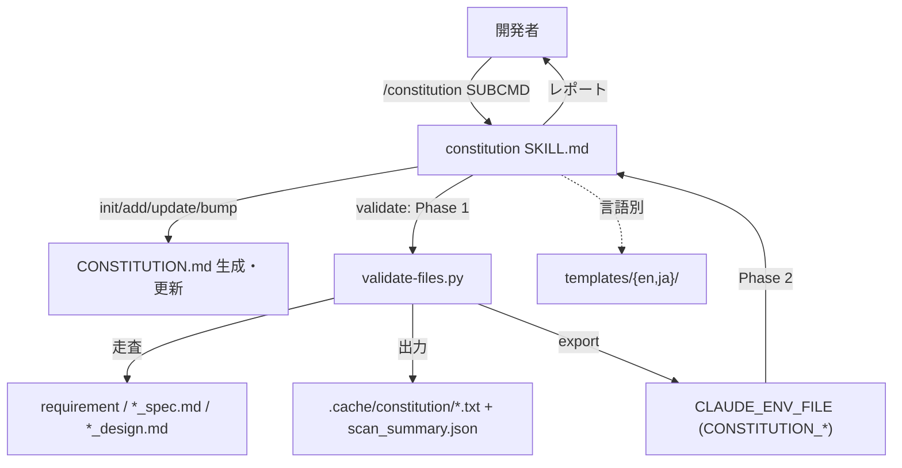

# プロジェクト原則管理

**関連 Spec:** [constitution-management_spec.md](constitution-management_spec.md)
**関連 PRD:** [constitution-management.md](../../requirement/workflow-foundation/constitution-management.md)（親: [workflow-foundation](../../requirement/workflow-foundation/index.md)）
**準拠する原則:** [CONSTITUTION.md](../../CONSTITUTION.md) A-001（Skills-First）, A-002（フックとスクリプトの責務分離）, B-002（多言語対応の一貫性）, D-001（Specification-Driven）, T-002（plugin.json 登録）, T-003（日本語出力の文字化け防止）

---

# 1. 実装ステータス

**ステータス:** 🟢 実装済み

本設計書は、既に実装・稼働している `constitution` スキル（`plugins/sdd-workflow/skills/constitution/`）の
構成を逆算して記述したものである。実装コード（`SKILL.md` / `scripts/validate-files.py` /
`templates/{en,ja}/` / `.claude-plugin/plugin.json` の `skills` 登録）を真実の源とする。

> **逆算記述の経緯（正当化）**: `constitution` スキルは AI-SDD ワークフローの基盤機能として先行実装され、
> 本 spec/design は後追いで機能要求を明文化した逆算記述である。D-001（Specification-Driven）の原則に対し、
> 実装先行という経緯を CONSTITUTION の例外プロセス（文書化・正当化・追跡）に沿って本節に記録する。
> 以降の記述は推測ではなく、実装ファイルの実態に一致させている。

## 1.1. 実装進捗

| モジュール/機能                     | ステータス | 備考                                                              |
|-----------------------------------|--------|-------------------------------------------------------------------|
| スキル本体（SKILL.md）               | 🟢     | init/add/show/update/validate/sync/bump-version を Markdown プロンプトで定義 |
| validate 用走査スクリプト             | 🟢     | `scripts/validate-files.py`（Python 標準ライブラリのみ）                  |
| 言語別テンプレート                    | 🟢     | `templates/{en,ja}/constitution_template.md` / `constitution_output.md`    |
| plugin.json 登録                    | 🟢     | `"skills": "./skills"` によりディレクトリ一括登録                          |

---

# 2. 設計目標

- 原則の全ライフサイクル（生成・追加・更新・検証・同期・バージョン管理）を一つのスキルで提供する（FR-001〜005）
- 検証時のファイル走査という決定的処理をスクリプトへ委譲し、Claude のトークン消費を抑える（A-002 / NFR-001）
- 走査スクリプトを OS 非依存にし、対応 OS で一貫動作させる（NFR-002）
- 出力言語をテンプレート言語に一致させ、言語混在を防ぐ（B-002 / FR-006 / NFR-003）
- 既存 `CONSTITUTION.md` を上書きしない非破壊動作を保証する（FR-007）

---

# 3. 実装方式

| 領域     | 採用方式                                          | 選定理由                                                                                     |
|--------|-------------------------------------------------|--------------------------------------------------------------------------------------------|
| skill  | Markdown プロンプト（`SKILL.md`）                   | 原則の生成・判断・レビューは Claude の推論を要するため、プロンプトで手順とテンプレート適用を定義する（A-001） |
| script | Python 3 + 標準ライブラリ（`pathlib` / `json` / `datetime`） | validate のファイル走査は決定的処理。OS 固有 CLI に依存せず標準ライブラリで実装（A-002 / NFR-002） |
| 実行分離 | 2 フェーズ（Phase 1: スクリプト走査 → Phase 2: Claude 判断） | 機械的走査と内容判断を分離し、Claude の Glob/Grep 逐次呼び出しを削減する（A-002 / NFR-001）        |
| template | 言語別ディレクトリ `templates/{en,ja}/`             | `SDD_LANG` に応じて雛形を切り替え、出力言語をテンプレート言語に一致させる（B-002）                     |
| env 連携 | `CLAUDE_ENV_FILE` への export（`env_export.rewrite_exports`） | 走査結果ファイルパスを環境変数として Phase 2 の Claude に引き渡す共通方式に従う                     |

---

# 4. アーキテクチャ

## 4.1. システム構成図



## 4.2. モジュール分割

| モジュール名             | 責務                                              | 依存関係                          | 配置場所                                       |
|------------------------|---------------------------------------------------|---------------------------------|------------------------------------------------|
| constitution スキル       | サブコマンドの手順定義・原則生成・内容判断・レポート整形       | templates, validate-files.py     | `skills/constitution/SKILL.md`                 |
| validate-files.py       | requirement/spec/design 走査、リスト・summary 生成、env export | `hook_common`, `env_export`      | `skills/constitution/scripts/validate-files.py` |
| 言語別テンプレート        | 原則雛形・出力レポート雛形の提供                          | -                               | `skills/constitution/templates/{en,ja}/`        |
| 共通ヘルパー             | プロジェクトルート解決・環境変数エクスポート                 | Python 標準ライブラリ             | `scripts/hook_common.py`, `scripts/env_export.py` |

---

# 5. データ構造

validate スクリプトは `${SDD_ROOT}/.cache/constitution/` に走査結果を生成し、`CLAUDE_ENV_FILE` へ
以下を export する（`env_export.rewrite_exports("CONSTITUTION_", ...)` により再実行時は旧値を置換）。

```json
// scan_summary.json
{
  "scanned_at": "2026-07-24T00:00:00Z",
  "requirement_files": 0,
  "spec_files": 0,
  "design_files": 0,
  "total_files": 0
}
```

```sh
# CLAUDE_ENV_FILE に書き込まれる export 群
export CONSTITUTION_CACHE_DIR=".../.sdd/.cache/constitution"
export CONSTITUTION_REQUIREMENT_FILES=".../requirement_files.txt"
export CONSTITUTION_SPEC_FILES=".../spec_files.txt"
export CONSTITUTION_DESIGN_FILES=".../design_files.txt"
export CONSTITUTION_SUMMARY=".../scan_summary.json"
```

---

# 6. ファイル構成

```
plugins/sdd-workflow/
├── skills/constitution/
│   ├── SKILL.md                                # スキル本体（サブコマンド手順）
│   ├── scripts/validate-files.py               # validate 用走査スクリプト
│   ├── templates/en/constitution_template.md   # 原則雛形（EN）
│   ├── templates/en/constitution_output.md     # 出力レポート雛形（EN）
│   ├── templates/ja/constitution_template.md   # 原則雛形（JA）
│   ├── templates/ja/constitution_output.md     # 出力レポート雛形（JA）
│   ├── references/                             # 前提条件・ベストプラクティス参照
│   └── examples/                               # 各サブコマンドの出力例
├── scripts/hook_common.py                      # resolve_project_root 共有
├── scripts/env_export.py                       # rewrite_exports 共有
└── .claude-plugin/plugin.json                  # "skills": "./skills"（T-002）
```

---

# 7. 非機能要件実現方針

| 要件                          | 実現方針                                                                     |
|-------------------------------|------------------------------------------------------------------------------|
| NFR-001 検証効率               | Phase 1 のスクリプトで一括走査し、Phase 2 の Claude は走査リストのみを読む             |
| NFR-002 移植性                 | `validate-files.py` は `pathlib.rglob` / `json` のみを使用し OS 固有 CLI に非依存    |
| NFR-003 言語一貫性             | `templates/${SDD_LANG:-en}/` を参照し、出力言語をテンプレート言語に固定する            |

---

# 8. テスト戦略

| テストレベル   | 対象                                              | カバレッジ目標                          |
|------------|---------------------------------------------------|----------------------------------------|
| 回帰         | `validate-files.py` の custom root 走査・キャッシュ配置・env export | `scripts/test-skill-scripts.sh` で検証（複数 OS の CI）  |
| 静的解析      | プロンプト内コードブロック・命名規則                       | `plugin-lint` で検査                     |
| 構文検証      | `plugin.json` の JSON 構文                           | `cat ... | jq .` で検証（T-001）          |

---

# 9. 設計判断

## 9.1. 決定事項

| 決定事項                | 選択肢                                          | 決定内容                       | 理由                                                                                          |
|-----------------------|-----------------------------------------------|------------------------------|-----------------------------------------------------------------------------------------------|
| 実装形態                | (a) legacy command / (b) skill                  | **(b) skill**                | A-001（Skills-First）に従い、新規機能は `skills/` として実装する                                    |
| validate の走査方式      | (a) Claude が Glob/Grep で逐次走査 / (b) スクリプトで一括走査 | **(b) スクリプト一括走査**       | A-002 に従い決定的処理をスクリプトへ委譲。Claude のツール呼び出しとトークンを削減（NFR-001）              |
| 走査スクリプトの言語      | (a) Bash + find/grep / (b) Python 標準ライブラリ    | **(b) Python 標準ライブラリ**    | OS 固有 CLI 非依存で対応 OS 間の挙動を等価にする（NFR-002。cross-platform-portability と整合）        |
| init の既存ファイル扱い   | (a) 上書き / (b) 存在時スキップ                     | **(b) 存在時スキップ**           | 既存の原則を尊重し、利用者のカスタマイズを破壊しない（FR-007）                                        |
| CONSTITUTION.md 生成の担当 | (a) sdd-init が生成 / (b) constitution init が生成 | **(b) constitution init**     | 原則はプロジェクト文脈に応じたカスタマイズが必要。sdd-init はテンプレート配置のみに限定し責務を分離        |

## 9.2. 未解決の課題

| 課題                                   | 影響度 | 対応方針                                            |
|--------------------------------------|-----|-----------------------------------------------------|
| validate の内容判断は Claude の推論に依存し決定的でない | 低   | 走査は決定化済み。内容整合の判断品質は CI のプロンプト回帰では担保できないため運用レビューで補完 |
| 原則違反の実装レベル検出は未対応             | 低   | 本機能はドキュメント同期検証まで。実装検出は quality-guardrails カテゴリで別途仕様化 |

---

# 10. 原則準拠チェックリスト

| 原則ID  | 原則名                   | 準拠状況 | 備考                                                          |
|-------|-------------------------|------|---------------------------------------------------------------|
| A-001 | Skills-First             | ✅   | `skills/constitution/` として実装。legacy command は追加しない          |
| A-002 | フックとスクリプトの責務分離   | ✅   | validate のファイル走査を `validate-files.py` に委譲                    |
| B-002 | 多言語対応の一貫性          | ✅   | `templates/{en,ja}/` を用意し `SDD_LANG` に応じて出力                    |
| D-001 | Specification-Driven     | ⚠️   | 実装先行のため本 spec/design を逆算作成（1 節に例外を文書化・正当化）          |
| T-002 | plugin.json 登録の徹底     | ✅   | `"skills": "./skills"` によりスキルを登録済み                           |
| T-003 | 日本語出力の文字化け防止     | ✅   | 日本語テンプレート・出力で UTF-8 を維持し mojibake を防止                  |

**原則から逸脱する場合**: D-001 について実装先行の経緯を「9.1 は該当なし・1 節」に文書化し、CONSTITUTION.md の例外プロセスに従う。
