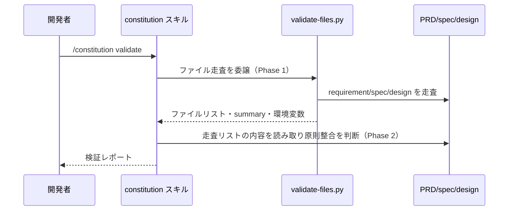

# プロジェクト原則管理

**関連 Design Doc:** [constitution-management_design.md](constitution-management_design.md)
**関連 PRD:** [constitution-management.md](../../requirement/workflow-foundation/constitution-management.md)（親: [workflow-foundation](../../requirement/workflow-foundation/index.md)）
**準拠する原則:** [CONSTITUTION.md](../../CONSTITUTION.md) A-002（フックとスクリプトの責務分離）, B-002（多言語対応の一貫性）, D-001（Specification-Driven）, T-003（日本語出力の文字化け防止）

---

# 1. 背景

AI-SDD ワークフローは仕様書を真実の源として扱うが、その仕様書・設計書がどのような設計判断を
許容し何を禁じるかを統べる上位のルールがなければ、判断の一貫性が保てない。プロジェクトの
「譲れない原則（Constitution）」を明文化し、PRD・仕様書・設計書がそれに整合しているかを
継続的に検証する仕組みが必要である。

本機能は、この原則ドキュメント `CONSTITUTION.md` の作成・追加・バージョン管理・同期と、
原則と他ドキュメント（PRD / 仕様書 / 設計書）との同期状態の検証を、`/constitution` スキルとして
提供する。原則の定義そのものと、それを他ドキュメントへ反映・検証する責務を一つのスキルに
集約することで、原則ガバナンスの起点を明確にする。

なお本仕様は、既存実装（`plugins/sdd-workflow/skills/constitution/`）を真実の源として逆算的に
明文化したものである（詳細な経緯は [constitution-management_design.md](constitution-management_design.md) の 1 節を参照）。

# 2. 概要

本機能は、開発者が手動で `/constitution` スキルを呼び出すことで、プロジェクト固有の原則を
定義・管理し、他ドキュメントとの同期を検証できるようにする。主要な設計原則は以下のとおり。

- **原則を真実の源にする**: `CONSTITUTION.md` を全設計判断の基盤として一元管理し、
  PRD・仕様書・設計書がそこへ整合することを検証可能にする（D-001）
- **サブコマンドによる操作分離**: 初期化・追加・表示・更新・検証・同期・バージョン管理を
  サブコマンドとして分離し、目的ごとに明確な操作を提供する
- **決定的処理の委譲**: 検証（validate）ではファイル走査という機械的処理をスクリプトに委譲し、
  Claude は走査結果を読み取って内容の妥当性判断に専念する（A-002）
- **多言語一貫性**: 出力テンプレートは `templates/{en,ja}/` を持ち、`SDD_LANG` に応じた言語で
  出力し、言語を混在させない（B-002）
- **セマンティックバージョニング**: 原則の追加・変更・修正をバージョンに反映し、変更履歴を残す

「何を管理・検証するか」を定義し、具体的な実装方式（スクリプトの走査ロジック・環境変数連携・
テンプレート適用手順）は [constitution-management_design.md](constitution-management_design.md) に委ねる。

# 3. 要求定義

## 3.1. 機能要件 (Functional Requirements)

| ID     | 要件                                                                                       | 優先度 | 根拠（上流要求）                    |
|--------|------------------------------------------------------------------------------------------|-----|----------------------------------|
| FR-001 | `/constitution init` で `${SDD_ROOT}/CONSTITUTION.md` を作成する（存在時はスキップ）             | 必須  | PRD FR_001 / 親 UR_002            |
| FR-002 | `/constitution add` で新規原則を追加し、バージョンと変更履歴を更新する                            | 必須  | PRD FR_001                       |
| FR-003 | `/constitution validate` で PRD・仕様書・設計書が原則に整合しているかを検証・報告する               | 必須  | PRD FR_001（同期検証）             |
| FR-004 | `/constitution sync` で原則をテンプレート・関連ドキュメントへ反映する                             | 必須  | PRD FR_001（同期検証）             |
| FR-005 | `/constitution bump-version {major\|minor\|patch}` でセマンティックバージョンを更新する          | 必須  | PRD FR_001                       |
| FR-006 | 出力テンプレートを `SDD_LANG`（en/ja）に応じて選択し、言語を混在させない                            | 必須  | 親 PRD B-002                     |
| FR-007 | 既存の `CONSTITUTION.md` を尊重し、`init` は既存ファイルを上書きしない                             | 必須  | PRD 制約（既存内容の非破壊）          |

## 3.2. 非機能要件 (Non-Functional Requirements)

| ID      | カテゴリ | 要件                                                             | 目標値                              |
|---------|------|------------------------------------------------------------------|-------------------------------------|
| NFR-001 | 効率性 | 検証時のファイル走査を事前スクリプト化し、Claude のツール呼び出しを削減する      | Glob/Grep の逐次実行を排し 1 スクリプトで走査 |
| NFR-002 | 移植性 | 走査スクリプトは OS 固有 CLI に依存せず Python 標準ライブラリで動作する          | 対応 OS の CI で通過                   |
| NFR-003 | 一貫性 | 出力言語がテンプレート言語と一致する                                      | 言語混在が発生しない                    |

# 4. 提供コンポーネント

| 種別     | 配置場所                                                    | 名前            | 概要                                                             |
|--------|-----------------------------------------------------------|---------------|------------------------------------------------------------------|
| skill  | `skills/constitution/SKILL.md`                            | constitution  | 原則の init/add/show/update/validate/sync/bump-version を提供する      |
| script | `skills/constitution/scripts/validate-files.py`          | validate-files | validate 用に requirement/spec/design を走査し環境変数へエクスポートする   |
| template | `skills/constitution/templates/{en,ja}/constitution_template.md` | 原則テンプレート  | `CONSTITUTION.md` 生成の雛形（言語別）                              |
| template | `skills/constitution/templates/{en,ja}/constitution_output.md`   | 出力テンプレート  | サブコマンド実行結果のレポート整形雛形（言語別）                        |

## 4.1. 入出力定義

- **入力**: サブコマンド + 任意引数（`init [context]` / `add "principle-name"` / `bump-version major|minor|patch` 等）
- **環境変数**: `SDD_ROOT` / `SDD_LANG` / `SDD_REQUIREMENT_PATH` / `SDD_SPECIFICATION_PATH`
- **出力**: `${SDD_ROOT}/CONSTITUTION.md`、および validate 時に走査結果ファイル群と `CONSTITUTION_*` 環境変数

```json
// validate スクリプトが出力する scan_summary.json の構造例
{
  "scanned_at": "2026-07-24T00:00:00Z",
  "requirement_files": 7,
  "spec_files": 4,
  "design_files": 4,
  "total_files": 15
}
```

# 5. 用語集

| 用語               | 説明                                                                    |
|------------------|-------------------------------------------------------------------------|
| Constitution      | プロジェクトの譲れない原則を定義する `CONSTITUTION.md`                          |
| サブコマンド        | `/constitution` に続けて指定する操作（init / add / validate 等）                 |
| 同期検証           | PRD・仕様書・設計書が原則へ整合しているかの検証                                   |
| セマンティックバージョニング | 原則変更の種別（major/minor/patch）に応じたバージョン付与                     |

# 6. 使用例

```
/constitution init                              # 原則ファイルを対話生成
/constitution init "TypeScript/React Web app"   # コンテキスト指定で非対話生成
/constitution add "Library-First"               # 原則を追加しマイナーバージョンを上げる
/constitution validate                          # 仕様書・設計書の原則整合を検証
/constitution bump-version major                # 破壊的変更に伴うメジャーバージョン更新
```

# 7. 振る舞い図



# 8. 制約事項

- 本機能が対象とするのはプロジェクト固有原則 `CONSTITUTION.md` であり、AI-SDD 原則ドキュメント
  `AI-SDD-PRINCIPLES.md` のバージョン追随更新は対象外（[session-config.md](../../requirement/workflow-foundation/session-config.md) が扱う）
- `.sdd/` 構造・テンプレートの生成そのものは対象外（[sdd-init.md](../../requirement/workflow-foundation/sdd-init.md) が扱う）
- 原則違反の実装レベル検出は対象外（quality-guardrails カテゴリが扱う。本機能はドキュメント間の同期検証まで）
- 対象プロジェクトのルートに書き込み権限があることを前提とする

# 9. 原則との整合性

| 原則ID  | 原則名                   | 本仕様への適用内容                                                       |
|-------|-------------------------|-------------------------------------------------------------------------|
| A-002 | フックとスクリプトの責務分離   | validate のファイル走査を `validate-files.py` に委譲し、Claude は判断に専念する    |
| B-002 | 多言語対応の一貫性          | `templates/{en,ja}/` を持ち `SDD_LANG` に応じた言語で出力する                    |
| D-001 | Specification-Driven     | 原則を真実の源とし、PRD・仕様書・設計書の整合を検証可能にする                       |
| T-003 | 日本語出力の文字化け防止     | 日本語テンプレート・出力で UTF-8 を維持し mojibake を防止する                      |

---

# PRD 整合性レビュー結果

| 確認項目        | 結果                                                                                    |
|---------------|------------------------------------------------------------------------------------------|
| 要求カバレッジ   | PRD FR_001（作成・更新・参照・同期検証）を FR-001〜005 に分解してカバー。B-002 を FR-006 でカバー   |
| 要求 ID 参照    | 各 FR に対応する PRD（FR_001）と親 PRD（UR_002・B-002）の要求 ID を「根拠」列に明記            |
| 非機能要求の反映 | 検証効率（NFR-001）・移植性（NFR-002）・言語一貫性（NFR-003）を非機能要件に補完                  |
| 用語整合性      | PRD の「同期検証」「CONSTITUTION.md」定義に整合                                             |
| スコープ整合性   | AI-SDD-PRINCIPLES 更新・構造生成・実装違反検出を PRD と一致させてスコープ外に明記               |
