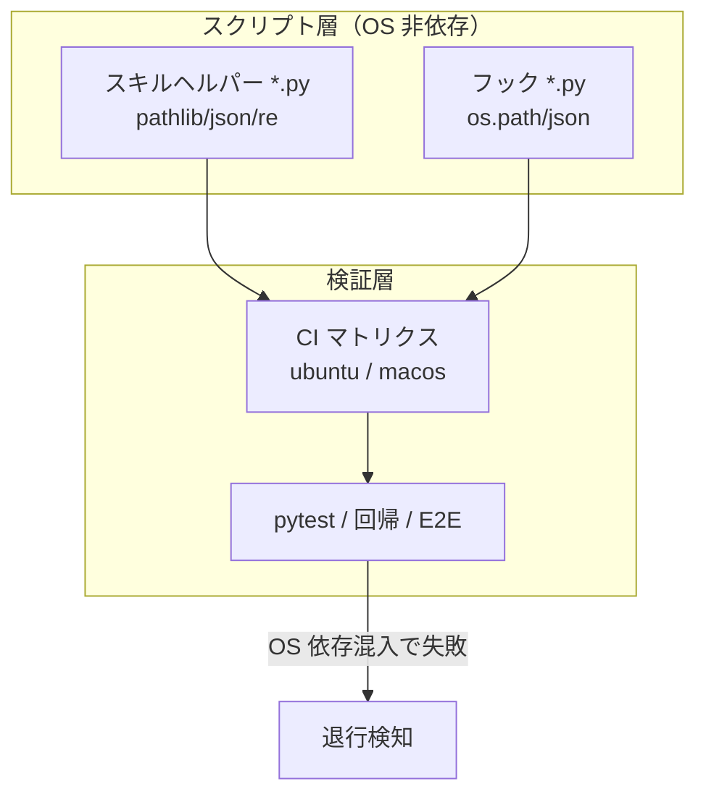

# クロスプラットフォーム移植性

**関連 Spec:** [cross-platform-portability_spec.md](cross-platform-portability_spec.md)
**関連 PRD:** [cross-platform-portability.md](../../requirement/workflow-foundation/cross-platform-portability.md)（親: [workflow-foundation](../../requirement/workflow-foundation/index.md)）
**準拠する原則:** [CONSTITUTION.md](../../CONSTITUTION.md) A-002（フックとスクリプトの責務分離）, D-001（Specification-Driven）, T-001（JSON/Markdown 構文の正当性）, T-002（plugin.json 登録）, T-003（日本語出力の文字化け防止）

---

# 1. 実装ステータス

**ステータス:** 🟢 実装済み

本設計書は、Issue #17（スキルヘルパー bash 7本の Python 統一）および #28〜#31 で実現済みの
移植性の状態を逆算して記述したものである。実装コード（`skills/*/scripts/*.py` /
`scripts/*.py` / `.github/workflows/ci.yml`）を真実の源とする。

> **逆算記述の経緯（正当化）**: Issue #17 は移植性向上を目的とした bash→Python 移植（リファクタリング）
> として先行実施され、本 spec/design はその後に非機能要求（移植性）を明文化した逆算記述である。
> D-001（Specification-Driven）の原則に対し、実装先行という経緯を CONSTITUTION の例外プロセス
> （文書化・正当化）に沿って本節に記録する。

## 1.1. 実装進捗

| モジュール/機能                | ステータス | 備考                                                                       |
|------------------------------|--------|----------------------------------------------------------------------------|
| スキルヘルパーの Python 化（7本） | 🟢     | #17/#28-31 で `find`/`sed`/`jq`/`grep`/`awk` 依存を除去し Python 標準ライブラリへ移植 |
| フックの Python 実装           | 🟢     | `session-start.py` / `pre-tool-use.py` / `post-tool-use.py` / `user-prompt-submit.py` は Python |
| OS 非依存パス処理              | 🟢     | スキルヘルパーは `pathlib`。フックは `os.path`（いずれも OS 非依存）。`pathlib` への統一は #32 で継続 |
| 複数 OS CI マトリクス          | 🟢     | `ci.yml` の `test` ジョブが `ubuntu-latest` / `macos-latest` で実行           |
| 回帰テスト                     | 🟢     | `pytest`・スキルスクリプト回帰・E2E を複数 OS の CI で実行                          |

> **補足**: `pathlib` への完全統一（フックの `os.path` 置換）は #32 の保守性改善タスクであり、
> 移植性の欠落ではない（`os.path` は OS 非依存に動作する）。

---

# 2. 設計目標

- スキルヘルパー・フックスクリプトを **OS 固有の外部 CLI に非依存**とし、対応 OS 間で挙動を等価にする（FR-001 / NFR-001）
- パス処理を **OS 非依存**にし、パス区切り・ルート表現の差異に依存しない（FR-002）
- 複数 OS を対象とした **CI マトリクス**で移植性を継続検証し、退行を自動検知する（FR-003 / NFR-002）
- 移植性の担保が既存スクリプトの **入出力・挙動を変更しない**（NFR-003 / 挙動等価）
- 対象を **実現済み範囲に限定**し、Windows ネイティブ完全対応は含めない（FR-004）

---

# 3. 実装方式

| 領域     | 採用方式                                       | 選定理由                                                                                     |
|--------|----------------------------------------------|--------------------------------------------------------------------------------------------|
| script | Python 3 + 標準ライブラリ（`pathlib` / `json` / `re`） | OS 固有 CLI（`find`/`sed`/`jq`/`grep`/`awk`）に非依存で、追加インストールなしに対応 OS で一貫動作する（A-002） |
| hook   | Python 3 + 標準ライブラリ（`os.path` / `json` 等）  | フックは元来 Python で cross-platform。`pathlib` への統一は #32 で継続（挙動は既に OS 非依存）           |
| path   | `pathlib.Path` を基本とし OS 固有パス表現をハードコードしない | パス区切り・ルート表現の差異を吸収し、OS 非依存にする（FR-002）                                          |
| ci     | GitHub Actions マトリクス（`ubuntu-latest` / `macos-latest`） | 同一テスト群を複数 OS で実行し、OS 依存混入時にいずれかの OS で失敗させて退行検知する（FR-003）              |

---

# 4. アーキテクチャ

## 4.1. システム構成図



## 4.2. モジュール分割

| モジュール名             | 責務                                        | 依存関係            | 配置場所                          |
|------------------------|---------------------------------------------|-------------------|-----------------------------------|
| スキルヘルパー群          | ドキュメント走査・キャッシュ生成・構造初期化を OS 非依存に実行 | Python 標準ライブラリ | `skills/*/scripts/*.py`           |
| フック群                | セッション・ツール使用前後の処理を OS 非依存に実行         | Python 標準ライブラリ | `scripts/*.py`                    |
| CI 検証マトリクス         | 複数 OS で全テストを実行し移植性を検証              | GitHub Actions    | `.github/workflows/ci.yml`        |
| 回帰・E2E テスト         | 移植後スクリプトの挙動等価・OS 非依存を検証           | pytest / bash     | `tests/`・`scripts/test-*.sh`     |

---

# 5. データ構造

本機能は品質制約であり、固有のデータ構造・受け渡し JSON を持たない。（対象スクリプトが扱う
データ構造は各機能の design を参照）

---

# 6. ファイル構成

```
plugins/sdd-workflow/
├── skills/
│   ├── check-spec/scripts/find-design-docs.py           # #29
│   ├── constitution/scripts/validate-files.py           # #29
│   ├── plan-refactor/scripts/scan-existing-docs.py      # #30
│   ├── plan-refactor/scripts/find-implementation-files.py # #30
│   ├── recommend-front-matter/scripts/scan-documents.py # #31
│   ├── sdd-init/scripts/init-structure.py               # #28
│   └── sdd-init/scripts/update-claude-md.py             # #28
├── scripts/
│   ├── session-start.py / pre-tool-use.py               # フック（Python）
│   ├── post-tool-use.py / user-prompt-submit.py         # フック（Python）
│   └── hook_common.py                                   # 共通ヘルパー
└── .github/workflows/ci.yml                             # test ジョブ: ubuntu / macos マトリクス
```

---

# 7. 非機能要件実現方針

| 要件                          | 実現方針                                                                     |
|-------------------------------|------------------------------------------------------------------------------|
| NFR-001 挙動等価（対応 OS 間）    | OS 固有 CLI を排し標準ライブラリのみで実装。複数 OS の CI で同一テストが通過することを確認 |
| NFR-002 退行検知（保守性）       | CI マトリクスで OS 依存混入時にいずれかの OS を失敗させる。shellcheck で残存 `.sh` も検査 |
| NFR-003 挙動等価（互換性）       | 移植前後で成果物・終了コード・キャッシュ配置が等価であることを回帰テストで検証（`test-skill-scripts.sh` 等） |

---

# 8. テスト戦略

| テストレベル      | 対象                                        | カバレッジ目標                          |
|--------------|---------------------------------------------|----------------------------------------|
| ユニット        | 移植後スクリプトのロジック（`tests/test_*.py`）      | 主要分岐を網羅、複数 OS の CI で実行         |
| 回帰          | スキルスクリプトの入出力・キャッシュ配置（`test-skill-scripts.sh`） | 移植前後で挙動等価                        |
| 回帰          | フックスクリプトの入出力（`test-hook-scripts.sh`）      | 移植前後で挙動等価                        |
| E2E          | sdd-init 通し（`test-e2e-sdd-init.sh`）          | en/ja テンプレート・custom root で成功      |
| 静的解析       | 残存 `.sh` の shellcheck、`plugin-lint`           | OS 依存 CLI の再混入・構文違反を検知         |
| CI マトリクス   | 上記すべてを `ubuntu-latest` / `macos-latest` で実行 | 両 OS で全テスト通過（移植性の継続検証）        |

---

# 9. 設計判断

## 9.1. 決定事項

| 決定事項                | 選択肢                                          | 決定内容                       | 理由                                                                                          |
|-----------------------|-----------------------------------------------|------------------------------|-----------------------------------------------------------------------------------------------|
| スクリプトの統一言語       | (a) Bash + 外部 CLI / (b) Python 標準ライブラリ / (c) OS ごとに Bash+PowerShell の二本立て | **(b) Python 標準ライブラリ**    | フックは既に Python で cross-platform。CI に PowerShell がなく (c) は二重ツールチェーン化と CI カバレッジ欠如を招く。(a) は OS 固有 CLI 依存で移植性を損なう（#17） |
| パス処理                | (a) 文字列連結 / (b) `os.path` / (c) `pathlib`      | **(c) `pathlib` を基本**（既存フックは `os.path`） | `pathlib` は OS 非依存で可読性が高い。`os.path` も OS 非依存のため既存フックは許容し、統一は #32 で継続   |
| 移植性の検証手段          | (a) 単一 OS CI / (b) 複数 OS マトリクス            | **(b) 複数 OS マトリクス**       | 単一 OS では OS 依存の混入を検知できない。ubuntu/macos の両実行で退行を検知する                        |
| 本設計のスコープ          | (a) Windows ネイティブ完全対応まで / (b) 実現済み移植性に限定 | **(b) 実現済み範囲に限定**       | #10 のネイティブサポートは範囲未確定。未確定範囲を含めると陳腐化するため、確定済みの移植性のみを対象とする（FR-004） |
| 外部プロセス呼び出しの扱い     | (a) subprocess を一切禁止 / (b) 準標準ツールに限り許容 | **(b) git のみ許容**           | プロジェクトルート検出は `$CLAUDE_PROJECT_DIR` → `git rev-parse --show-toplevel` → CWD の順でフォールバックする。`git` は Windows 含め広く利用可能な準標準ツールのため、この用途に限り subprocess 経由の呼び出しを許容する（`find`/`sed`/`jq`/`grep`/`awk` 等の OS 固有 CLI は引き続き禁止） |

## 9.2. 未解決の課題

| 課題                                   | 影響度 | 対応方針                                            |
|--------------------------------------|-----|-----------------------------------------------------|
| フックの `os.path` → `pathlib` 統一        | 低   | #32（共有モジュール化 + pathlib 化）で対応。移植性の欠落ではなく保守性改善 |
| Windows ランナーの CI マトリクス追加         | 中   | #10 のネイティブサポート要求確定後に検討。現状は Linux/macOS で移植性を担保 |
| 共通ロジックの重複（命名検証・FM 走査等）        | 低   | #32 で共有 Python モジュール化                          |

---

# 10. 原則準拠チェックリスト

| 原則ID  | 原則名                   | 準拠状況 | 備考                                                          |
|-------|-------------------------|------|---------------------------------------------------------------|
| A-002 | フックとスクリプトの責務分離   | ✅   | 機械的処理を OS 非依存な標準ライブラリのスクリプトへ委譲                   |
| D-001 | Specification-Driven     | ✅   | 本 spec/design に基づき移植性を担保。実装が仕様に準拠                    |
| T-001 | JSON/Markdown 構文の正当性 | ✅   | 移植後もプラグイン JSON・ドキュメントリンクの正当性を CI で検証             |
| T-002 | plugin.json 登録の徹底     | ✅   | 移植はスクリプト実体の置換であり、登録済みスキル・フックの構成を変えない        |
| T-003 | 日本語出力の文字化け防止     | ✅   | 移植後スクリプトの出力・テンプレートで UTF-8 を維持し mojibake を防止        |
