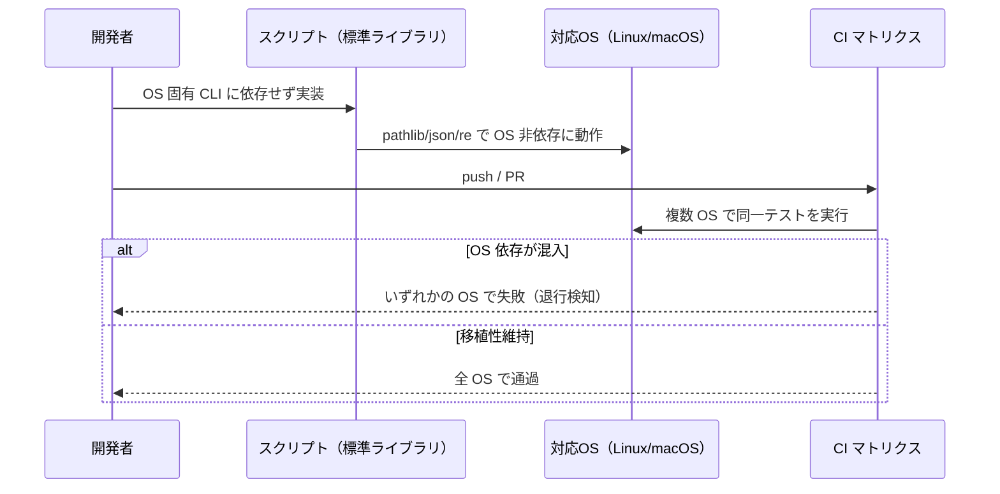

# クロスプラットフォーム移植性

**関連 Design Doc:** [cross-platform-portability_design.md](cross-platform-portability_design.md)
**関連 PRD:** [cross-platform-portability.md](../../requirement/workflow-foundation/cross-platform-portability.md)（親: [workflow-foundation](../../requirement/workflow-foundation/index.md)）
**準拠する原則:** [CONSTITUTION.md](../../CONSTITUTION.md) A-002（フックとスクリプトの責務分離）, D-001（Specification-Driven）

---

# 1. 背景

プラグインのスキルは補助処理（ドキュメント走査・キャッシュ生成・構造初期化など）を、フックは
セッション開始・ツール使用前後の処理をスクリプトで実行する。これらのスクリプトが特定 OS 固有の
外部コマンド（`find` / `sed` / `jq` / `grep` / `awk` 等）や OS 依存のパス表現に依存すると、
プラグインが動作する OS が実質的に限定され、利用者・開発者の実行環境を狭める。

実際、当初スキルヘルパーの一部は Bash + 外部 CLI で実装されており、これが移植性の阻害要因で
あった。これらを Python 標準ライブラリへ統一し、CI を複数 OS で実行することで、移植性を担保
できる状態になった。本仕様は、この移植性を「何を満たすべきか」という検証可能な要件として
明文化し、退行を防ぐことを目的とする。

# 2. 概要

本機能は、プラグインのスキルヘルパー・フックスクリプトが OS 非依存で動作することを、
横断的な品質要件として定義する。主要な設計原則は以下のとおり。

- **OS 非依存な実装手段**: 機械的処理を担うスクリプトは、OS 固有の外部 CLI に依存せず、
  実行環境で一貫して利用できる標準的な手段（Python 標準ライブラリ）で実装する（A-002）
- **OS 非依存なパス処理**: パス区切りやルート表現の差異を吸収し、ハードコードされた
  OS 固有パスに依存しない
- **CI による継続検証**: 複数 OS を対象とした CI で動作を検証し、移植性の退行を検知する
- **挙動等価**: 移植性の担保は、各スクリプトの既存の入出力・挙動を変更しない
- **範囲限定**: 本仕様は実現済みで確定した移植性範囲を対象とし、Windows ネイティブサポートの
  完全対応（インストーラ・シェル統合等）は含まない

「移植性として何を満たすか」を定義し、具体的な実装方式（標準ライブラリの選定・パス抽象化の
方法・CI マトリクス構成）は [cross-platform-portability_design.md](cross-platform-portability_design.md) に委ねる。

# 3. 要求定義

## 3.1. 機能要件 (Functional Requirements)

| ID     | 要件                                                                                  | 優先度 | 根拠（上流要求）              |
|--------|---------------------------------------------------------------------------------------|-----|----------------------------|
| FR-001 | スキルヘルパー・フックスクリプトを OS 固有の外部 CLI に依存させず、Python 標準ライブラリのみで実装する | 必須  | 子 PRD NFR_001 / 親 PRD NFR_002 |
| FR-002 | ファイル・ディレクトリのパス処理を OS 非依存で実装する（パス区切り・ルート表現の差異を吸収）        | 必須  | 子 PRD NFR_002              |
| FR-003 | スクリプト・フックの動作を複数 OS（少なくとも Linux / macOS）を対象とした CI で検証する          | 必須  | 子 PRD NFR_003 / 親 PRD NFR_002 |
| FR-004 | 対象を実現済みの移植性範囲に限定し、Windows ネイティブサポートの完全対応は含めない               | 必須  | 子 PRD DC_001               |

## 3.2. 非機能要件 (Non-Functional Requirements)

| ID      | カテゴリ   | 要件                                                             | 目標値                              |
|---------|--------|------------------------------------------------------------------|-------------------------------------|
| NFR-001 | 移植性   | 対応 OS 間でスクリプト・フックの挙動が等価であること                    | 対応 OS の CI で同一テストが通過       |
| NFR-002 | 保守性   | 移植性の退行を CI で自動検知できること                                | OS 依存の混入時に CI が失敗する         |
| NFR-003 | 互換性   | 移植性担保が既存スクリプトの入出力・挙動を変更しないこと                  | 移植前後で成果物・終了コードが等価       |

# 4. 提供コンポーネント

本機能は新規コンポーネントを追加するのではなく、既存のスクリプト群・CI に移植性の制約を課す
横断的品質要件である。対象コンポーネントは以下のとおり。

| 種別     | 配置場所                                          | 名前                     | 概要                                                                 |
|--------|-------------------------------------------------|------------------------|----------------------------------------------------------------------|
| script | `skills/*/scripts/*.py`                         | スキルヘルパースクリプト群   | ドキュメント走査・キャッシュ生成・構造初期化等を OS 非依存で実行する（FR-001・002） |
| hook   | `scripts/*.py`（session-start / pre / post / prompt） | フックスクリプト群          | セッション・ツール使用前後の処理を OS 非依存で実行する（FR-001・002）           |
| ci     | `.github/workflows/ci.yml`                      | 複数 OS 検証 CI マトリクス   | 複数 OS ランナーでテストを実行し移植性を検証する（FR-003）                    |

## 4.1. 入出力定義

本仕様は品質制約であり固有の入出力を持たない。制約の観点は以下。

```
# 移植性制約の観点（各スクリプトに適用）
- 依存禁止 : OS 固有の外部 CLI（find / sed / jq / grep / awk 等）に依存しない（subprocess 経由の呼び出しを含む）
- 依存許容 : プロジェクトルート検出等で、全対応 OS に広く存在する準標準ツールをフォールバック利用することは妨げない
- 実装手段 : OS 非依存に動作する標準的な手段で実装する（採用する具体的なライブラリの選定は design を参照）
- パス     : OS 固有の区切り・絶対パス表現をハードコードしない
- CI       : 少なくとも Linux / macOS のランナーで全テストを実行する
```

# 5. 用語集

| 用語               | 説明                                                                        |
|------------------|-----------------------------------------------------------------------------|
| 移植性（Portability） | 異なる OS 上で同一の挙動を保って動作できる度合い                                     |
| OS 固有 CLI         | 特定 OS / 環境に前提を置く外部コマンド（`find` / `sed` / `jq` / `grep` / `awk` 等） |
| 標準ライブラリ         | Python 処理系に同梱され、追加インストールなしで利用できるライブラリ（`pathlib` / `json` / `re` 等） |
| CI マトリクス         | 複数 OS・条件の組み合わせで同一テストを実行する CI 構成                              |
| 挙動等価            | 移植前後で成果物・終了コード・副作用が変わらないこと                                  |

# 6. 使用例

本機能は品質制約であり、開発時とCIで継続的に検証される。

```
# 開発時: スクリプトは標準ライブラリのみで実装（OS 固有 CLI を呼ばない）
skills/plan-refactor/scripts/scan-existing-docs.py  # pathlib/json/re で実装

# CI: 複数 OS で全テストが実行される
ci.yml (test job) → ubuntu-latest / macos-latest で pytest・スキルスクリプト回帰・E2E を実行

# 退行検知: OS 固有 CLI 依存が混入すると、対応 OS のいずれかで CI が失敗する
```

# 7. 振る舞い図



# 8. 制約事項

- 本仕様は非機能（移植性）要件であり、特定機能の新規追加を目的としない。対象は既存スクリプト・
  フック・CI の品質特性である
- スクリプト実行には Python 処理系が利用可能であることを前提とする（Python 処理系そのものの
  同梱・インストールはスコープ外）
- 移植性の担保が既存の挙動・出力を変更してはならない（挙動等価）
- Windows ネイティブサポートの完全対応（インストーラ・シェル統合・Windows 固有対応の網羅）は
  本仕様のスコープ外。親エピックで要求が固まった段階で別途仕様化する

# 9. 原則との整合性

| 原則ID  | 原則名                   | 本仕様への適用内容                                                          |
|-------|-------------------------|----------------------------------------------------------------------------|
| A-002 | フックとスクリプトの責務分離   | 機械的処理を担うスクリプト／フックを OS 非依存な標準ライブラリで実装し、環境差に依存させない   |
| D-001 | Specification-Driven     | 移植性を検証可能な要件として仕様化し、実装・CI がこれに準拠することを担保する               |

---

# PRD 整合性レビュー結果

| 確認項目        | 結果                                                                                       |
|---------------|--------------------------------------------------------------------------------------------|
| 要求カバレッジ   | 子 PRD NFR_001 を FR-001 で、NFR_002 を FR-002 で、NFR_003 を FR-003 で、DC_001 を FR-004 でカバー |
| 要求 ID 参照    | 各 FR に対応する子 PRD（NFR_001〜003・DC_001）と親 PRD（NFR_002）の要求 ID を「根拠」列に明記         |
| 非機能要求の反映 | 子 PRD UR_001（対応 OS での一貫実行）を NFR-001（挙動等価）に反映。退行防止・互換性を NFR-002・003 に補完 |
| 用語整合性      | 親子 PRD の「移植性」「OS 固有 CLI」「標準ライブラリ」定義に整合                                     |
| スコープ整合性   | Windows ネイティブ完全対応・Python 処理系配布をスコープ外として PRD と一致させて明記                   |
