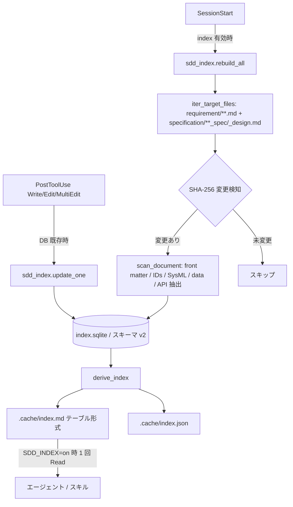

# ドキュメントインデックス

**関連 Spec:** [documentation-index_spec.md](documentation-index_spec.md)
**関連 PRD:** [documentation-index.md](../../requirement/workflow-foundation/documentation-index.md)（親: [workflow-foundation](../../requirement/workflow-foundation/index.md)）
**準拠する原則:** [CONSTITUTION.md](../../CONSTITUTION.md) A-002（フックとスクリプトの責務分離）, D-001（Specification-Driven）, D-003（ドキュメント永続性）, T-002（plugin.json 登録）, T-003（日本語出力の文字化け防止）

---

# 1. 実装ステータス `<MUST>`

**ステータス:** 🟢 実装済み

本設計書は既存実装（`scripts/sdd_index.py` / `scripts/session-start.py` / `scripts/post-tool-use.py`）の
挙動を逆算して記述したものである。スキーマ・抽出内容・キャッシュ方式は実装コードを真実の源とする。

## 1.1. 実装進捗

| モジュール/機能            | ステータス | 備考                                                              |
|--------------------------|--------|-------------------------------------------------------------------|
| インデックスビルダ           | 🟢     | `scripts/sdd_index.py`（SQLite スキーマ v2・抽出・派生・キャッシュ無効化）    |
| 全体構築（SessionStart）    | 🟢     | `scripts/session-start.py` の `rebuild_index()` → `sdd_index.rebuild_all()` |
| 増分更新（PostToolUse）    | 🟢     | `scripts/post-tool-use.py` の `try_update_index()` → `sdd_index.update_one()`（DB 既存時のみ） |
| フック登録                 | 🟢     | `hooks/hooks.json` の `PostToolUse`（matcher: `Write\|Edit\|MultiEdit`）  |
| 設定・環境変数             | 🟢     | `.sdd-config.json` `index`（bool・既定 on）→ `SDD_INDEX="on"`（session-config FR_001_04） |
| ユニットテスト             | 🟢     | `tests/test_sdd_index.py`（抽出・キャッシュ無効化・派生・増分更新）／`tests/test_session_start.py`（`index` パース・`SDD_INDEX` 出力） |

---

# 2. 設計目標 `<MUST>`

- `.sdd/` ドキュメントの構造化情報を**決定的・軽量**に抽出し、消費側の参照を単一 Read に集約する（NFR-001）
- 抽出・キャッシュ管理を**スクリプト（フック）へ**、インデックスの解釈を**消費側へ**分離する（A-002）
- インデックスは**派生成果物**とし、真実の源である本文を代替・破壊しない（D-003）
- **変更検知**により未変更ドキュメントの再処理を避け、構築コストを最小化する（FR-004）
- 構築・更新の失敗が**ワークフローを停止させない**（FR-006 / 親 PRD DC_002）

---

# 3. 実装方式 `<MUST>`

| 領域     | 採用方式                                          | 選定理由                                                                                  |
|--------|-----------------------------------------------|-----------------------------------------------------------------------------------------|
| script | Python 3 + 標準ライブラリ `sqlite3`（中間ストア）        | 構造化データの集約・クエリに適し、外部依存なしで動作。抽出は決定的で LLM 推論を要さない（A-002）              |
| 派生     | SQLite → テーブル形式 Markdown（`index.md`）を派生生成   | 消費側は Markdown を 1 回 Read するだけで全体像を得られ、トークンを削減（NFR-001）                     |
| キャッシュ | SHA-256 コンテンツハッシュによる変更検知                  | 未変更ドキュメントの再抽出を回避。決定的で再現性がある（FR-004）                                       |
| 構築     | SessionStart フック（全体再構築）                      | セッション開始時に一度だけ最新化。`index` 設定が有効な場合のみ実行（FR-001・005）                        |
| 更新     | PostToolUse フック（増分更新、DB 既存時のみ）              | 編集直後に当該ドキュメントのみ更新。DB 未構築（＝無効）時は何もせず自動的に off 連動（FR-002・005）           |

---

# 4. アーキテクチャ `<MUST>`

## 4.1. システム構成図



## 4.2. モジュール分割

| モジュール名        | 責務                                                                                | 依存関係                    | 配置場所                                       |
|------------------|-------------------------------------------------------------------------------------|---------------------------|----------------------------------------------|
| sdd_index.py     | ドキュメント走査・構造化情報抽出・SQLite 格納・圧縮インデックス派生・キャッシュ無効化              | sqlite3, hashlib, hook_common | `plugins/sdd-workflow/scripts/sdd_index.py`    |
| rebuild_all      | 全対象ドキュメントを走査し、変更分を upsert・stale 分を削除して派生を更新（SessionStart から呼ぶ） | sdd_index 内部              | `sdd_index.py` 内の関数                         |
| update_one       | 単一ドキュメントを増分更新（DB 未存在時は即 return＝無効連動）（PostToolUse から呼ぶ）           | sdd_index 内部              | `sdd_index.py` 内の関数                         |
| derive_index     | SQLite からテーブル形式 `index.md`・`index.json` を派生生成                              | sdd_index 内部              | `sdd_index.py` 内の関数                         |
| session-start.py | `index` 設定を解決し、有効時に `rebuild_all` を呼び `SDD_INDEX="on"` を出力                 | sdd_index                  | `plugins/sdd-workflow/scripts/session-start.py` |
| post-tool-use.py | 編集ファイルが requirement/specification 配下の `.md` のとき `update_one` を呼ぶ            | sdd_index, hook_common     | `plugins/sdd-workflow/scripts/post-tool-use.py` |

---

# 5. データ構造 `<OPTIONAL>`

## 5.1. SQLite スキーマ（`index.sqlite`, `SCHEMA_VERSION = "2"`）

| テーブル               | 役割                                                              |
|----------------------|-------------------------------------------------------------------|
| `meta`               | スキーマバージョン管理                                                |
| `documents`          | パス・コンテンツハッシュ・front matter（doc_id / type / status / impl-status 等） |
| `dependencies`       | ドキュメント間の依存関係（`depends-on`）                                 |
| `tags`               | ドキュメントタグ                                                     |
| `ids`                | 要求 ID（UR/FR/NFR）の抽出結果                                        |
| `sysml_relationships`| SysML 要求関係（source_id / rel_type / target_id）                   |
| `data_models`        | フェンスブロック内のデータ定義                                          |
| `api_signatures`     | REST API シグネチャ                                                 |

## 5.2. 派生する圧縮インデックス（`index.md`）の区分

`derive_index` が SQLite から以下のセクションを持つテーブル形式 Markdown を生成する。消費側はこれを 1 回 Read する。

```
## Metadata            # doc_id / type / path / status / impl-status / depends-on / category
## Requirement IDs     # req_id / kind(UR/FR/NFR) / doc_id / section
## SysML Relationships # source_id / rel_type / target_id
## API Signatures      # REST エンドポイント等
## Data Models         # 言語別のデータ定義
```

`index.json`（`{"schema": "sdd-index/2", "document_count": N, "documents": [...]}`）も併せて派生する。

## 5.3. 走査対象（`iter_target_files`）

- `${SDD_ROOT}/${requirement_dir}/` 配下の全 `.md`
- `${SDD_ROOT}/${specification_dir}/` 配下の `*_spec.md` / `*_design.md` のみ
- `${SDD_ROOT}/.cache/` は対象外（派生成果物のため）

---

# 6. ファイル構成 `<OPTIONAL>`

```
plugins/sdd-workflow/
├── scripts/
│   ├── sdd_index.py        # インデックスビルダ本体（抽出・格納・派生・キャッシュ無効化）
│   ├── session-start.py    # SessionStart: index 有効時に rebuild_all、SDD_INDEX 出力
│   └── post-tool-use.py    # PostToolUse: DB 既存時に update_one（増分更新）
└── hooks/
    └── hooks.json          # PostToolUse（matcher: Write|Edit|MultiEdit）へ登録

# 生成物（プロジェクト側、真実の源ではない派生キャッシュ）
${SDD_ROOT}/.cache/
├── index.sqlite            # 中間ストア（スキーマ v2）
├── index.json              # 構造化データの JSON 派生
└── index.md                # 消費側が 1 回 Read するテーブル形式インデックス

# テスト（リポジトリルート）
tests/
├── test_sdd_index.py       # 抽出・キャッシュ無効化・派生・増分更新
└── test_session_start.py   # index 設定パース・SDD_INDEX 出力
```

既存フックの逆算記述であり、新規スキル・エージェント追加ではないため `plugin.json` の変更は不要（T-002）。

---

# 7. 非機能要件実現方針 `<OPTIONAL>`

| 要件                        | 実現方針                                                                                 |
|---------------------------|------------------------------------------------------------------------------------------|
| NFR-001（トークン削減）        | 消費側は `.cache/index.md` を 1 回 Read するのみ。多数の Glob/Grep/Read を単一 Read に集約する      |
| NFR-002（精度維持）          | front matter・要求 ID・SysML 関係・データモデル・API を漏れなく抽出し、本文直接参照と同等の情報を提供する |
| NFR-003（共通契約準拠）        | `.sdd-config.json` `index` / `SDD_INDEX` の名称・意味を session-config・親 PRD IR_001 と一致させる    |

---

# 8. テスト戦略 `<OPTIONAL>`

| テストレベル      | 対象                              | カバレッジ目標                                                    |
|----------------|----------------------------------|----------------------------------------------------------------|
| ユニットテスト     | `tests/test_sdd_index.py`         | スキーマ初期化・front matter/要求 ID/SysML 抽出・SHA-256 キャッシュ無効化・`index.md` 派生・増分更新 |
| ユニットテスト     | `tests/test_session_start.py`     | `index` の bool パース・既定 on・`SDD_INDEX="on"` 出力／無効時の未出力          |
| A/B ハーネス     | `.claude/tests/harness/`（RUNBOOK 参照） | マーケットプレイス版比較でのトークン削減量と defect 検出精度の比較                     |
| CI 検証         | `.github/workflows/ci.yml` の `test` ジョブ | 上記ユニットテストが CI で実行される                                     |

---

# 9. 設計判断 `<MUST>`

## 9.1. 決定事項

| 決定事項              | 選択肢                                  | 決定内容                          | 理由                                                                        |
|---------------------|----------------------------------------|---------------------------------|---------------------------------------------------------------------------|
| 中間ストア            | プレーン JSON / SQLite                    | SQLite（スキーマ v2）              | 構造化データの集約・関係表現・部分更新に適し、標準ライブラリのみで動作                    |
| 消費形式             | SQLite を直接参照 / Markdown 派生          | テーブル形式 Markdown を派生         | 消費側（LLM）は Markdown を 1 回 Read するのが最も低コスト（NFR-001）                 |
| キャッシュ無効化        | 更新時刻 / コンテンツハッシュ                | SHA-256 コンテンツハッシュ           | 内容変化のみを検知し再現性がある。時刻依存の誤検知を避ける（FR-004）                      |
| 増分更新のガード        | 設定フラグ参照 / DB 存在チェック             | DB 存在時のみ更新（`update_one` 冒頭で return） | 無効時は DB が無いので自動的に no-op。設定の二重管理を避け off と自然に連動（FR-005）        |
| 有効判定の既定         | off / on                               | on（session-config FR_001_04）    | トークン削減効果を標準で享受。無効化は `index: false` で明示（子 PRD DC_001）             |
| 失敗時の挙動          | 例外送出 / 警告して継続                     | try/except で警告し継続            | 派生生成の失敗がワークフローを止めない（FR-006 / 親 PRD DC_002）                        |
| 出力エンコーディング     | `ensure_ascii=True` / `False`           | UTF-8（`ensure_ascii=False`）      | 日本語ドキュメントのタイトル・パスを派生物に文字化けなく含める（T-003）                     |

## 9.2. 未解決の課題

| 課題                                              | 影響度 | 対応方針                                                          |
|--------------------------------------------------|-----|------------------------------------------------------------------|
| スキーマ変更時の後方互換（`SCHEMA_VERSION` 更新）        | 低   | `meta` テーブルでバージョンを保持。不一致時は全体再構築で吸収する              |
| 消費側が古いインデックスを参照する可能性（本文編集直後の未再構築） | 低   | PostToolUse 増分更新で追随。乖離時は本文を真実の源として優先（D-003）           |

---

# 10. 原則準拠チェックリスト `<RECOMMENDED>`

| 原則ID  | 原則名                   | 準拠状況 | 備考                                                            |
|-------|-------------------------|--------|---------------------------------------------------------------|
| A-002 | フックとスクリプトの責務分離   | ✅     | 抽出・キャッシュはスクリプト／フック、解釈は消費側に分離                     |
| D-001 | Specification-Driven     | ✅     | 構造化情報を集約し仕様書を真実の源とする参照フローを低コストで維持              |
| D-003 | ドキュメント永続性          | ✅     | インデックスは `.cache/` 配下の派生物に留め、本文を代替・破壊しない            |
| T-002 | plugin.json 登録の一貫性    | ✅     | 既存フックの逆算記述であり新規コンポーネント追加なし（plugin.json 変更不要）      |
| T-003 | 日本語出力の文字化け防止      | ✅     | 派生生成は `ensure_ascii=False` で日本語を保持                        |

**原則から逸脱する場合**: 理由を「9.1. 決定事項」に明記し、CONSTITUTION.md の例外プロセスに従うこと。
