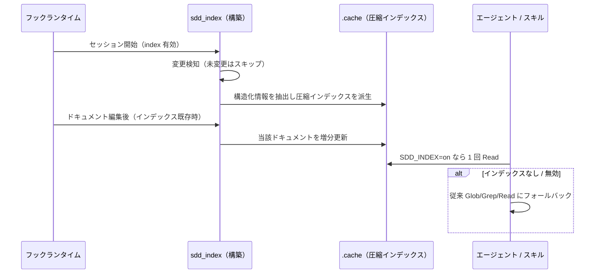

# ドキュメントインデックス

**関連 Design Doc:** [documentation-index_design.md](documentation-index_design.md)
**関連 PRD:** [documentation-index.md](../../requirement/workflow-foundation/documentation-index.md)（親: [workflow-foundation](../../requirement/workflow-foundation/index.md)）
**準拠する原則:** [CONSTITUTION.md](../../CONSTITUTION.md) A-002（フックとスクリプトの責務分離）, D-001（Specification-Driven）, D-003（ドキュメント永続性）

---

# 1. 背景 `<MUST>`

エージェント（prd-reviewer / spec-reviewer / requirement-analyzer 等）やスキル
（doc-consistency-checker 等）が `.sdd/` の要求仕様書・仕様書を横断参照する際、従来は
複数回の Glob / Grep / Read を要した。ドキュメント数が増えるほどトークン消費が増大し、
参照コストが AI-SDD ワークフローの実用性を圧迫する。

`.sdd/` ドキュメントは front matter・要求 ID（UR/FR/NFR）・SysML 関係・データモデル・
API シグネチャという構造化された情報を持つ。これらをセッション開始時に一度抽出して
圧縮インデックスにまとめておけば、消費側は 1 回の Read で全体像を把握でき、参照精度を
保ちつつトークンを大幅に削減できる。

# 2. 概要 `<MUST>`

本機能は、`.sdd/` の要求仕様書・仕様書から構造化情報を抽出して圧縮インデックスを構築し、
消費側が 1 回の Read で参照できる形で提供する。主要な設計原則は以下のとおり。

- **抽出とキャッシュの分離**: 機械的な抽出・キャッシュ管理はスクリプト（フック）が担い、
  インデックスの解釈・活用は消費側（エージェント・スキル）が担う（A-002）
- **派生成果物**: インデックスは各ドキュメント本文から派生した成果物であり、真実の源は
  常に `.sdd/` ドキュメント本文である。インデックスが古い場合の判断は本文が優先される
- **オプトイン（既定有効）**: 設定でインデックスの有効・無効を切り替えられる。無効時や
  未構築時は消費側が従来の Glob / Grep / Read にフォールバックする
- **変更検知による無駄の排除**: 未変更のドキュメントは再抽出しない
- **非停止**: 構築・更新の失敗はワークフローを止めず、消費側はフォールバックする

「何を抽出し、どう提供するか」を定義し、スキーマ・抽出ロジック・キャッシュ方式の具体は
[documentation-index_design.md](documentation-index_design.md) に委ねる。

# 3. 要求定義 `<RECOMMENDED>`

## 3.1. 機能要件 (Functional Requirements)

| ID     | 要件                                                                           | 優先度 | 根拠（上流要求）                          |
|--------|--------------------------------------------------------------------------------|-----|----------------------------------------|
| FR-001 | セッション開始時に要求仕様書・仕様書を走査し、構造化情報を抽出してインデックスへ格納する    | 必須  | 子 PRD FR_001_01 / 親 PRD FR_005・UR_005 |
| FR-002 | ドキュメント編集後、当該ドキュメントの構造化情報を増分更新する（インデックス既存時のみ）     | 必須  | 子 PRD FR_001_02                        |
| FR-003 | 消費側が 1 回で読める圧縮インデックス（テーブル形式）を派生生成する                     | 必須  | 子 PRD FR_001_03                        |
| FR-004 | ドキュメント内容の変更を検知し、未変更ドキュメントの再処理をスキップする                  | 必須  | 子 PRD FR_001_04                        |
| FR-005 | インデックスの有効・無効を設定で切り替える（既定有効）。無効・未構築時は何も構築しない       | 必須  | 子 PRD DC_001 / 親 PRD DC_002           |
| FR-006 | 構築・更新の失敗時は警告に留め、ワークフローを停止しない                               | 必須  | 子 PRD 制約 / 親 PRD DC_002             |

抽出する構造化情報は、front matter（id / type / status / impl-status / depends-on / category 等）、
要求 ID（UR/FR/NFR）、SysML 要求関係、データモデル、API シグネチャを含む。

## 3.2. 非機能要件 (Non-Functional Requirements) `<OPTIONAL>`

| ID      | カテゴリ         | 要件                                                        | 目標値                                        |
|---------|--------------|-----------------------------------------------------------|----------------------------------------------|
| NFR-001 | 効率           | 消費側の参照を単一 Read に集約し、トークン消費を削減する          | マーケットプレイス版比較で有意なトークン削減（A/B 実測） |
| NFR-002 | 精度           | インデックス参照は本文直接参照と同等以上の検出精度を保つ           | defect 検出が悪化しない（A/B 実測）              |
| NFR-003 | インターフェース | `.sdd-config.json` の `index` / `SDD_INDEX` 環境変数の共通契約に準拠 | 親 PRD IR_001                                |

# 4. 提供コンポーネント `<MUST>`

| 種別     | 配置場所                                                      | 名前                | 概要                                                                          |
|--------|-----------------------------------------------------------|-------------------|-------------------------------------------------------------------------------|
| script | `scripts/sdd_index.py`                                    | インデックスビルダ     | `.sdd/` ドキュメントから構造化情報を抽出し、インデックスと圧縮インデックスを構築・派生する（FR-001〜004） |
| hook   | `scripts/session-start.py`（SessionStart）                 | インデックス全体構築    | セッション開始時に `index` 設定が有効なら全ドキュメントを走査して再構築し、`SDD_INDEX` を設定する（FR-001・005） |
| hook   | `scripts/post-tool-use.py` + `hooks/hooks.json`（PostToolUse） | インデックス増分更新    | ドキュメント編集後、インデックス既存時のみ当該ドキュメントを増分更新する（FR-002）             |

## 4.1. 入出力定義 `<OPTIONAL>`

**設定（入力）**: `.sdd-config.json` の `index`（真偽値、既定 `true`）。有効時 `SDD_INDEX="on"` が
消費側に伝播する（設定・環境変数の詳細は [session-config.md](../../requirement/workflow-foundation/session-config.md) の FR_001_04）。

**成果物（出力）**: `${SDD_ROOT}/.cache/` 配下に、消費側が参照する圧縮インデックス（テーブル形式の
Markdown）と、その基盤となる構造化データを生成する。圧縮インデックスは少なくとも以下の区分を含む。

```
# 圧縮インデックス（テーブル形式）の論理区分
- Metadata           : doc_id / type / path / status / impl-status / depends-on / category
- Requirement IDs    : req_id / kind(UR/FR/NFR) / doc_id / section
- SysML Relationships: source_id / rel_type / target_id
- API Signatures     : REST エンドポイント等のシグネチャ
- Data Models        : 言語別のデータ定義
```

# 5. 用語集 `<OPTIONAL>`

| 用語              | 説明                                                                          |
|-----------------|-------------------------------------------------------------------------------|
| インデックス         | `.sdd/` ドキュメントから抽出した構造化情報の集約。消費側の参照コストを下げる派生成果物            |
| 圧縮インデックス      | 消費側が 1 回の Read で参照するテーブル形式のドキュメント（インデックスから派生生成）             |
| 増分更新           | 編集されたドキュメントのみを再抽出してインデックスへ反映すること                              |
| キャッシュ無効化      | ドキュメント内容の変更を検知し、変更分のみ再処理・未変更分をスキップする仕組み                     |
| `SDD_INDEX`      | インデックスが有効なときに消費側へ伝播する環境変数（有効時 `on`、無効時は未設定）                  |

# 6. 使用例 `<RECOMMENDED>`

本機能はフックとして自動発火する。消費側はインデックスの有無で参照方法を切り替える。

```
# セッション開始（index 有効）→ 圧縮インデックスが構築される
SessionStart → sdd_index.rebuild_all() → ${SDD_ROOT}/.cache/ に圧縮インデックス生成

# ドキュメント編集後 → 増分更新（インデックス既存時のみ）
Edit: .sdd/requirement/auth/user-login.md → sdd_index.update_one() で当該分を更新

# 消費側（SDD_INDEX=on 時）→ 圧縮インデックスを1回だけ Read
Agent/Skill: Read ${SDD_ROOT}/.cache の圧縮インデックス → 必要時のみ個別ドキュメントを Read

# SDD_INDEX 未設定/off → 従来の Glob/Grep/Read にフォールバック
```

# 7. 振る舞い図 `<OPTIONAL>`



# 8. 制約事項 `<OPTIONAL>`

- インデックスは派生成果物であり、真実の源は `.sdd/` ドキュメント本文（D-003）。乖離時は本文が優先される
- 構築・更新の失敗はワークフローを停止させない。失敗時は警告に留め消費側はフォールバックする
- 消費側での具体的な活用方法は本仕様のスコープ外（各機能カテゴリの spec / design が扱う）

# 9. 原則との整合性 `<RECOMMENDED>`

| 原則ID  | 原則名                   | 本仕様への適用内容                                                              |
|-------|-------------------------|--------------------------------------------------------------------------------|
| A-002 | フックとスクリプトの責務分離   | 機械的な抽出・キャッシュ管理をスクリプト／フックへ、インデックスの解釈を消費側へ分離する         |
| D-001 | Specification-Driven     | ドキュメントの構造化情報を集約し、仕様書を真実の源とする参照フローを低コストで維持する           |
| D-003 | ドキュメント永続性         | インデックスは派生キャッシュに留め、真実の源である本文を代替・破壊しない                       |

---

# PRD 整合性レビュー結果

| 確認項目        | 結果                                                                                     |
|---------------|------------------------------------------------------------------------------------------|
| 要求カバレッジ   | 子 PRD FR_001_01〜04 を FR-001〜004 で、DC_001 を FR-005 で、非停止制約を FR-006 でカバー          |
| 要求 ID 参照    | 各 FR に対応する子 PRD / 親 PRD（FR_005・UR_005・IR_001・DC_002）の要求 ID を「根拠」列に明記         |
| 非機能要求の反映 | 子 PRD UR_001（効率・精度）と親 PRD IR_001 を NFR-001〜003 に反映                                |
| 用語整合性      | 親 PRD・session-config の「SDD_INDEX」「インデックス」定義に整合。固有語（圧縮インデックス・増分更新）を追加定義 |
| スコープ整合性   | 設定・環境変数の設定（session-config）と消費側の活用（各カテゴリ）をスコープ外として明記               |
