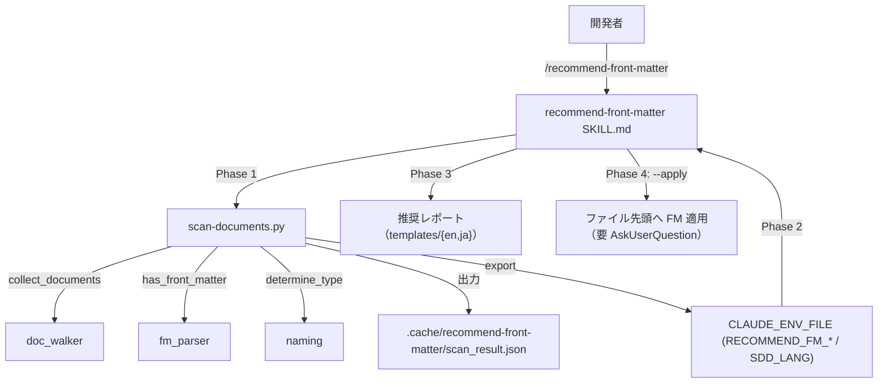

# front matter 推奨

**関連 Spec:** [front-matter-recommend_spec.md](front-matter-recommend_spec.md)
**関連 PRD:** [front-matter-recommend.md](../../requirement/workflow-foundation/front-matter-recommend.md)（親: [workflow-foundation](../../requirement/workflow-foundation/index.md)）
**準拠する原則:** [CONSTITUTION.md](../../CONSTITUTION.md) A-001（Skills-First）, A-002（フックとスクリプトの責務分離）, B-002（多言語対応の一貫性）, D-001（Specification-Driven）, T-002（plugin.json 登録）, T-003（日本語出力の文字化け防止）

---

# 1. 実装ステータス

**ステータス:** 🟢 実装済み

本設計書は、既に実装・稼働している `recommend-front-matter` スキル
（`plugins/sdd-workflow/skills/recommend-front-matter/`）の構成を逆算して記述したものである。
実装コード（`SKILL.md` / `scripts/scan-documents.py` / 共有モジュール
`fm_parser` / `naming` / `doc_walker` / `templates/{en,ja}/`）を真実の源とする。

> **逆算記述の経緯（正当化）**: `recommend-front-matter` スキルは front matter 対応の後付け導入を
> 支援する基盤機能として先行実装され、本 spec/design は後追いで機能要求を明文化した逆算記述である。
> D-001（Specification-Driven）の原則に対し、実装先行という経緯を CONSTITUTION の例外プロセス
> （文書化・正当化・追跡）に沿って本節に記録する。以降の記述は実装ファイルの実態に一致させている。

## 1.1. 実装進捗

| モジュール/機能                     | ステータス | 備考                                                             |
|-----------------------------------|--------|------------------------------------------------------------------|
| スキル本体（SKILL.md）               | 🟢     | 4 フェーズ（走査 → 推論 → レポート → --apply 適用）を Markdown で定義        |
| 走査スクリプト                       | 🟢     | `scripts/scan-documents.py`（Python 標準ライブラリ + 共有モジュール）        |
| 共有モジュール利用                    | 🟢     | `fm_parser.has_front_matter` / `naming.determine_type` / `doc_walker.collect_documents` |
| 言語別テンプレート                    | 🟢     | `recommendation_report.md` / `application_result.md` / `type_specific_fields.md`（en/ja） |
| plugin.json 登録                    | 🟢     | `"skills": "./skills"` によりディレクトリ一括登録                          |

---

# 2. 設計目標

- 既存ドキュメントへの front matter 付与を「推奨」と「適用」に分離して提供する（FR-004 / FR-005）
- front matter の有無検出・種別判定・タイトル抽出という決定的処理をスクリプトへ委譲する（A-002 / NFR-002）
- 走査スクリプトを OS 非依存にし、対応 OS で一貫動作させる（NFR-003）
- front matter を持つ既存ドキュメントを変更せず後方互換を維持する（FR-006 / NFR-001）
- 出力言語をテンプレート言語に一致させ、言語混在を防ぐ（B-002 / FR-007）

---

# 3. 実装方式

| 領域     | 採用方式                                          | 選定理由                                                                                     |
|--------|-------------------------------------------------|--------------------------------------------------------------------------------------------|
| skill  | Markdown プロンプト（`SKILL.md`, `agent: haiku`）     | メタデータ推論（id/tags/category/depends-on）は Claude の推論を要する。軽量タスクのため haiku を指定（A-001） |
| script | Python 3 + 標準ライブラリ + 共有モジュール            | 有無検出・種別判定・タイトル抽出は決定的処理。共有モジュールで他スキルとロジックを共通化（A-002 / NFR-003） |
| 実行分離 | 4 フェーズ（走査 → 推論 → レポート → 適用）           | 機械的走査と推論・適用を分離し、Claude の Glob/Grep 逐次呼び出しを削減する（A-002 / NFR-002）        |
| 適用制御 | `--apply` + `AskUserQuestion` によるユーザー確認     | 既定は非破壊（レポートのみ）。ファイル変更は明示的な opt-in と確認を必須にする（安全側の既定）             |
| template | 言語別ディレクトリ `templates/{en,ja}/`             | `SDD_LANG` に応じて雛形を切り替え、出力言語をテンプレート言語に一致させる（B-002）                     |

---

# 4. アーキテクチャ

## 4.1. システム構成図



## 4.2. モジュール分割

| モジュール名                | 責務                                                      | 依存関係                                 | 配置場所                                                  |
|---------------------------|-----------------------------------------------------------|----------------------------------------|-----------------------------------------------------------|
| recommend-front-matter スキル | 走査結果からの FM 推論・レポート整形・`--apply` 適用手順          | scan-documents.py, templates            | `skills/recommend-front-matter/SKILL.md`                  |
| scan-documents.py          | ドキュメント走査・FM 有無/種別/タイトル抽出・JSON 生成・env export | 共有モジュール群, `hook_common`, `env_export` | `skills/recommend-front-matter/scripts/scan-documents.py` |
| 共有モジュール              | FM 検出（`fm_parser`）・種別判定（`naming`）・走査（`doc_walker`）   | Python 標準ライブラリ                     | `scripts/fm_parser.py` / `naming.py` / `doc_walker.py`    |
| 言語別テンプレート           | 推奨・適用レポート雛形、種別別フィールド定義                       | -                                       | `skills/recommend-front-matter/templates/{en,ja}/`         |

---

# 5. データ構造

走査スクリプトは `${SDD_ROOT}/.cache/recommend-front-matter/scan_result.json` を生成し、
`CLAUDE_ENV_FILE` へ `RECOMMEND_FM_*` と `SDD_LANG` を export する。

```json
// scan_result.json
{
  "scan_timestamp": "2026-07-24T00:00:00Z",
  "total_documents": 0,
  "documents_with_front_matter": 0,
  "documents_without_front_matter": 0,
  "documents": [
    {
      "path": "/abs/.sdd/requirement/foo.md",
      "relative_path": "requirement/foo.md",
      "basename": "foo",
      "type": "prd",
      "has_front_matter": false,
      "title_line": "Foo 要求仕様書"
    }
  ]
}
```

```sh
# CLAUDE_ENV_FILE に書き込まれる export 群
export RECOMMEND_FM_CACHE_DIR=".../.sdd/.cache/recommend-front-matter"
export RECOMMEND_FM_SCAN_RESULT=".../scan_result.json"
export SDD_LANG="ja"
```

適用する front matter の共通フィールドは `id` / `title` / `type` / `status` / `created` /
`updated` / `depends-on` / `tags` / `category`。種別固有フィールドは `type_specific_fields.md` に従う
（例: prd は `priority` / `risk`、spec は `sdd-phase: "specify"`、design は `sdd-phase: "plan"` + `impl-status`）。

---

# 6. ファイル構成

```
plugins/sdd-workflow/
├── skills/recommend-front-matter/
│   ├── SKILL.md                                    # スキル本体（4 フェーズ手順）
│   ├── scripts/scan-documents.py                   # 走査スクリプト
│   ├── references/                                 # FM スキーマ・前提条件・scan_result_schema
│   ├── templates/en/recommendation_report.md       # 推奨レポート雛形（EN）
│   ├── templates/en/application_result.md           # 適用結果雛形（EN）
│   ├── templates/en/type_specific_fields.md         # 種別別フィールド（EN）
│   └── templates/ja/{同上}                          # 日本語版
├── scripts/fm_parser.py                            # has_front_matter 共有
├── scripts/naming.py                               # determine_type 共有
├── scripts/doc_walker.py                           # collect_documents 共有
├── scripts/hook_common.py / env_export.py          # ルート解決・env export 共有
└── .claude-plugin/plugin.json                      # "skills": "./skills"（T-002）
```

---

# 7. 非機能要件実現方針

| 要件                          | 実現方針                                                                     |
|-------------------------------|------------------------------------------------------------------------------|
| NFR-001 後方互換               | FM を持つドキュメントは走査で `has_front_matter: true` とし推奨・適用対象から除外する    |
| NFR-002 走査効率               | Phase 1 のスクリプトで一括走査し、Phase 2 の Claude は未付与ドキュメントのみを読む         |
| NFR-003 移植性                 | `scan-documents.py` は `pathlib` / `re` / `json` と共有モジュールのみで OS 固有 CLI に非依存 |

---

# 8. テスト戦略

| テストレベル   | 対象                                              | カバレッジ目標                          |
|------------|---------------------------------------------------|----------------------------------------|
| ユニット     | 共有モジュール（`fm_parser` / `naming` / `doc_walker`）  | `tests/` で主要分岐を網羅（複数 OS の CI）  |
| 静的解析      | プロンプト内コードブロック・命名規則                       | `plugin-lint` で検査                     |
| 構文検証      | `plugin.json` の JSON 構文                           | `jq .` で検証（T-001）                    |

---

# 9. 設計判断

## 9.1. 決定事項

| 決定事項                | 選択肢                                          | 決定内容                       | 理由                                                                                          |
|-----------------------|-----------------------------------------------|------------------------------|-----------------------------------------------------------------------------------------------|
| 実装形態                | (a) legacy command / (b) skill                  | **(b) skill（agent: haiku）**  | A-001 に従い skills として実装。推論主体の軽量タスクのため haiku を指定                              |
| 走査の実装             | (a) Claude が逐次 Read / (b) スクリプトで一括走査     | **(b) スクリプト一括走査**       | A-002 に従い決定的処理を委譲。ツール呼び出しとトークンを削減（NFR-002）                               |
| 走査ロジックの共通化      | (a) スキル内に固有実装 / (b) 共有モジュールを利用       | **(b) 共有モジュール**           | `fm_parser`/`naming`/`doc_walker` を他スキル・フックと共有し、検出・種別判定ロジックの重複を排除     |
| 既定動作               | (a) 常に適用 / (b) 推奨のみ、適用は --apply           | **(b) 推奨のみが既定**           | ファイル変更は破壊的操作。安全側の既定とし、適用は明示 opt-in + AskUserQuestion 確認を必須にする       |
| FM 検証の担当           | (a) 本スキルで検証も実施 / (b) 推奨・適用に限定         | **(b) 推奨・適用に限定**         | 検証は quality-guardrails の front-matter-reviewer が担当。責務を分離し本機能は付与支援に集中する      |

## 9.2. 未解決の課題

| 課題                                   | 影響度 | 対応方針                                            |
|--------------------------------------|-----|-----------------------------------------------------|
| `depends-on` / `tags` / `category` の推論精度 | 低   | パターンマッチのため取りこぼしがある。適用後の手動調整を推奨としてレポートに明記 |
| `priority` / `risk` の既定値            | 低   | 常に既定値を推奨。ユーザーレビューを前提とする                       |

---

# 10. 原則準拠チェックリスト

| 原則ID  | 原則名                   | 準拠状況 | 備考                                                          |
|-------|-------------------------|------|---------------------------------------------------------------|
| A-001 | Skills-First             | ✅   | `skills/recommend-front-matter/` として実装。legacy command は追加しない  |
| A-002 | フックとスクリプトの責務分離   | ✅   | 走査を `scan-documents.py` と共有モジュールに委譲                       |
| B-002 | 多言語対応の一貫性          | ✅   | `templates/{en,ja}/` を用意し `SDD_LANG` に応じて出力                    |
| D-001 | Specification-Driven     | ⚠️   | 実装先行のため本 spec/design を逆算作成（1 節に例外を文書化・正当化）          |
| T-002 | plugin.json 登録の徹底     | ✅   | `"skills": "./skills"` によりスキルを登録済み                           |
| T-003 | 日本語出力の文字化け防止     | ✅   | 日本語テンプレート・出力で UTF-8 を維持し mojibake を防止                  |

**原則から逸脱する場合**: D-001 について実装先行の経緯を 1 節に文書化し、CONSTITUTION.md の例外プロセスに従う。
