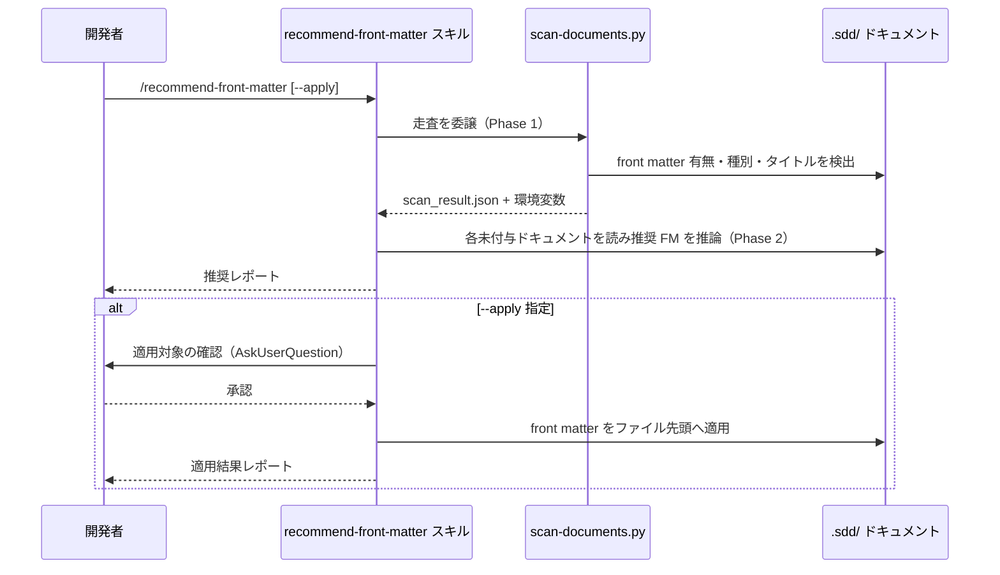

# front matter 推奨

**関連 Design Doc:** [front-matter-recommend_design.md](front-matter-recommend_design.md)
**関連 PRD:** [front-matter-recommend.md](../../requirement/workflow-foundation/front-matter-recommend.md)（親: [workflow-foundation](../../requirement/workflow-foundation/index.md)）
**準拠する原則:** [CONSTITUTION.md](../../CONSTITUTION.md) A-002（フックとスクリプトの責務分離）, B-002（多言語対応の一貫性）, D-001（Specification-Driven）, T-003（日本語出力の文字化け防止）

---

# 1. 背景

AI-SDD ドキュメントは YAML front matter によって機械的な検索・フィルタリング・整合性検証を
可能にするが、front matter 対応より前に作成された既存ドキュメントにはメタデータが付与されて
いない。これらを一括で調査し、ドキュメント種別（PRD / spec / design / task / implementation-log）に
応じた front matter の付与を推奨・適用する手段がなければ、既存資産の構造化が進まない。

本機能は、`.sdd/` 配下の既存ドキュメントをスキャンして front matter の有無・種別・タイトルを
検出し、種別に応じた推奨 front matter を提示する `/recommend-front-matter` スキルを提供する。
`--apply` 指定時は、ユーザー確認のうえで推奨内容を一括適用する。front matter は任意かつ
後方互換であり、付与しない既存ドキュメントも引き続き有効として扱う。

本仕様は、既存実装（`plugins/sdd-workflow/skills/recommend-front-matter/`）を真実の源として
逆算的に明文化したものである（詳細な経緯は [front-matter-recommend_design.md](front-matter-recommend_design.md) の 1 節を参照）。

# 2. 概要

本機能は、開発者が手動で `/recommend-front-matter` スキルを呼び出すことで、既存ドキュメントへの
front matter 付与を推奨・適用できるようにする。主要な設計原則は以下のとおり。

- **決定的走査の委譲**: front matter の有無検出・種別判定・タイトル抽出という機械的処理を
  スクリプトへ委譲し、Claude はメタデータの推論とレポート生成に専念する（A-002）
- **推奨と適用の分離**: 既定（引数なし）は推奨レポートのみを生成し、`--apply` 指定時のみ
  ユーザー確認を経てファイルへ適用する（非破壊がデフォルト）
- **後方互換の維持**: front matter を持たない既存ドキュメントを破壊せず、引き続き有効として扱う
- **多言語一貫性**: 出力テンプレートは `templates/{en,ja}/` を持ち、`SDD_LANG` に応じた言語で出力する（B-002）
- **推奨に留める**: 本機能は付与の推奨・適用までを担い、front matter の検証は担当しない

「何を推奨・適用するか」を定義し、具体的な実装方式（スキャンロジック・種別判定・依存推論・
適用手順）は [front-matter-recommend_design.md](front-matter-recommend_design.md) に委ねる。

# 3. 要求定義

## 3.1. 機能要件 (Functional Requirements)

| ID     | 要件                                                                                            | 優先度 | 根拠（上流要求）                    |
|--------|-----------------------------------------------------------------------------------------------|-----|----------------------------------|
| FR-001 | `.sdd/` 配下の requirement/specification/task ドキュメントをスキャンし front matter の有無を検出する      | 必須  | PRD FR_001 / 親 UR_004            |
| FR-002 | ファイルパスと命名規則からドキュメント種別を判定し、最初の `#` 見出しからタイトルを抽出する                     | 必須  | PRD FR_001                       |
| FR-003 | front matter のない各ドキュメントに、種別に応じた共通・固有フィールドの推奨 front matter を生成する            | 必須  | PRD FR_001                       |
| FR-004 | 推奨レポートを生成する（既定動作。ファイルは変更しない）                                                  | 必須  | PRD FR_001                       |
| FR-005 | `--apply` 指定時はユーザー確認のうえ推奨 front matter をファイル先頭へ適用し、結果レポートを生成する           | 必須  | PRD FR_001                       |
| FR-006 | front matter を持つ既存ドキュメントは変更せず、後方互換を維持する                                         | 必須  | 親 PRD NFR_001（後方互換）          |
| FR-007 | 出力テンプレートを `SDD_LANG`（en/ja）に応じて選択し、言語を混在させない                                    | 必須  | 親 PRD B-002                     |

## 3.2. 非機能要件 (Non-Functional Requirements)

| ID      | カテゴリ | 要件                                                             | 目標値                              |
|---------|------|------------------------------------------------------------------|-------------------------------------|
| NFR-001 | 互換性 | front matter を持たない既存ドキュメントを破壊しない                        | 既存ワークフローが継続動作する            |
| NFR-002 | 効率性 | ドキュメント走査を事前スクリプト化し、Claude のツール呼び出しを削減する          | 走査を 1 スクリプトに集約                |
| NFR-003 | 移植性 | 走査スクリプトは OS 固有 CLI に依存せず Python 標準ライブラリで動作する          | 対応 OS の CI で通過                   |

# 4. 提供コンポーネント

| 種別     | 配置場所                                                        | 名前               | 概要                                                       |
|--------|---------------------------------------------------------------|------------------|------------------------------------------------------------|
| skill  | `skills/recommend-front-matter/SKILL.md`                     | recommend-front-matter | ドキュメント走査・front matter 推奨・`--apply` 適用を提供する    |
| script | `skills/recommend-front-matter/scripts/scan-documents.py`    | scan-documents    | front matter の有無・種別・タイトルを走査し JSON と環境変数を出力する |
| template | `skills/recommend-front-matter/templates/{en,ja}/recommendation_report.md` | 推奨レポート雛形   | 推奨 front matter を提示するレポート（言語別）                   |
| template | `skills/recommend-front-matter/templates/{en,ja}/application_result.md`     | 適用結果雛形       | `--apply` の適用結果レポート（言語別）                          |
| template | `skills/recommend-front-matter/templates/{en,ja}/type_specific_fields.md`   | 種別別フィールド定義 | 種別ごとの固有フィールド一覧（言語別）                           |

## 4.1. 入出力定義

- **入力**: 任意オプション `--apply`（省略時は推奨レポートのみ）
- **環境変数**: `SDD_ROOT` / `SDD_LANG` / requirement・specification・task の各ディレクトリ名
- **出力**: 走査結果 JSON（`${SDD_ROOT}/.cache/recommend-front-matter/scan_result.json`）、推奨レポート、`--apply` 時は適用済みファイルと結果レポート

```json
// scan_result.json の documents 要素の構造例
{
  "path": ".../requirement/foo.md",
  "relative_path": "requirement/foo.md",
  "basename": "foo",
  "type": "prd",
  "has_front_matter": false,
  "title_line": "Foo 要求仕様書"
}
```

# 5. 用語集

| 用語               | 説明                                                                    |
|------------------|-------------------------------------------------------------------------|
| front matter      | Markdown 先頭の `---` で囲まれた YAML メタデータブロック                          |
| ドキュメント種別     | `prd` / `spec` / `design` / `task` / `implementation-log` の分類               |
| depends-on 推論    | 命名規則から上流ドキュメント（spec→prd, design→spec）を推定する処理                  |
| 後方互換           | front matter を持たない既存ドキュメントも有効として扱う性質                          |

# 6. 使用例

```
/recommend-front-matter           # 推奨レポートのみ生成（ファイルは変更しない）
/recommend-front-matter --apply   # ユーザー確認後に front matter を一括適用
```

# 7. 振る舞い図



# 8. 制約事項

- front matter の導入が既存ワークフローを破壊しないこと。front matter を持たない既存ドキュメントも
  引き続き有効として扱う（親 PRD NFR_001）
- 本機能は front matter の推奨・適用まで。front matter の検証は対象外（quality-guardrails カテゴリの
  front-matter-reviewer が扱う）
- `.sdd/` 構造・テンプレートの初期化は対象外（[sdd-init.md](../../requirement/workflow-foundation/sdd-init.md) が扱う）
- セッション設定・環境変数の初期化は対象外（[session-config.md](../../requirement/workflow-foundation/session-config.md) が扱う）
- `--apply` はファイルを直接変更するため、事前の Git コミットを推奨する
- 対象プロジェクトの `.sdd/` 配下に読み書き権限があることを前提とする

# 9. 原則との整合性

| 原則ID  | 原則名                   | 本仕様への適用内容                                                       |
|-------|-------------------------|-------------------------------------------------------------------------|
| A-002 | フックとスクリプトの責務分離   | 走査（有無検出・種別判定・タイトル抽出）を `scan-documents.py` に委譲する          |
| B-002 | 多言語対応の一貫性          | `templates/{en,ja}/` を持ち `SDD_LANG` に応じた言語で出力する                    |
| D-001 | Specification-Driven     | 推奨・適用の対象と手順を仕様化し、実装がこれに準拠することを担保する                  |
| T-003 | 日本語出力の文字化け防止     | 日本語テンプレート・出力で UTF-8 を維持し mojibake を防止する                      |

---

# PRD 整合性レビュー結果

| 確認項目        | 結果                                                                                    |
|---------------|------------------------------------------------------------------------------------------|
| 要求カバレッジ   | PRD FR_001（スキャン・推奨・一括適用）を FR-001〜005 に分解してカバー。B-002 を FR-007 でカバー   |
| 要求 ID 参照    | 各 FR に対応する PRD（FR_001）・親 PRD（UR_004・NFR_001・B-002）の要求 ID を「根拠」列に明記      |
| 非機能要求の反映 | 後方互換（NFR-001）を親 PRD NFR_001 に整合。走査効率・移植性を NFR-002・003 に補完             |
| 用語整合性      | PRD の「front matter」「メタデータ」「後方互換」定義に整合                                     |
| スコープ整合性   | front matter 検証・構造初期化・セッション設定を PRD と一致させてスコープ外に明記                 |
