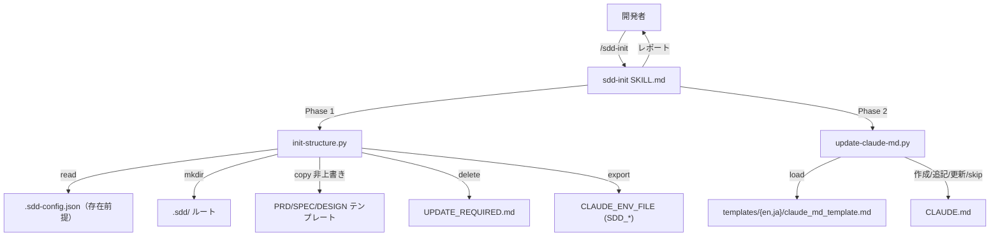

# プロジェクト初期化

**関連 Spec:** [sdd-init_spec.md](sdd-init_spec.md)
**関連 PRD:** [sdd-init.md](../../requirement/workflow-foundation/sdd-init.md)（親: [workflow-foundation](../../requirement/workflow-foundation/index.md)）
**準拠する原則:** [CONSTITUTION.md](../../CONSTITUTION.md) A-001（Skills-First）, A-002（フックとスクリプトの責務分離）, B-002（多言語対応の一貫性）, D-001（Specification-Driven）, D-002（ファイル命名規則の厳守）, T-002（plugin.json 登録）, T-003（日本語出力の文字化け防止）

---

# 1. 実装ステータス

**ステータス:** 🟢 実装済み

本設計書は、既に実装・稼働している `sdd-init` スキル（`plugins/sdd-workflow/skills/sdd-init/`）の
構成を逆算して記述したものである。実装コード（`SKILL.md` / `scripts/init-structure.py` /
`scripts/update-claude-md.py` / `templates/{en,ja}/` / `templates/ai_sdd_instructions_rules.md`）を
真実の源とする。

> **逆算記述の経緯（正当化）**: `sdd-init` スキルは AI-SDD ワークフロー導入の基盤機能として先行実装され、
> 本 spec/design は後追いで機能要求を明文化した逆算記述である。D-001（Specification-Driven）の原則に対し、
> 実装先行という経緯を CONSTITUTION の例外プロセス（文書化・正当化・追跡）に沿って本節に記録する。
> 以降の記述は推測ではなく、実装ファイルの実態（2 フェーズ・CLAUDE.md 更新分岐・詳細ルールの分離）に一致させている。

## 1.1. 実装進捗

| モジュール/機能                     | ステータス | 備考                                                             |
|-----------------------------------|--------|------------------------------------------------------------------|
| スキル本体（SKILL.md）               | 🟢     | 2 フェーズ実行手順を Markdown で定義（`agent: haiku`, `--ci` 対応）        |
| Phase 1 スクリプト                   | 🟢     | `init-structure.py`（ルート作成・テンプレコピー・掃除・env export）         |
| Phase 2 スクリプト                   | 🟢     | `update-claude-md.py`（CLAUDE.md 作成/追記/更新/skip の分岐）             |
| 言語別テンプレート                    | 🟢     | `claude_md_template.md` / `init_output.md`（en/ja）                     |
| 詳細ルール雛形                       | 🟢     | `ai_sdd_instructions_rules.md`（単一英語ファイル。session-start が配置）      |
| E2E 検証                            | 🟢     | `scripts/test-e2e-sdd-init.sh` が session-start → init → update を連鎖検証   |

---

# 2. 設計目標

- 静的なファイル操作（ディレクトリ作成・テンプレコピー・掃除・env export）と CLAUDE.md 更新を
  それぞれスクリプトへ委譲し、Claude はレポートに専念する（A-002 / NFR-002）
- 既存テンプレート・既存 CLAUDE.md 記述を破壊しない冪等な初期化を実現する（FR-002 / FR-004 / NFR-001）
- 常時ロードされる CLAUDE.md を最小化し、詳細ガイドは `.claude/rules/` へ分離する
- 初期化スクリプトを OS 非依存にし、対応 OS で一貫動作させる（NFR-003）
- EN/JA 同等構成のテンプレートを `SDD_LANG` に応じて生成する（B-002 / FR-007）

---

# 3. 実装方式

| 領域     | 採用方式                                          | 選定理由                                                                                     |
|--------|-------------------------------------------------|--------------------------------------------------------------------------------------------|
| skill  | Markdown プロンプト（`SKILL.md`, `agent: haiku`）     | 手順の統括・結果報告を担う。決定的操作はスクリプトへ委譲するため軽量な haiku で足りる（A-001）          |
| script (Phase 1) | Python 3 + 標準ライブラリ（`pathlib` / `shutil` / `json`） | ディレクトリ作成・テンプレコピー・掃除は決定的処理。OS 固有 CLI 非依存で実装（A-002 / NFR-003）    |
| script (Phase 2) | Python 3 + 標準ライブラリ（`pathlib` / `re` / `json`）    | CLAUDE.md のセクション検出・置換は決定的処理。sed/awk/grep を使わず `re` で実装（A-002 / NFR-003） |
| 実行分離 | 2 フェーズ（構造初期化 → CLAUDE.md 更新）            | 静的操作と CLAUDE.md 更新を分離し、Claude のツール呼び出しを 60〜70% 削減する（NFR-002）           |
| 詳細ガイド分離 | `.claude/rules/ai-sdd-instructions.md`（session-start が配置） | 常時ロードの CLAUDE.md を最小化。詳細は path-scoped rule として `.sdd/**` 作業時のみロード         |
| template | 言語別ディレクトリ `templates/{en,ja}/`             | `SDD_LANG` に応じて雛形を切り替え、EN/JA 同等構成で生成する（B-002）                              |

---

# 4. アーキテクチャ

## 4.1. システム構成図



## 4.2. モジュール分割

| モジュール名             | 責務                                                        | 依存関係                          | 配置場所                                        |
|------------------------|-------------------------------------------------------------|---------------------------------|-------------------------------------------------|
| sdd-init スキル          | 2 フェーズの統括・初期化結果の検証と報告・後続スキルの案内            | init-structure.py, update-claude-md.py | `skills/sdd-init/SKILL.md`                      |
| init-structure.py       | ルート作成・テンプレコピー（非上書き）・UPDATE_REQUIRED.md 削除・env export | `hook_common`, `env_export`      | `skills/sdd-init/scripts/init-structure.py`     |
| update-claude-md.py     | プラグインバージョン取得・テンプレ置換・CLAUDE.md 分岐更新             | `hook_common`                    | `skills/sdd-init/scripts/update-claude-md.py`   |
| 言語別テンプレート        | CLAUDE.md セクション雛形・初期化出力雛形                            | -                               | `skills/sdd-init/templates/{en,ja}/`             |
| 詳細ルール雛形           | `.claude/rules/ai-sdd-instructions.md` の元テンプレート               | session-start が配置              | `skills/sdd-init/templates/ai_sdd_instructions_rules.md` |

---

# 5. データ構造

Phase 1 は `.sdd-config.json`（session-config が生成）を読み、`CLAUDE_ENV_FILE` へ `SDD_*` を export する
（`env_export.rewrite_exports("SDD_", ...)` により再実行時は旧値を置換）。

```sh
# CLAUDE_ENV_FILE に書き込まれる export 群
export SDD_ROOT=".sdd"
export SDD_REQUIREMENT_DIR="requirement"
export SDD_SPECIFICATION_DIR="specification"
export SDD_TASK_DIR="task"
export SDD_REQUIREMENT_PATH=".sdd/requirement"
export SDD_SPECIFICATION_PATH=".sdd/specification"
export SDD_TASK_PATH=".sdd/task"
export SDD_LANG="en"
```

Phase 2 は CLAUDE.md 内の `## AI-SDD Instructions (vX.Y.Z)` を検出し、以下の分岐で更新する。

```
- CLAUDE.md なし          -> 新規作成（セクション付き）
- セクションなし           -> 末尾へ追記
- 旧バージョン            -> 当該セクションのみ置換
- 同一バージョン          -> skip（up to date）
```

---

# 6. ファイル構成

```
plugins/sdd-workflow/
├── skills/sdd-init/
│   ├── SKILL.md                                   # スキル本体（2 フェーズ手順）
│   ├── scripts/init-structure.py                  # Phase 1（静的操作）
│   ├── scripts/update-claude-md.py                # Phase 2（CLAUDE.md 更新）
│   ├── references/sdd_config_default.md           # 既定 config 定義
│   ├── templates/ai_sdd_instructions_rules.md     # 詳細ルール雛形（単一英語）
│   ├── templates/en/claude_md_template.md         # CLAUDE.md 雛形（EN）
│   ├── templates/en/init_output.md                # 出力雛形（EN）
│   └── templates/ja/{同上}                         # 日本語版
├── scripts/hook_common.py / env_export.py         # ルート解決・env export 共有
├── scripts/session-start.py                       # 詳細ルール配置（session-config 側）
└── .claude-plugin/plugin.json                     # "skills": "./skills"（T-002）
```

---

# 7. 非機能要件実現方針

| 要件                          | 実現方針                                                                     |
|-------------------------------|------------------------------------------------------------------------------|
| NFR-001 冪等性                 | テンプレは `target.exists()` で存在時スキップ。CLAUDE.md は同一バージョン時 skip、旧版のみ置換 |
| NFR-002 効率性                 | 静的操作を 2 スクリプトに集約し、Claude のツール呼び出しを削減                          |
| NFR-003 移植性                 | 両スクリプトは `pathlib` / `shutil` / `re` / `json` のみを使用し OS 固有 CLI に非依存      |

---

# 8. テスト戦略

| テストレベル   | 対象                                                    | カバレッジ目標                          |
|------------|---------------------------------------------------------|----------------------------------------|
| E2E         | session-start → init-structure → update-claude-md の連鎖    | `test-e2e-sdd-init.sh`（en/ja・custom root・冪等性・レガシー掃除、複数 OS の CI） |
| 静的解析      | プロンプト内コードブロック・命名規則                             | `plugin-lint` で検査                     |
| 構文検証      | `plugin.json` の JSON 構文                                 | `jq .` で検証（T-001）                    |

---

# 9. 設計判断

## 9.1. 決定事項

| 決定事項                | 選択肢                                          | 決定内容                       | 理由                                                                                          |
|-----------------------|-----------------------------------------------|------------------------------|-----------------------------------------------------------------------------------------------|
| 実装形態                | (a) legacy command / (b) skill                  | **(b) skill（agent: haiku）**  | A-001 に従い skills として実装。統括役のため軽量な haiku で足りる                                    |
| 実行分離                | (a) Claude が逐次ツール実行 / (b) 2 フェーズスクリプト | **(b) 2 フェーズ**              | A-002 に従い決定的操作を委譲。ツール呼び出しを 60〜70% 削減（NFR-002）                              |
| CLAUDE.md の情報量       | (a) 詳細ガイドも CLAUDE.md に含める / (b) 最小化し rules へ分離 | **(b) 最小化 + rules 分離**    | 常時ロードのコンテキストを軽く保つ。詳細は `.sdd/**` 作業時のみロードされる path-scoped rule に置く      |
| 詳細ルールの言語対応      | (a) en/ja 二本 / (b) 単一英語ファイル               | **(b) 単一英語**               | rules は AI エージェント向けガイドで人間向けドキュメントではない。単一ファイルで path-scoped rule を 1 本に保つ |
| CONSTITUTION.md 生成      | (a) sdd-init が生成 / (b) constitution init が生成    | **(b) constitution init**     | 原則はプロジェクト文脈に応じたカスタマイズが必要。sdd-init はテンプレ配置に限定し責務を分離             |
| 詳細ルールの配置担当      | (a) sdd-init が配置 / (b) session-start が配置        | **(b) session-start**          | バージョン追随更新はセッション開始ごとに必要。session-config の責務とし sdd-init は CLAUDE.md 最小セクションのみ扱う |

## 9.2. 未解決の課題

| 課題                                   | 影響度 | 対応方針                                            |
|--------------------------------------|-----|-----------------------------------------------------|
| `.sdd-config.json` 未生成時の依存         | 低   | session-start が生成する前提。単独実行時は config 事前作成を SKILL.md で案内 |
| CLAUDE.md セクション検出の頑健性          | 低   | 見出し `## AI-SDD Instructions (vX.Y.Z)` を正規表現で検出。E2E で分岐を回帰検証 |

---

# 10. 原則準拠チェックリスト

| 原則ID  | 原則名                   | 準拠状況 | 備考                                                          |
|-------|-------------------------|------|---------------------------------------------------------------|
| A-001 | Skills-First             | ✅   | `skills/sdd-init/` として実装。legacy command は追加しない              |
| A-002 | フックとスクリプトの責務分離   | ✅   | 静的操作・CLAUDE.md 更新を 2 スクリプトへ委譲                          |
| B-002 | 多言語対応の一貫性          | ✅   | `templates/{en,ja}/` を用意し `SDD_LANG` に応じて EN/JA 同等構成で生成      |
| D-001 | Specification-Driven     | ⚠️   | 実装先行のため本 spec/design を逆算作成（1 節に例外を文書化・正当化）          |
| D-002 | ファイル命名規則の厳守       | ✅   | 生成構造・テンプレートが requirement/specification 命名規則に準拠           |
| T-002 | plugin.json 登録の徹底     | ✅   | `"skills": "./skills"` によりスキルを登録済み                           |
| T-003 | 日本語出力の文字化け防止     | ✅   | 日本語テンプレート・出力で UTF-8 を維持し mojibake を防止                  |

**原則から逸脱する場合**: D-001 について実装先行の経緯を 1 節に文書化し、CONSTITUTION.md の例外プロセスに従う。
