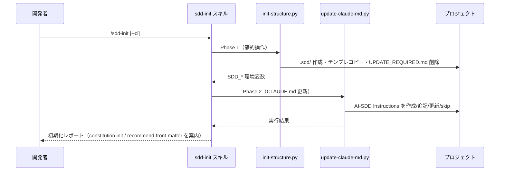

# プロジェクト初期化

**関連 Design Doc:** [sdd-init_design.md](sdd-init_design.md)
**関連 PRD:** [sdd-init.md](../../requirement/workflow-foundation/sdd-init.md)（親: [workflow-foundation](../../requirement/workflow-foundation/index.md)）
**準拠する原則:** [CONSTITUTION.md](../../CONSTITUTION.md) A-002（フックとスクリプトの責務分離）, B-002（多言語対応の一貫性）, D-001（Specification-Driven）, D-002（ファイル命名規則の厳守）, T-003（日本語出力の文字化け防止）

---

# 1. 背景

AI-SDD ワークフローを新規プロジェクトへ導入するには、`.sdd/` ルートディレクトリと各テンプレート
（PRD / 抽象仕様書 / 技術設計書）の配置、および `CLAUDE.md` への AI-SDD Instructions 設定が必要である。
これらを手作業で行うと、ディレクトリ構成・命名規則・言語設定の不整合が生じやすく、導入の障壁になる。

本機能は、対象プロジェクトに `.sdd/` 構造とテンプレートを生成し、`CLAUDE.md` に最小限の
AI-SDD Instructions セクションを設定する `/sdd-init` スキルを提供する。ワークフロー導入の前提を
最小限の操作で整えることを目的とする。既存の `CLAUDE.md` 記述やテンプレートは破壊せず共存させる。

本仕様は、既存実装（`plugins/sdd-workflow/skills/sdd-init/`）を真実の源として逆算的に明文化した
ものである（詳細な経緯は [sdd-init_design.md](sdd-init_design.md) の 1 節を参照）。

# 2. 概要

本機能は、開発者が手動で `/sdd-init` スキルを呼び出すことで、AI-SDD 導入の前提を整える。
主要な設計原則は以下のとおり。

- **決定的操作の委譲**: ディレクトリ作成・テンプレートコピー・クリーンアップ・環境変数エクスポートと、
  `CLAUDE.md` の更新という機械的処理をスクリプトへ委譲し、Claude は結果の検証・報告に専念する（A-002）
- **非破壊の初期化**: 既存テンプレート・既存 `CLAUDE.md` 記述を上書きせず共存させる（冪等性）
- **CLAUDE.md の最小化**: 常時ロードされる `CLAUDE.md` には最小限の宣言・トリガー・詳細ルールへの
  ポインタのみを置き、詳細ガイドはセッション設定機能（[session-config.md](../../requirement/workflow-foundation/session-config.md)）が管理する `.claude/rules/` に分離する
- **多言語一貫性**: テンプレートは `templates/{en,ja}/` を持ち、`SDD_LANG` に応じた言語で生成する（B-002）
- **命名規則の遵守**: 生成する構造・テンプレートは AI-SDD 命名規則に準拠する（D-002）
- **原則管理の包含**: プロジェクト原則の定義・管理は兄弟機能 [constitution-management.md](../../requirement/workflow-foundation/constitution-management.md) が担い、CONSTITUTION.md は本機能では生成しない

「何を初期化するか」を定義し、具体的な実装方式（2 フェーズ実行・スクリプトの処理内容・
CLAUDE.md 更新ロジック）は [sdd-init_design.md](sdd-init_design.md) に委ねる。

# 3. 要求定義

## 3.1. 機能要件 (Functional Requirements)

| ID     | 要件                                                                                            | 優先度 | 根拠（上流要求）                    |
|--------|-----------------------------------------------------------------------------------------------|-----|----------------------------------|
| FR-001 | `.sdd/` ルートディレクトリを作成する（サブディレクトリはファイル生成時に自動作成）                        | 必須  | PRD FR_001 / 親 UR_001            |
| FR-002 | テンプレート（PRD / 仕様書 / 設計書）を配置する（既存ファイルは上書きしない）                            | 必須  | PRD FR_001 / 親 DC_001            |
| FR-003 | `CLAUDE.md` に最小限の AI-SDD Instructions セクション（バージョン付き）を設定する                        | 必須  | PRD FR_001                       |
| FR-004 | 既存 `CLAUDE.md` を尊重する（未設定なら追記、旧バージョンなら当該セクションのみ置換、同一なら skip）        | 必須  | PRD 制約（既存内容の非破壊）          |
| FR-005 | `SDD_ROOT` 等の環境変数を `CLAUDE_ENV_FILE` へエクスポートする                                        | 必須  | 親 PRD IR_001                    |
| FR-006 | 生成する構造・テンプレートを AI-SDD 命名規則に準拠させる                                                | 必須  | PRD 制約（D-002）                 |
| FR-007 | テンプレートを `SDD_LANG`（en/ja）に応じて選択し、EN/JA で同等構成を維持する                             | 必須  | PRD 制約（B-002）                 |
| FR-008 | `--ci` 指定時は確認を省略し上書き承認を自動化する（非対話モード）                                        | 任意  | PRD FR_001（トリガー方式）          |

## 3.2. 非機能要件 (Non-Functional Requirements)

| ID      | カテゴリ | 要件                                                             | 目標値                              |
|---------|------|------------------------------------------------------------------|-------------------------------------|
| NFR-001 | 冪等性 | 再実行しても既存資産を破壊せず、バージョン差分のみを更新する               | 再実行で既存テンプレート・記述が保持される  |
| NFR-002 | 効率性 | 静的操作をスクリプト化し、Claude のツール呼び出しを削減する                | 2 フェーズ実行でツール呼び出しを削減      |
| NFR-003 | 移植性 | 初期化スクリプトは OS 固有 CLI に依存せず Python 標準ライブラリで動作する      | 対応 OS の CI（E2E）で通過             |

# 4. 提供コンポーネント

| 種別     | 配置場所                                              | 名前              | 概要                                                             |
|--------|-----------------------------------------------------|-----------------|------------------------------------------------------------------|
| skill  | `skills/sdd-init/SKILL.md`                          | sdd-init         | `.sdd/` 構造・テンプレート生成と CLAUDE.md 設定を提供する                |
| script | `skills/sdd-init/scripts/init-structure.py`         | init-structure    | ルート作成・テンプレートコピー・クリーンアップ・環境変数エクスポート（Phase 1） |
| script | `skills/sdd-init/scripts/update-claude-md.py`       | update-claude-md  | CLAUDE.md の AI-SDD Instructions セクションを作成/追記/更新/skip（Phase 2） |
| template | `skills/sdd-init/templates/{en,ja}/claude_md_template.md` | CLAUDE.md 雛形  | AI-SDD Instructions セクションの雛形（言語別）                          |
| template | `skills/sdd-init/templates/{en,ja}/init_output.md`        | 出力雛形        | 初期化結果レポートの整形雛形（言語別）                                 |
| template | `skills/sdd-init/templates/ai_sdd_instructions_rules.md`  | 詳細ルール雛形   | `.claude/rules/ai-sdd-instructions.md` の雛形（言語非依存の単一英語ファイル） |

## 4.1. 入出力定義

- **入力**: 任意引数 `--ci`（非対話モード）
- **環境変数**: `SDD_ROOT` / `SDD_LANG` / requirement・specification・task の各ディレクトリ名とパス
- **出力**: `.sdd/` ルートと各テンプレート、`CLAUDE.md` の AI-SDD Instructions セクション、`SDD_*` 環境変数

```json
// 前提となる .sdd-config.json の既定構造（session-config が生成、sdd-init は存在を前提）
{
  "root": ".sdd",
  "lang": "en",
  "directories": {
    "requirement": "requirement",
    "specification": "specification",
    "task": "task"
  }
}
```

# 5. 用語集

| 用語               | 説明                                                                    |
|------------------|-------------------------------------------------------------------------|
| AI-SDD Instructions | `CLAUDE.md` に置く AI-SDD ワークフロー宣言セクション（バージョン付き）             |
| 2 フェーズ実行      | Phase 1（静的操作スクリプト）と Phase 2（CLAUDE.md 更新スクリプト）の分離           |
| 非破壊初期化        | 既存テンプレート・既存 CLAUDE.md 記述を上書きしない冪等な初期化                     |
| UPDATE_REQUIRED.md | バージョン不整合時に session-start が生成し、初期化後に削除される通知ファイル          |

# 6. 使用例

```
/sdd-init         # 対話モードで .sdd/ 構造・テンプレート・CLAUDE.md を初期化
/sdd-init --ci    # 非対話モード（CI 等で確認を省略）
```

# 7. 振る舞い図



# 8. 制約事項

- `CLAUDE.md` への設定はプロジェクト側の既存記述と共存し、既存内容を破壊してはならない
- B-002 原則に従い、テンプレートは EN/JA で同等の構成を維持すること
- D-002 原則に従い、生成する構造・テンプレートは命名規則に準拠すること
- CONSTITUTION.md の作成・更新・同期検証は対象外（[constitution-management.md](../../requirement/workflow-foundation/constitution-management.md) が扱う。ユースケース上は初期化フローに包含される兄弟機能）
- セッション開始時の設定ロード・環境変数初期化・原則ドキュメント追随更新は対象外（[session-config.md](../../requirement/workflow-foundation/session-config.md) が扱う）
- 既存ドキュメントへの front matter 推奨は対象外（[front-matter-recommend.md](../../requirement/workflow-foundation/front-matter-recommend.md) が扱う）
- `.sdd-config.json` の生成は session-config が担い、本機能は存在を前提とする
- 対象プロジェクトのルートに書き込み権限があることを前提とする

# 9. 原則との整合性

| 原則ID  | 原則名                   | 本仕様への適用内容                                                       |
|-------|-------------------------|-------------------------------------------------------------------------|
| A-002 | フックとスクリプトの責務分離   | 静的操作と CLAUDE.md 更新を 2 スクリプトへ委譲し、Claude は検証・報告に専念する    |
| B-002 | 多言語対応の一貫性          | `templates/{en,ja}/` を持ち `SDD_LANG` に応じて EN/JA 同等構成で生成する          |
| D-001 | Specification-Driven     | 初期化の対象と手順を仕様化し、実装がこれに準拠することを担保する                    |
| D-002 | ファイル命名規則の厳守       | 生成する構造・テンプレートが requirement/specification 命名規則に準拠する           |
| T-003 | 日本語出力の文字化け防止     | 日本語テンプレート・出力で UTF-8 を維持し mojibake を防止する                      |

---

# PRD 整合性レビュー結果

| 確認項目        | 結果                                                                                    |
|---------------|------------------------------------------------------------------------------------------|
| 要求カバレッジ   | PRD FR_001（構造・テンプレート・CLAUDE.md 初期化）を FR-001〜008 に分解してカバー                |
| 要求 ID 参照    | 各 FR に対応する PRD（FR_001）・親 PRD（UR_001・IR_001・DC_001・B-002・D-002）の要求 ID を明記   |
| 非機能要求の反映 | 冪等性（NFR-001）・効率性（NFR-002）・移植性（NFR-003）を非機能要件に補完                        |
| 用語整合性      | PRD の「AI-SDD Instructions」「テンプレート」「命名規則」定義に整合                             |
| スコープ整合性   | CONSTITUTION 管理・セッション設定・front matter 推奨・config 生成を PRD と一致させてスコープ外に明記 |
