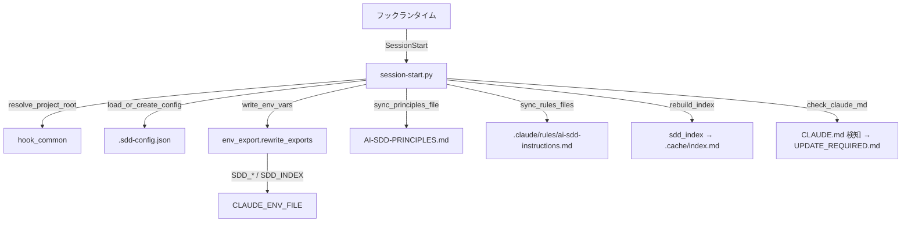

# セッション設定初期化

**関連 Spec:** [session-config_spec.md](session-config_spec.md)
**関連 PRD:** [session-config.md](../../requirement/workflow-foundation/session-config.md)（親: [workflow-foundation](../../requirement/workflow-foundation/index.md)）
**準拠する原則:** [CONSTITUTION.md](../../CONSTITUTION.md) A-002（フックとスクリプトの責務分離）, B-002（多言語対応の一貫性）, D-001（Specification-Driven）, T-002（plugin.json 登録）, T-003（日本語出力の文字化け防止）

---

# 1. 実装ステータス

**ステータス:** 🟢 実装済み

本設計書は、既に実装・稼働しているセッション設定初期化機能（`plugins/sdd-workflow/scripts/session-start.py`
と共有モジュール `hook_common.py` / `env_export.py` / `sdd_index.py`、`hooks/hooks.json` の
SessionStart 登録）の構成を逆算して記述したものである。実装コードを真実の源とする。

> **逆算記述の経緯（正当化）**: セッション設定初期化は AI-SDD ワークフローの基盤フックとして先行実装され、
> 本 spec/design は後追いで機能要求を明文化した逆算記述である。D-001（Specification-Driven）の原則に対し、
> 実装先行という経緯を CONSTITUTION の例外プロセス（文書化・正当化・追跡）に沿って本節に記録する。
> 以降の記述は推測ではなく、実装ファイルの実態（設定ロード分岐・env export・原則/rules 同期・
> インデックス構築・CLAUDE.md 検知）に一致させている。

## 1.1. 実装進捗

| モジュール/機能                     | ステータス | 備考                                                             |
|-----------------------------------|--------|------------------------------------------------------------------|
| SessionStart フック登録              | 🟢     | `hooks/hooks.json` が `session-start.py --default-lang en` を起動      |
| 設定ロード/生成                      | 🟢     | `load_or_create_config` / `build_sdd_config`（不正 JSON・非真偽値は警告 + 既定） |
| 環境変数エクスポート                  | 🟢     | `write_env_vars`（`env_export.rewrite_exports` で prefix 単位に置換）      |
| 原則ドキュメント追随更新              | 🟢     | `sync_principles_file`（version 行を差し替えて原子的に書き込み）             |
| rules 同期                          | 🟢     | `sync_rules_files`（`.claude/rules/ai-sdd-instructions.md`、レガシー掃除）  |
| 圧縮インデックス構築                  | 🟢     | `rebuild_index` → `sdd_index.rebuild_all`（既定有効）                    |
| CLAUDE.md バージョン検知              | 🟢     | `check_claude_md`（不整合時 `UPDATE_REQUIRED.md` 生成、整合時削除）         |

---

# 2. 設計目標

- セッション開始時に設定・環境変数・原則・インデックスを自動かつ決定的に初期化する（FR-001 / A-002）
- 設定の欠落・不正・非真偽値に対して既定値へフォールバックし、初期化を中断しない（FR-006 / NFR-001）
- 環境変数を全コンポーネントの共通契約として公開し、再実行時に旧値を残さない（FR-003 / NFR-003）
- 原則ドキュメントをプラグインバージョンへ追随更新する（FR-004）
- 圧縮インデックスを既定で構築し `SDD_INDEX` を設定する（FR-005）
- フックスクリプトを OS 非依存にし、対応 OS で一貫動作させる（NFR-002）

---

# 3. 実装方式

| 領域     | 採用方式                                          | 選定理由                                                                                     |
|--------|-------------------------------------------------|--------------------------------------------------------------------------------------------|
| hook   | JSON 形式の `hooks.json`（SessionStart / command）  | セッション開始イベントで決定的にスクリプトを起動する。Claude の判断を介さない（A-002）              |
| script | Python 3 + 標準ライブラリ（`json` / `re` / `pathlib` / `os` / `shutil` / `dataclasses`） | 設定ロード・env export・原則同期は決定的処理。OS 固有 CLI 非依存で実装（A-002 / NFR-002） |
| ルート解決 | `hook_common.resolve_project_root`（`CLAUDE_PROJECT_DIR` → `git` → CWD） | フック実行環境でのルート特定をフォールバック付きで一元化する                                    |
| env 連携 | `env_export.rewrite_exports("SDD_", ...)`（原子的 tmp+replace） | 再実行時に旧 `SDD_*` を除去してから最新値を追記し、陳腐化を防ぐ（NFR-003）                       |
| インデックス | `sdd_index`（SQLite → index.md）、`index` 真偽値で制御 | 読み手が単一 Read で構造化情報を得られるようにする。既定有効・非真偽値は警告 + 既定              |
| 言語切替 | `SDD_LANG` を設定・エクスポート                       | EN/JA 切り替えの起点を環境変数に一元化する（B-002 / DC_003）                                    |

---

# 4. アーキテクチャ

## 4.1. システム構成図



## 4.2. モジュール分割

| モジュール名             | 責務                                                            | 依存関係                     | 配置場所                          |
|------------------------|-----------------------------------------------------------------|----------------------------|-----------------------------------|
| session-start.py        | 設定ロード/生成・env export・原則/rules 同期・インデックス構築・CLAUDE.md 検知の統括 | hook_common, env_export, sdd_index | `scripts/session-start.py`        |
| hook_common.py          | プロジェクトルート解決・`.sdd-config.json` パス読込・stdin/出力ヘルパー       | Python 標準ライブラリ（subprocess は git のみ） | `scripts/hook_common.py`          |
| env_export.py           | `CLAUDE_ENV_FILE` への原子的 export（prefix 単位で旧値置換）              | Python 標準ライブラリ         | `scripts/env_export.py`           |
| sdd_index.py            | `.sdd` ドキュメント圧縮インデックス（SQLite → index.md）の構築             | fm_parser, doc_walker, sqlite3 | `scripts/sdd_index.py`            |
| hooks.json              | SessionStart への `session-start.py` 登録                            | -                          | `hooks/hooks.json`                |

---

# 5. データ構造

```json
// .sdd-config.json（session-start が欠落時に生成。index は既定 true）
{
  "root": ".sdd",
  "lang": "en",
  "directories": {
    "requirement": "requirement",
    "specification": "specification",
    "task": "task"
  },
  "index": true
}
```

```python
# SddConfig（session-start.py の内部設定表現）
@dataclass
class SddConfig:
    root: str = ".sdd"
    lang: str = "en"
    requirement_dir: str = "requirement"
    specification_dir: str = "specification"
    task_dir: str = "task"
    index: bool = True
```

```sh
# CLAUDE_ENV_FILE へ書き込まれる export 群（index 有効時に SDD_INDEX を追加）
export SDD_ROOT=".sdd"
export SDD_REQUIREMENT_DIR="requirement"
export SDD_SPECIFICATION_DIR="specification"
export SDD_TASK_DIR="task"
export SDD_REQUIREMENT_PATH=".sdd/requirement"
export SDD_SPECIFICATION_PATH=".sdd/specification"
export SDD_TASK_PATH=".sdd/task"
export SDD_LANG="en"
export SDD_INDEX="on"
```

`index` は真偽値のみを受け付ける。キー未設定は既定（有効）。真偽値以外（例: `"on"` 等の文字列）は
警告のうえ既定（有効）にフォールバックする（`parse_index_flag`）。

---

# 6. ファイル構成

```
plugins/sdd-workflow/
├── hooks/hooks.json                    # SessionStart → session-start.py 登録
├── scripts/
│   ├── session-start.py                # SessionStart フック本体
│   ├── hook_common.py                  # ルート解決・config パス読込・出力ヘルパー
│   ├── env_export.py                   # CLAUDE_ENV_FILE 原子的 export
│   ├── sdd_index.py                    # 圧縮インデックス構築（SQLite → index.md）
│   ├── fm_parser.py / doc_walker.py    # インデックス構築が利用する共有モジュール
│   └── naming.py                       # 命名規則・種別判定共有
├── AI-SDD-PRINCIPLES.source.md         # 原則ドキュメントの元ソース（version を差し替えて配布）
└── skills/sdd-init/templates/ai_sdd_instructions_rules.md  # rules 同期の元テンプレート
```

---

# 7. 非機能要件実現方針

| 要件                          | 実現方針                                                                     |
|-------------------------------|------------------------------------------------------------------------------|
| NFR-001 可用性                 | 不正 JSON は警告のうえ空 dict、非真偽値 index は警告 + 既定へフォールバックして初期化を継続 |
| NFR-002 移植性                 | `pathlib` / `re` / `json` / `shutil` のみを使用。subprocess は git ルート検出に限り許容    |
| NFR-003 env 一貫性             | `rewrite_exports` が prefix 一致行を除去後に最新値を追記し、原子的（tmp+replace）に書き込む   |

---

# 8. テスト戦略

| テストレベル   | 対象                                                    | カバレッジ目標                          |
|------------|---------------------------------------------------------|----------------------------------------|
| ユニット     | session-start / hook_common / env_export / sdd_index のロジック  | `tests/` で主要分岐を網羅（複数 OS の CI）  |
| ゴールデン    | `session-start.py` の出力回帰                              | `scripts/test-session-start.sh`          |
| E2E         | session-start → init-structure → update-claude-md の連鎖    | `test-e2e-sdd-init.sh`（custom root・en/ja） |
| 構文検証      | `hooks.json` / `plugin.json` の JSON 構文                  | `jq .` で検証（T-001）                    |

---

# 9. 設計判断

## 9.1. 決定事項

| 決定事項                | 選択肢                                          | 決定内容                       | 理由                                                                                          |
|-----------------------|-----------------------------------------------|------------------------------|-----------------------------------------------------------------------------------------------|
| 起動方式                | (a) スキル手動呼び出し / (b) SessionStart フック    | **(b) SessionStart フック**     | 一貫した設定は全コンポーネントの前提。開始ごとに自動・決定的に初期化する必要がある（A-002）           |
| 設定不正時の挙動         | (a) エラー中断 / (b) 既定値フォールバック            | **(b) フォールバック**           | 設定不正でセッションを止めると可用性を損なう。警告のうえ既定で継続する（NFR-001 / DC_002）           |
| env export の再実行対策  | (a) 追記のみ / (b) prefix 単位で旧値置換             | **(b) prefix 単位で置換**        | 追記のみだと再実行で `SDD_*` が陳腐化・重複する。`rewrite_exports` で最新値へ更新（NFR-003）         |
| index の制御値           | (a) 文字列 on/off / (b) 真偽値のみ                  | **(b) 真偽値のみ**              | 型を真偽値に統一し曖昧さを排除。非真偽値は警告 + 既定にフォールバックして後方の誤設定に耐える           |
| インデックス構築言語      | (a) 外部 CLI（jq/sqlite3 コマンド）/ (b) Python 標準ライブラリ | **(b) Python 標準ライブラリ**  | `sqlite3` モジュールは標準同梱。OS 固有 CLI 非依存で移植性を確保（NFR-002）                          |
| ルート解決              | (a) CWD 固定 / (b) CLAUDE_PROJECT_DIR → git → CWD    | **(b) フォールバック連鎖**       | フック実行時の CWD は不定。環境変数 → git ルート → CWD の順で頑健に解決する                          |

## 9.2. 未解決の課題

| 課題                                   | 影響度 | 対応方針                                            |
|--------------------------------------|-----|-----------------------------------------------------|
| フックの `os.path` → `pathlib` 統一        | 低   | 挙動は既に OS 非依存。統一は保守性改善として継続対応（cross-platform-portability と共通課題） |
| インデックス構築失敗時の影響               | 低   | `rebuild_index` は例外を捕捉し警告出力のみ。セッション初期化は継続する |

---

# 10. 原則準拠チェックリスト

| 原則ID  | 原則名                   | 準拠状況 | 備考                                                          |
|-------|-------------------------|------|---------------------------------------------------------------|
| A-002 | フックとスクリプトの責務分離   | ✅   | 設定ロード・env export・原則同期・インデックス構築をフックスクリプトへ委譲     |
| B-002 | 多言語対応の一貫性          | ✅   | `SDD_LANG` を設定・エクスポートし EN/JA 切り替えの起点とする               |
| D-001 | Specification-Driven     | ⚠️   | 実装先行のため本 spec/design を逆算作成（1 節に例外を文書化・正当化）          |
| T-002 | plugin.json 登録の徹底     | ✅   | フックは `hooks/hooks.json`、共有スクリプトはプラグイン構成に登録済み          |
| T-003 | 日本語出力の文字化け防止     | ✅   | 原則ドキュメント・生成ファイルで UTF-8 を維持し mojibake を防止              |

**原則から逸脱する場合**: D-001 について実装先行の経緯を 1 節に文書化し、CONSTITUTION.md の例外プロセスに従う。
