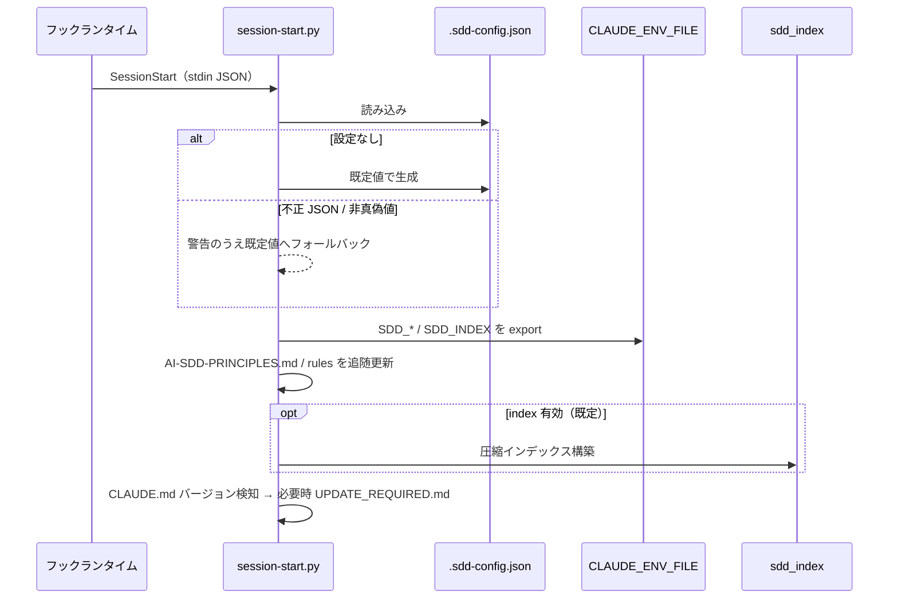

# セッション設定初期化

**関連 Design Doc:** [session-config_design.md](session-config_design.md)
**関連 PRD:** [session-config.md](../../requirement/workflow-foundation/session-config.md)（親: [workflow-foundation](../../requirement/workflow-foundation/index.md)）
**準拠する原則:** [CONSTITUTION.md](../../CONSTITUTION.md) A-002（フックとスクリプトの責務分離）, B-002（多言語対応の一貫性）, D-001（Specification-Driven）, T-003（日本語出力の文字化け防止）

---

# 1. 背景

AI-SDD ワークフローの各スキル・エージェント・フックは、`.sdd/` のルート・言語・ディレクトリ構成に
関する一貫した設定を前提に動作する。この設定がセッションごとに初期化されず、各コンポーネントが
個別に設定を解決すると、参照するパスや言語の不整合が生じ、ワークフロー全体の一貫性が損なわれる。

本機能は、Claude Code の SessionStart フックとしてセッション開始時に自動実行され、設定ファイルの
読み込み（存在しない場合は生成）、環境変数の設定、AI-SDD 原則ドキュメントのバージョン追随更新、
`.sdd` ドキュメント圧縮インデックスの構築を行う。これにより、以降の全コンポーネントが参照する
一貫した設定基盤を初期化することを目的とする。

本仕様は、既存実装（`plugins/sdd-workflow/scripts/session-start.py` および共有モジュール
`hook_common.py` / `env_export.py` / `sdd_index.py`、`hooks/hooks.json` 登録）を真実の源として
逆算的に明文化したものである（詳細な経緯は [session-config_design.md](session-config_design.md) の 1 節を参照）。

# 2. 概要

本機能は、セッション開始イベントで自動実行され、以降の全機能が参照する設定を初期化する。
主要な設計原則は以下のとおり。

- **自動実行と決定的処理の委譲**: 設定ロード・環境変数エクスポート・原則同期・インデックス構築という
  機械的処理を SessionStart フックスクリプトへ委譲し、Claude の判断を介さず決定的に実行する（A-002）
- **既定値へのフォールバック**: 設定ファイルの欠落・不正（不正 JSON・空値・非真偽値等）があっても、
  既定値にフォールバックしてセッション初期化を継続する（可用性の確保）
- **一貫した環境変数契約**: `SDD_ROOT` / `SDD_LANG` / 各ディレクトリ名・パスを環境変数として公開し、
  全コンポーネントの共通契約とする
- **原則ドキュメントの追随更新**: AI-SDD 原則ドキュメントをプラグインバージョンに追随更新する
- **インデックスの既定有効**: `.sdd` ドキュメント圧縮インデックスを既定で構築し `SDD_INDEX` を設定する
- **言語切り替え**: `SDD_LANG` により EN/JA を切り替える（B-002）

「セッション開始時に何を初期化するか」を定義し、具体的な実装方式（フックスクリプトの処理フロー・
設定スキーマ・環境変数エクスポート方式・インデックス構築）は [session-config_design.md](session-config_design.md) に委ねる。

# 3. 要求定義

## 3.1. 機能要件 (Functional Requirements)

| ID     | 要件                                                                                            | 優先度 | 根拠（上流要求）                    |
|--------|-----------------------------------------------------------------------------------------------|-----|----------------------------------|
| FR-001 | セッション開始時に自動実行され、以降の全機能が参照する設定を初期化する                                | 必須  | PRD FR_001 / 親 UR_003            |
| FR-002 | `.sdd-config.json` を読み込む。存在しない場合は既定値で生成する                                      | 必須  | PRD FR_001_01                    |
| FR-003 | `SDD_ROOT` / `SDD_LANG` / requirement・specification・task の各ディレクトリ名とパスを環境変数へ設定する | 必須  | PRD FR_001_02 / 親 IR_001         |
| FR-004 | AI-SDD 原則ドキュメント（AI-SDD-PRINCIPLES.md）をプラグインバージョンへ追随更新する                    | 必須  | PRD FR_001_03                    |
| FR-005 | `.sdd` ドキュメント圧縮インデックスを構築し `SDD_INDEX` を設定する（既定有効）                          | 必須  | PRD FR_001_04                    |
| FR-006 | 設定ファイルの欠落・不正・非真偽値があっても既定値にフォールバックして初期化を継続する                    | 必須  | 親 PRD DC_002                    |
| FR-007 | `SDD_LANG` により EN/JA を切り替える                                                              | 必須  | 親 PRD DC_003 / B-002            |
| FR-008 | CLAUDE.md のバージョン不整合を検知し、必要時に `UPDATE_REQUIRED.md` で `/sdd-init` を案内する            | 任意  | PRD FR_001（一貫性維持の付随処理）    |

## 3.2. 非機能要件 (Non-Functional Requirements)

| ID      | カテゴリ | 要件                                                             | 目標値                              |
|---------|------|------------------------------------------------------------------|-------------------------------------|
| NFR-001 | 可用性 | 設定不正・欠落時もセッション初期化を中断しない                            | 既定値で初期化を完了する                |
| NFR-002 | 移植性 | フックスクリプトは OS 固有 CLI に依存せず Python 標準ライブラリで動作する      | 対応 OS の CI で通過                   |
| NFR-003 | 一貫性 | 環境変数エクスポートが再実行時に旧値を残さず最新値へ更新される                | 再実行で `SDD_*` の重複・陳腐化が起きない |

# 4. 提供コンポーネント

| 種別     | 配置場所                              | 名前            | 概要                                                             |
|--------|-------------------------------------|---------------|------------------------------------------------------------------|
| hook   | `hooks/hooks.json`（SessionStart）    | SessionStart 登録 | セッション開始時に `session-start.py` を起動する                        |
| script | `scripts/session-start.py`          | session-start   | 設定ロード/生成・env export・原則同期・rules 同期・インデックス構築・CLAUDE.md 検知 |
| script | `scripts/hook_common.py`            | hook_common     | プロジェクトルート解決・設定パス読込・共通出力の共有ヘルパー                  |
| script | `scripts/env_export.py`             | env_export      | `CLAUDE_ENV_FILE` への原子的 export（prefix 単位で旧値置換）              |
| script | `scripts/sdd_index.py`              | sdd_index       | `.sdd` ドキュメントの圧縮インデックス（SQLite → index.md）を構築する          |

## 4.1. 入出力定義

- **入力**: SessionStart フックペイロード（stdin JSON）、引数 `--default-lang`（既定 `en`）
- **設定ファイル**: `.sdd-config.json`（欠落時は既定値で生成）
- **出力**: `SDD_*` / `SDD_INDEX` 環境変数、`AI-SDD-PRINCIPLES.md`、`.claude/rules/ai-sdd-instructions.md`、圧縮インデックス、必要時 `UPDATE_REQUIRED.md`

```json
// .sdd-config.json の既定構造（欠落時に生成、index は既定 true）
{
  "root": ".sdd",
  "lang": "en",
  "directories": {
    "requirement": "requirement",
    "specification": "specification",
    "task": "task"
  },
  "index": true
}
```

# 5. 用語集

| 用語               | 説明                                                                    |
|------------------|-------------------------------------------------------------------------|
| SessionStart フック | セッション開始時に Claude Code が起動するフックイベント                         |
| `.sdd-config.json` | ルート・言語・ディレクトリ・index を定義するプロジェクト設定ファイル                  |
| フォールバック      | 設定の欠落・不正時に既定値で処理を継続する挙動                                    |
| 圧縮インデックス     | `.sdd` ドキュメントを構造化した検索用インデックス（SQLite → index.md）              |
| 原則追随更新        | `AI-SDD-PRINCIPLES.md` をプラグインバージョンへ同期する処理                        |

# 6. 使用例

```
# 自動実行（開発者が明示的に呼ばない）。SessionStart フックとして起動される。
python3 ${CLAUDE_PLUGIN_ROOT}/scripts/session-start.py --default-lang en

# 結果: .sdd-config.json ロード/生成、SDD_* / SDD_INDEX 設定、
#       AI-SDD-PRINCIPLES.md 追随更新、.claude/rules/ 同期、圧縮インデックス構築
```

# 7. 振る舞い図



# 8. 制約事項

- セッション設定初期化は Claude Code の SessionStart フックとして実装され、フックランタイムの
  提供するインターフェース（環境変数エクスポート等）に依存する
- 設定ファイルの欠落・不正（不正 JSON・空値等）があっても、既定値にフォールバックして初期化を継続すること（親 PRD DC_002）
- `.sdd/` 構造・テンプレート・CLAUDE.md の初期化は対象外（[sdd-init.md](../../requirement/workflow-foundation/sdd-init.md) が扱う）
- プロジェクト固有原則 CONSTITUTION.md の管理は対象外（[constitution-management.md](../../requirement/workflow-foundation/constitution-management.md) が扱う。本機能が更新するのは AI-SDD-PRINCIPLES.md）
- 既存ドキュメントへの front matter 推奨は対象外（[front-matter-recommend.md](../../requirement/workflow-foundation/front-matter-recommend.md) が扱う）
- `CLAUDE_PLUGIN_ROOT` が未設定の場合は初期化を中止する（フック実行の前提）

# 9. 原則との整合性

| 原則ID  | 原則名                   | 本仕様への適用内容                                                       |
|-------|-------------------------|-------------------------------------------------------------------------|
| A-002 | フックとスクリプトの責務分離   | 設定ロード・env export・原則同期・インデックス構築をフックスクリプトへ委譲する      |
| B-002 | 多言語対応の一貫性          | `SDD_LANG` を設定・エクスポートし、EN/JA 切り替えの起点とする（DC_003）           |
| D-001 | Specification-Driven     | セッション初期化の対象と手順を仕様化し、実装がこれに準拠することを担保する            |
| T-003 | 日本語出力の文字化け防止     | 原則ドキュメント・生成ファイルで UTF-8 を維持し mojibake を防止する                |

---

# PRD 整合性レビュー結果

| 確認項目        | 結果                                                                                    |
|---------------|------------------------------------------------------------------------------------------|
| 要求カバレッジ   | PRD FR_001 と子要求 FR_001_01〜04 を FR-001〜005 に対応付けてカバー。DC_002 を FR-006、DC_003 を FR-007 でカバー |
| 要求 ID 参照    | 各 FR に対応する PRD（FR_001・FR_001_01〜04）・親 PRD（UR_003・IR_001・DC_002・DC_003・B-002）を明記 |
| 非機能要求の反映 | 可用性（NFR-001）を DC_002 に整合。移植性・env 一貫性を NFR-002・003 に補完                    |
| 用語整合性      | PRD の「SessionStart フック」「.sdd-config.json」「圧縮インデックス」定義に整合                  |
| スコープ整合性   | 構造初期化・CONSTITUTION 管理・front matter 推奨を PRD と一致させてスコープ外に明記               |
