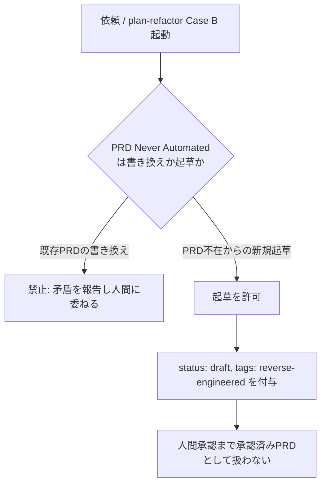
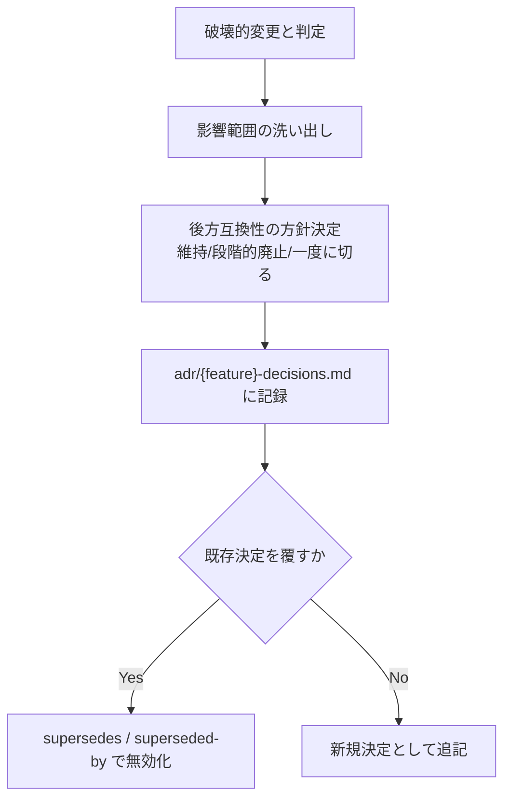

# タスク種別判定と破壊的変更・PRD起草ポリシー

**関連 PRD:** [task-type-determination.md](../../requirement/workflow-foundation/task-type-determination.md)
（親: [workflow-foundation](../../requirement/workflow-foundation/index.md)）
**関連 Design Doc:** なし（本機能はドキュメント記述の追加のみでコード上の技術設計判断を伴わないため
`design-draft.md` は作成していない。詳細は 8 節を参照）
**関連 ADR:** [task-type-determination.md](../../adr/workflow-foundation/task-type-determination.md)
**準拠する原則:** [CONSTITUTION.md](../../CONSTITUTION.md)（参照した版: `v2.0.0`）の B-001（Vibe Coding防止）,
D-001（Specification-Driven）, D-003（ドキュメント永続性ルールの遵守）

---

# 1. 背景

`AI-SDD-PRINCIPLES.md` の Task Type Determination 表は、タスクの性質に応じて必要なフェーズと成果物を
定義するが、表に「破壊的変更」の受け皿がなく、Refactoring 行は振る舞いを変えない変更にしか対応
していなかった。さらに、「PRD が存在しないケースでの新規起草の可否」が明記されておらず、既存の
「Updating `requirement/` (PRD) — Never Automated」節が禁止側にも許可側にも読める曖昧な状態だった
（詳細な経緯は issue #96 を参照）。

# 2. 概要

本機能は、原則ドキュメント（`AI-SDD-PRINCIPLES.md`）側の定義を拡張し、それをプロジェクト側の開発ルール
ドキュメント（`.claude/rules/ai-sdd-instructions.md`）へ伝播させる。主要な設計原則は以下のとおり。

- **原則ドキュメントを唯一の真実の源とする**: Task Type Determination 表・Breaking Change Handling・
  PRD 起草ポリシーはすべて `AI-SDD-PRINCIPLES.md` に定義し、プロジェクト側の開発ルールドキュメントへの
  転記はこの原則ドキュメントの内容を写すだけの派生物とする（D-001）
- **「禁止」と「許可」を操作単位で区別する**: 「PRD Never Automated」は既存 PRD の書き換えという操作を
  禁止するものであり、存在しない PRD をゼロから起草するという別の操作には適用されない。起草は許可するが、
  人間承認までは効力を持たないという条件を課す
- **移行手順の記録先は永続領域（`adr/`）に統一する**: 破壊的変更の移行手順は一時ドラフト（`task/`）に
  留めず、`adr/{feature}-decisions.md` に永続化し、決定を覆す場合は `supersedes` / `superseded-by` で
  無効化する（D-003）

本機能が定義するポリシーは、`plan-refactor`（PRD 不在検知時の起草提案）と `vibe-detector`（推奨開始
フェーズ出力）から利用されるが、それらの振る舞い要求自体は
[plan-refactor_spec.md](../spec-design/plan-refactor_spec.md) と
[vibe-detection_spec.md](../quality-guardrails/vibe-detection_spec.md) が所有する（6 節「トレーサビリティ」
参照）。

# 3. 要求定義

## 3.1. 機能要件 (Functional Requirements)

| ID     | 要件                                                                                             | 優先度 | 根拠（上流要求）        |
|--------|--------------------------------------------------------------------------------------------------|-----|---------------------|
| FR-001 | `AI-SDD-PRINCIPLES.md` の Task Type Determination 表に Breaking Change 行を追加する                    | 必須  | PRD FR_001          |
| FR-002 | Task Scale Criteria に Breaking Change の判定基準を追加する                                              | 必須  | PRD FR_001          |
| FR-003 | 破壊的変更の扱い（影響範囲の洗い出し・後方互換性の方針決定・移行手順の記録先）を定義する                            | 必須  | PRD FR_001          |
| FR-004 | PRD 不在時の新規起草ポリシー（`status: "draft"` / `tags: ["reverse-engineered"]` / 人間承認ゲート）を明記する | 必須  | PRD FR_001          |
| FR-005 | Task Type Determination 表と Task Scale Criteria を `ai_sdd_instructions_rules.md` に転記する           | 必須  | PRD FR_001_01       |

## 3.2. 非機能要件 (Non-Functional Requirements)

| ID      | カテゴリ  | 要件                                                                | 目標値                                   |
|---------|-------|---------------------------------------------------------------------|-------------------------------------------|
| NFR-001 | 追従性  | 原則ドキュメント側の変更が `.sdd/AI-SDD-PRINCIPLES.md` に同期されている               | セッション開始時の同期後、source と内容が一致する    |

# 4. 提供コンポーネント

| 種別       | 配置場所                                                                     | 概要                                                            |
|----------|------------------------------------------------------------------------------|-------------------------------------------------------------------|
| ドキュメント  | `AI-SDD-PRINCIPLES.source.md`                                               | Task Type Determination 表・Breaking Change Handling 節・PRD起草ポリシーの定義元 |
| ドキュメント  | `.sdd/AI-SDD-PRINCIPLES.md`                                                 | 上記の同期先（本リポジトリの生成物）                                       |
| テンプレート  | `skills/sdd-init/templates/ai_sdd_instructions_rules.md`                   | プロジェクト側 CLAUDE.md（`.claude/rules/ai-sdd-instructions.md`）への転記元 |

## 4.1. 入出力定義

- **入力**: なし（原則ドキュメントの記述そのものが成果物であり、実行時入力を持たない）
- **出力**: `AI-SDD-PRINCIPLES.md` の Task Type Determination 表・Breaking Change Handling 節・PRD 起草
  ポリシー、および `.claude/rules/ai-sdd-instructions.md` への転記内容

# 5. 用語集

| 用語              | 説明                                                                                    |
|-------------------|-----------------------------------------------------------------------------------------|
| Breaking Change   | 既存の公開 API・振る舞いを変更し既存利用者が対応を要する変更（Task Scale Criteria で判定）      |
| 逆生成 draft PRD   | 実装・spec から逆算して起草する、人間承認前提の PRD（`status: "draft"`, `tags: ["reverse-engineered"]`） |
| Never Automated   | PRD を下流（spec/design/実装）から逆算して**書き換える**ことを禁止する原則。新規起草には適用されない  |

# 6. 使用例

```
# plan-refactor Case B（PRD不在検知時）の計画出力例（抜粋。振る舞いは plan-refactor_spec.md FR-008 が所有）
No PRD found for `auth`. Consider drafting a reverse-engineered PRD
(`status: "draft"`, `tags: ["reverse-engineered"]`) for human review before treating it as approved.

# vibe-detector の出力例（抜粋。振る舞いは vibe-detection_spec.md FR-006 が所有）
### Task Type & Recommended Starting Phase
| Task Type       | Recommended Starting Phase |
|:-----------------|:------------------------------|
| Breaking Change  | Specify                      |
```

# 7. 振る舞い図

## 7.1. PRD 起草ポリシー（FR-004）



## 7.2. 破壊的変更ハンドリング（FR-003）



# 8. 制約事項

- 本機能はドキュメント（原則・テンプレート）の記述追加であり、新規のコード・スキーマ変更は含まない
- **CONSTITUTION.md 例外プロセスの適用**: D-001（Specification-Driven）は `*_spec.md` / `*_design.md`
  なしでの実装を禁じるが、本機能はコード上の技術設計判断を伴わないドキュメント記述の追加のみのため、
  `design-draft.md` を作成せず本仕様と ADR のみで完結させる。この判断自体を決定として
  [task-type-determination.md](../../adr/workflow-foundation/task-type-determination.md) の対象範囲に含める
- 移行手順の記録先（`adr/`）は前提 issue #92 が定義する `adr` front matter スキーマ（`supersedes` /
  `superseded-by`）に依存する
- `plan-refactor` の PRD 不在時の起草提案の振る舞いは対象外（[plan-refactor_spec.md](../spec-design/plan-refactor_spec.md)
  FR-008 が扱う。本仕様が定義するのは提案の根拠となるポリシーのみ）
- `vibe-detector` の推奨開始フェーズ出力の振る舞いは対象外（[vibe-detection_spec.md](../quality-guardrails/vibe-detection_spec.md)
  FR-006 が扱う。本仕様が定義するのは分類基準となる表のみ）
- `generate-spec` / `implement` / `plan-refactor` の各テンプレート（Migration Plan・Migration Guide 欄
  等）への詳細ガイダンス追記は対象外（[task-type-determination.md](../../requirement/workflow-foundation/task-type-determination.md)
  の「スコープ外」を参照）

# 9. 原則との整合性

| 原則ID  | 原則名                    | 本仕様への適用内容                                                                |
|-------|--------------------------|-----------------------------------------------------------------------------------|
| B-001 | Vibe Coding防止           | Task Type Determination 表の整備は、`vibe-detector` が着手フェーズの不明確さを解消する土台となる |
| D-001 | Specification-Driven      | 原則ドキュメントを唯一の真実の源とし、下流（プロジェクト側開発ルール）はその伝播先として整合させる       |
| D-003 | ドキュメント永続性ルールの遵守 | 破壊的変更の移行手順を一時ドラフトでなく永続領域（`adr/`）に記録することを定義する                 |

---

# PRD 整合性レビュー結果

| 確認項目        | 結果                                                                                       |
|---------------|---------------------------------------------------------------------------------------------|
| 要求カバレッジ   | PRD FR_001・FR_001_01 を FR-001〜005 で全カバー                                                   |
| 要求 ID 参照    | 各 FR に対応する PRD 要求 ID を明記                                                             |
| 用語整合性      | PRD の「Breaking Change」「逆生成 draft PRD」定義に整合                                          |
| スコープ整合性   | PRD の「スコープ外」節（plan-refactor / vibe-detector の振る舞い・テンプレート詳細ガイダンス・generate-prd 新機能・CONSTITUTION 文言更新）と一致 |
