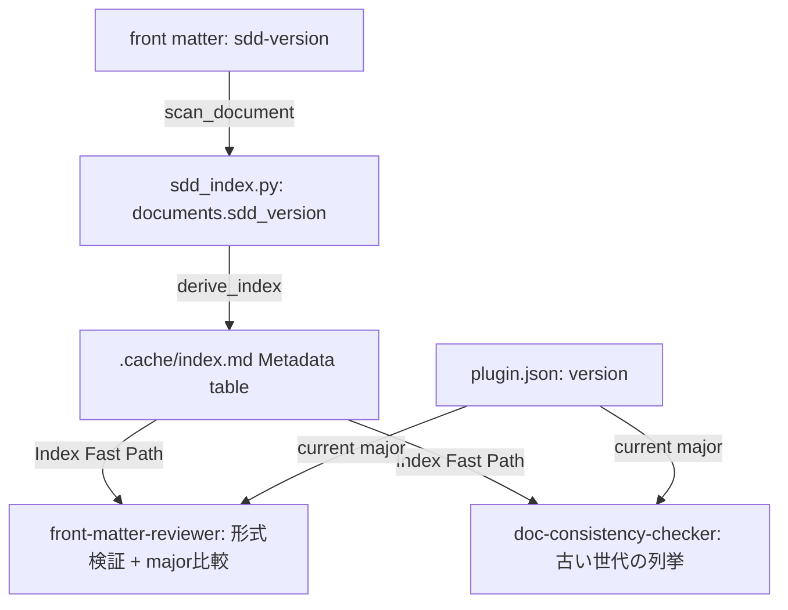

# sdd-version の読み取り側実装（世代判別・移行漏れ検知） `<MUST>`

**関連 Spec:** [documentation-index_spec.md](../../specification/workflow-foundation/documentation-index_spec.md),
[front-matter-validation_spec.md](../../specification/quality-guardrails/front-matter-validation_spec.md),
[doc-consistency-check_spec.md](../../specification/quality-guardrails/doc-consistency-check_spec.md),
[front-matter-recommend_spec.md](../../specification/workflow-foundation/front-matter-recommend_spec.md)
**関連 PRD:** GitHub Issue #95
**準拠する原則:** [CONSTITUTION.md](../../CONSTITUTION.md)（参照した版: v2.0.0）の A-002（フックとスクリプトの責務分離）, D-001（Specification-Driven）, D-003（ドキュメント永続性）

---

# 1. 実装ステータス `<MUST>`

**ステータス:** 🔴 未実装

## 1.1. 実装進捗

| モジュール/機能                                          | ステータス | 備考 |
|--------------------------------------------------------|-------|----|
| `sdd_index.py` への `sdd_version` 列追加                  | 🔴    | スキーマ・抽出・INSERT・Metadata 出力 |
| `front-matter-reviewer` の semver 検証・世代 warning         | 🔴    | 形式検証 + major 比較 |
| `doc-consistency-checker` の古い世代ドキュメント列挙             | 🔴    | index の `sdd_version` 列を利用 |
| `recommend-front-matter` の `sdd-version` 後付け方針の整理    | 🔴    | 本ドキュメント §9.1 の決定に従う |

---

# 2. 設計目標 `<MUST>`

`sdd-version`（front matter フィールド）は書き込みのみで読み取り実装が存在しないため、
世代判別・移行漏れ検知に活用できない。本設計は以下を達成する。

1. インデックス（`sdd_index.py`）が `sdd_version` を構造化データとして保持する
2. `front-matter-reviewer` が `sdd-version` の形式を検証し、古い世代を warning で報告する
3. `doc-consistency-checker` が古い世代のドキュメントを一覧化できる
4. `recommend-front-matter` が既存ドキュメントへの `sdd-version` 後付けで誤った世代情報を
   生成しないよう、方針を明確化する

---

# 3. 実装方式 `<MUST>`

| 領域                    | 採用方式                                                        | 選定理由                                                              |
|-------------------------|-----------------------------------------------------------------|------------------------------------------------------------------|
| `sdd_index.py`          | `documents` テーブルに `sdd_version TEXT` 列を追加し `SCHEMA_VERSION` を bump | 既存の `impl_status` 等と同じパターンを踏襲。列追加は破壊的スキーマ変更なので既存 DB を強制再構築する必要がある |
| `front-matter-reviewer` | Common Checks に semver 形式チェックを追加し、`${CLAUDE_PLUGIN_ROOT}/.claude-plugin/plugin.json` の `version` の major と比較 | 既存の「ルール基盤の軽量検証（haiku）」の設計原則に従う。複雑な推論を要しない |
| `doc-consistency-checker` | Index Fast Path のセクションに「古い世代の列挙」を追加し、`index.md` の Metadata テーブルの `sdd_version` 列を読むだけで足りるようにする | 追加の Glob/Grep なしで実現できるため、既存の「index があれば1回の Read で足りる」設計を維持できる |
| `recommend-front-matter` | 後付け（既存ドキュメントへの新規 front matter 生成）では `sdd-version` を推奨対象から除外する | §9.1 決定事項を参照 |

---

# 4. アーキテクチャ `<MUST>`

## 4.1. データフロー



## 4.2. モジュール分割

本 issue は既存 4 機能への追記のみで、新規モジュールは作らない。

| モジュール                | 責務                                    | 変更範囲                          |
|---------------------------|-----------------------------------------|-----------------------------------|
| `scripts/sdd_index.py`    | `sdd_version` の抽出・格納・Metadata 出力 | スキーマ・`scan_document`・`upsert_document`・`derive_index` |
| `agents/front-matter-reviewer.md` | `sdd-version` の形式検証・世代 warning | Common Checks セクション |
| `skills/doc-consistency-checker/SKILL.md` | 古い世代ドキュメントの列挙 | Check Items セクション |
| `skills/recommend-front-matter/SKILL.md` | `sdd-version` 後付けの除外 | Infer Common Fields / Phase 4 の適用テンプレート |

---

# 5. データ構造 `<OPTIONAL>`

`documents` テーブルへの追加列（既存列と同じ形式）:

```sql
ALTER TABLE documents ADD COLUMN sdd_version TEXT;  -- 実際は SCHEMA_VERSION bump による再作成
```

Metadata テーブル出力（`.cache/index.md`）:

```
| doc_id | type | path | status | impl-status | sdd-version | depends-on | category |
```

---

# 6. ファイル構成 `<OPTIONAL>`

```
plugins/sdd-workflow/
├── scripts/sdd_index.py                          # sdd_version 列追加（スキーマ/抽出/INSERT/Metadata出力）
├── agents/front-matter-reviewer.md                # semver検証 + major比較 warning
├── skills/doc-consistency-checker/SKILL.md        # 古い世代ドキュメント列挙
└── skills/recommend-front-matter/SKILL.md         # sdd-version 後付け除外

tests/test_sdd_index.py                            # sdd_version の抽出・比較テスト追加

.sdd/
├── requirement/workflow-foundation/documentation-index.md          # FR追加
├── requirement/quality-guardrails/front-matter-validation.md       # FR追加
├── requirement/quality-guardrails/doc-consistency-check.md         # FR追加
├── requirement/workflow-foundation/front-matter-recommend.md       # 制約追加（決定理由を明記）
└── specification/**/*_spec.md                                       # 対応するFR追加（4ファイル）
```

---

# 7. 非機能要件実現方針 `<OPTIONAL>`

| 要件                                        | 実現方針                                                                 |
|---------------------------------------------|--------------------------------------------------------------------------|
| 既存ドキュメントの後方互換（`sdd-version` 不在は info） | front-matter-reviewer の警告ポリシーで「不在 = info」「semver不正 = warning」「major古い = warning」を明確に分離する |
| 軽量検証（haiku で十分）                       | semver 文字列パターンマッチと major 整数比較のみで、複雑な推論を要しない            |

---

# 8. テスト戦略 `<OPTIONAL>`

| テストレベル | 対象                                              | カバレッジ目標                                       |
|--------------|---------------------------------------------------|------------------------------------------------------|
| ユニット     | `sdd_index.py` の `scan_document` / `upsert_document` / `derive_index` | `sdd_version` の抽出・格納・Metadata 出力を新規テストで検証 |
| ユニット     | スキーマ migration                                  | 既存の `test_migration_on_version_mismatch` で `sdd_version` 列が追加されることを検証 |

---

# 9. 設計判断 `<MUST>`

## 9.1. 決定事項

| 決定事項 | 選択肢 | 決定内容 | 理由 |
|------|-----|------|------|
| `recommend-front-matter` が既存ドキュメントに後付けする front matter に `sdd-version` を含めるか | (A) 現行バージョンを設定する<br>(B) `"unknown"` 等の明示的な不明値を設定する<br>(C) フィールド自体を推奨対象から除外する | **(C) を採用** | (A) は「このドキュメントは現行世代で生成された」という偽の信号を作り、本 issue が実現したい世代判別・移行漏れ検知を汚染する。(B) は既存スキーマ（semver 文字列）に "unknown" という非 semver 値を許容する例外を作り、front-matter-reviewer の形式検証が複雑化する。(C) は既存の設計（`.claude/rules/ai-sdd-instructions.md` の「`sdd-version` フィールドが無いドキュメントは導入前の世代」という規約）と整合し、既存コードの変更も最小になる |

## 9.2. 未解決の課題

なし。
