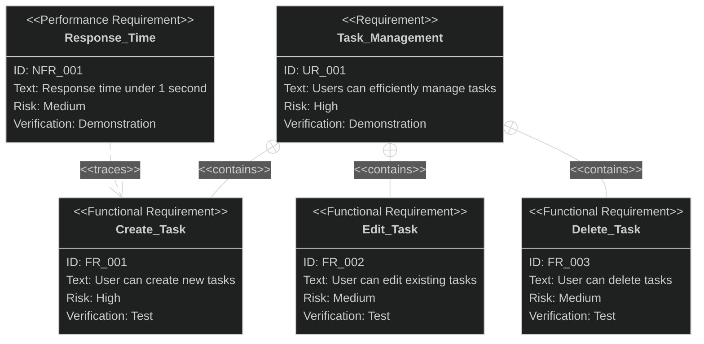

# Output Example

Example of the markdown structure returned by this skill:

````markdown
## Requirements Diagram (SysML)



## Diagram Structure

- **UR_001**: Task_Management (User Requirement)
  - **FR_001**: Create_Task (contains)
  - **FR_002**: Edit_Task (contains)
  - **FR_003**: Delete_Task (contains)
- **NFR_001**: Response_Time → traces → FR_001

## Relationship Summary

| From    | Relationship | To      | Rationale                                 |
|:--------|:-------------|:--------|:------------------------------------------|
| UR_001  | contains     | FR_001  | Task creation is part of task management  |
| UR_001  | contains     | FR_002  | Task editing is part of task management   |
| UR_001  | contains     | FR_003  | Task deletion is part of task management  |
| NFR_001 | traces       | FR_001  | Response time affects task creation UX    |
````
