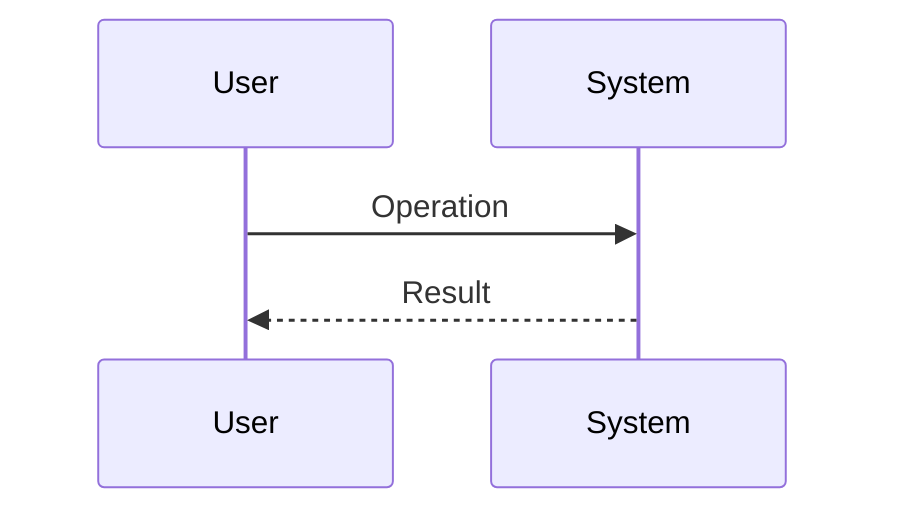

# Abstract Specification Template

This document is a template for creating abstract specifications under `${SDD_SPECIFICATION_PATH}/`.
The filename should be `{feature-name}_spec.md`.

> **Note**: This template is a fallback for the plugin.
> When using in a project, customize it according to your programming language and project structure,
> and save it as `${SDD_ROOT}/SPECIFICATION_TEMPLATE.md`.

## Difference from the Other Technical Documents

| Document                                | SDD Phase              | Role and Focus                                                                                          | Abstraction           | Persistence                                        |
|-----------------------------------------|------------------------|---------------------------------------------------------------------------------------------------------|-----------------------|----------------------------------------------------|
| `{feature-name}_spec.md` (this file)    | **Specify**            | **"What to build" "Why to build"** - Defines abstract structure and behavior. No technical details      | High (Abstract)       | **Persistent**                                     |
| `task/{ticket-number}/design-draft.md`  | **Plan (Design)**      | **"How to implement"** - Concrete technical plan for one ticket                                         | Medium-Low (Concrete) | **Temporary** - deleted after implementation       |
| `adr/{feature-name}.md`                 | **Implement & Review** | **"Why it was decided this way"** - Append-only log of decisions, rationale, and rejected alternatives  | Medium                | **Persistent** (append-only)                       |

---

# {Feature Name} `<MUST>`

**Related Design Draft:** [link to task/{ticket-number}/design-draft.md] (temporary — may already be deleted)
**Related Decision Log:** [link to adr/{feature-name}.md]
**Related PRD:** [link to requirement/{feature-name}.md]

---

# 1. Background `<MUST>`

Describe why this feature is needed.

# 2. Overview `<MUST>`

Describe the purpose and main design principles of the feature.
**Do not include technical implementation details; focus on "what to achieve".**

# 3. Requirements Definition `<RECOMMENDED>`

## 3.1. Functional Requirements

| ID     | Requirement   | Priority | Rationale |
|--------|---------------|----------|-----------|
| FR-001 | [Requirement] | Required | [Reason]  |

## 3.2. Non-Functional Requirements `<OPTIONAL>`

| ID      | Category    | Requirement   | Target   |
|---------|-------------|---------------|----------|
| NFR-001 | Performance | [Requirement] | [Target] |

# 4. API `<MUST>`

List of public APIs in table format.

| pkg (directory name) | class (filename) | member   | description   |
|----------------------|------------------|----------|---------------|
| [pkg]                | [class]          | [member] | [description] |

## 4.1. Type Definitions `<OPTIONAL>`

<!--
Modify the notation according to your project's programming language.
e.g., TypeScript, Go, Python, Kotlin, etc.
-->

```
// Describe type definitions according to your project's language
interface SomeType {
  property: string
}
```

# 5. Glossary `<OPTIONAL>`

| Term   | Description   |
|--------|---------------|
| [Term] | [Description] |

# 6. Usage Examples `<RECOMMENDED>`

<!--
Modify the notation according to your project's programming language.
-->

```
// Describe usage examples according to your project's language
```

# 7. Behavior Diagram `<OPTIONAL>`

Describe behavior in Mermaid format.



# 8. Constraints `<OPTIONAL>`

Describe business or technical constraints.

---

# Section Requirement Legend

> **Note:** These markers are author-facing guides that indicate section requirement levels. Remove them from the generated document — they must not appear in the final output.

| Marker          | Meaning     | Description                            |
|-----------------|-------------|----------------------------------------|
| `<MUST>`        | Required    | Must be included in all specifications |
| `<RECOMMENDED>` | Recommended | Include whenever possible              |
| `<OPTIONAL>`    | Optional    | Include as needed                      |

---

# Guidelines

## What to Include

- ✅ Feature purpose and background
- ✅ User stories and use cases
- ✅ Public API (interface) definitions
- ✅ Logical structure of data models
- ✅ Abstract description of behavior
- ✅ Functional and non-functional requirements
- ✅ Glossary

## What NOT to Include

Technical content goes to one of two other documents. Pick the destination by how long the content must live.

### → `task/{ticket-number}/design-draft.md` (temporary draft, deleted after implementation)

- ❌ Implementation status and progress
- ❌ Architecture and module structure
- ❌ Implementation patterns and design patterns
- ❌ Directory structure and file placement
- ❌ Test strategy and coverage goals
- ❌ Change history and migration guides

### → `adr/{feature-name}.md` (persistent, append-only decision log)

- ❌ Design decision records — the decision, its rationale, and the rejected alternatives
- ❌ Technology stack selection rationale

**A decision that must outlive the ticket does not survive in the design draft.** The draft is deleted once
implementation completes, so append its decisions, rationale, and rejected alternatives to
`adr/{feature-name}.md` before deletion (the `task-cleanup` skill does this). Recording a decision only in the
draft loses it.

---

# Customization Guidelines for Projects

When customizing this template for your project, update the following:

1. **Type definition notation**: Adjust to project's programming language
2. **Usage example notation**: Adjust to project's programming language
3. **API table columns**: Adjust to project's structure (package/module organization)
4. **Related document link format**: Adjust to project's document management method
