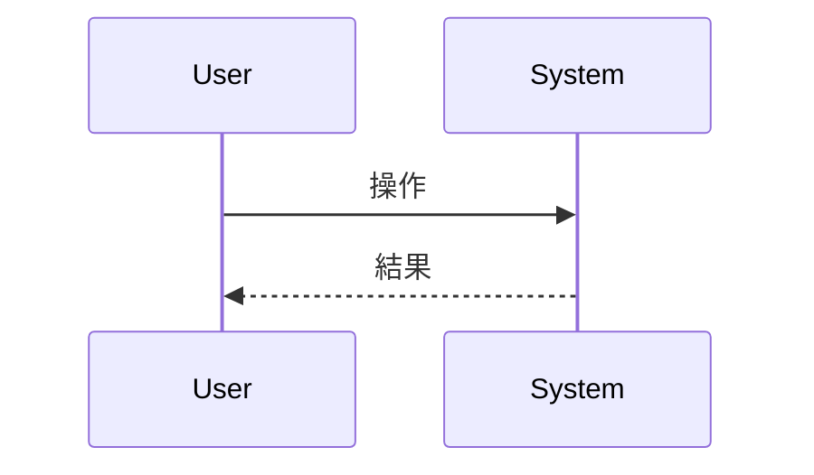

# 抽象仕様書テンプレート

このドキュメントは `${SDD_SPECIFICATION_PATH}/` 配下の抽象仕様書を作成する際のテンプレートです。
ファイル名は `{機能名}_spec.md` となります。

> **注意**: このテンプレートはプラグインのフォールバック用です。
> プロジェクトで使用する際は、プログラミング言語やプロジェクト構成に合わせてカスタマイズし、
> `${SDD_ROOT}/SPECIFICATION_TEMPLATE.md` として保存してください。

## 他の技術ドキュメントとの違い

| ドキュメント                                 | SDDフェーズ                    | 役割と焦点                                                  | 抽象度      | 永続性                    |
|----------------------------------------|----------------------------|--------------------------------------------------------|----------|------------------------|
| `{機能名}_spec.md`（このファイル）                | **Specify（仕様化）**           | **「何を作るか」「なぜ作るか」** - システムの抽象的な構造と振る舞いを定義。技術的詳細は含めない    | 高（抽象的）   | **永続**                 |
| `task/{ticket-number}/design-draft.md` | **Plan（計画/設計）**            | **「どのように実現するか」** - 1チケット分の具体的な技術計画                     | 中〜低（具体的） | **一時** — 実装完了後に削除する    |
| `adr/{機能名}.md`                         | **Implement & Review（実装）** | **「なぜそう決めたか」** - 決定・理由・却下した代替案の追記専用（append-only）ログ     | 中        | **永続**（append-only）    |

---

# {機能名} `<MUST>`

**関連 Design Draft:** [task/{ticket-number}/design-draft.md へのリンク]（一時ファイル。すでに削除済みの場合もある）
**関連 Decision Log:** [adr/{機能名}.md へのリンク]
**関連 PRD:** [requirement/{機能名}.md へのリンク]

---

# 1. 背景 `<MUST>`

なぜこの機能が必要なのかを説明します。

# 2. 概要 `<MUST>`

機能の目的と主要な設計原則を説明します。
**技術的な実装詳細は含めず、「何を実現するか」に焦点を当てます。**

# 3. 要求定義 `<RECOMMENDED>`

## 3.1. 機能要件 (Functional Requirements)

| ID     | 要件   | 優先度 | 根拠   |
|--------|------|-----|------|
| FR-001 | [要件] | 必須  | [理由] |

## 3.2. 非機能要件 (Non-Functional Requirements) `<OPTIONAL>`

| ID      | カテゴリ | 要件   | 目標値  |
|---------|------|------|------|
| NFR-001 | 性能   | [要件] | [目標] |

# 4. API `<MUST>`

公開APIの一覧を表形式で記載します。

| pkg (ディレクトリ名) | class(ファイル名) | member   | 概要   |
|---------------|--------------|----------|------|
| [pkg]         | [class]      | [member] | [概要] |

## 4.1. 型定義 `<OPTIONAL>`

<!--
プロジェクトのプログラミング言語に合わせて記法を変更してください。
例: TypeScript, Go, Python, Kotlin など
-->

```
// プロジェクトの言語に合わせた型定義を記載
interface SomeType {
  property: string
}
```

# 5. 用語集 `<OPTIONAL>`

| 用語   | 説明   |
|------|------|
| [用語] | [説明] |

# 6. 使用例 `<RECOMMENDED>`

<!--
プロジェクトのプログラミング言語に合わせて記法を変更してください。
-->

```
// プロジェクトの言語に合わせた使用例を記載
```

# 7. 振る舞い図 `<OPTIONAL>`

Mermaid形式で振る舞いを記述します。



# 8. 制約事項 `<OPTIONAL>`

ビジネス制約や技術的制約を記載します。

---

# セクション必須度の凡例

> **Note:** これらのマーカーはセクションの必須度を示す著者向けのガイド表記です。生成するドキュメントからは除去してください — 最終成果物に残してはいけません。

| マーク             | 意味 | 説明                 |
|-----------------|----|--------------------|
| `<MUST>`        | 必須 | すべての仕様書で必ず記載してください |
| `<RECOMMENDED>` | 推奨 | 可能な限り記載することを推奨します  |
| `<OPTIONAL>`    | 任意 | 必要に応じて記載してください     |

---

# ガイドライン

## 含めるべき内容

- ✅ 機能の目的と背景
- ✅ ユーザーストーリー・ユースケース
- ✅ 公開API（インターフェース）の定義
- ✅ データモデルの論理構造
- ✅ 振る舞いの抽象的な記述
- ✅ 機能要件・非機能要件
- ✅ 用語集

## 含めないべき内容

技術的な内容は他の2つのドキュメントに書きます。**その内容がどれだけ長く残る必要があるか**で行き先を選んでください。

### → `task/{ticket-number}/design-draft.md`（一時ドラフト。実装完了後に削除する）

- ❌ 実装ステータス・進捗
- ❌ アーキテクチャ・モジュール構成
- ❌ 実装パターン・デザインパターンの適用
- ❌ ディレクトリ構造・ファイル配置
- ❌ テスト戦略・カバレッジ目標
- ❌ 変更履歴・移行ガイド

### → `adr/{機能名}.md`（永続。append-only の決定ログ）

- ❌ 設計判断の記録 — 決定内容・その理由・却下した代替案
- ❌ 技術スタックの選定理由

**チケットより長く残すべき決定は、design draft には残りません。** ドラフトは実装完了後に削除されるため、
決定内容・理由・却下した代替案は削除前に `adr/{機能名}.md` へ追記してください（`task-cleanup` スキルがこれを行います）。
ドラフトだけに書いた決定は失われます。

---

# プロジェクトへのカスタマイズ指針

このテンプレートをプロジェクト用にカスタマイズする際は、以下の項目を更新してください：

1. **型定義の記法**: プロジェクトのプログラミング言語に合わせる
2. **使用例の記法**: プロジェクトのプログラミング言語に合わせる
3. **API表のカラム**: プロジェクトの構成（パッケージ/モジュール構造）に合わせる
4. **関連ドキュメントのリンク形式**: プロジェクトのドキュメント管理方法に合わせる
