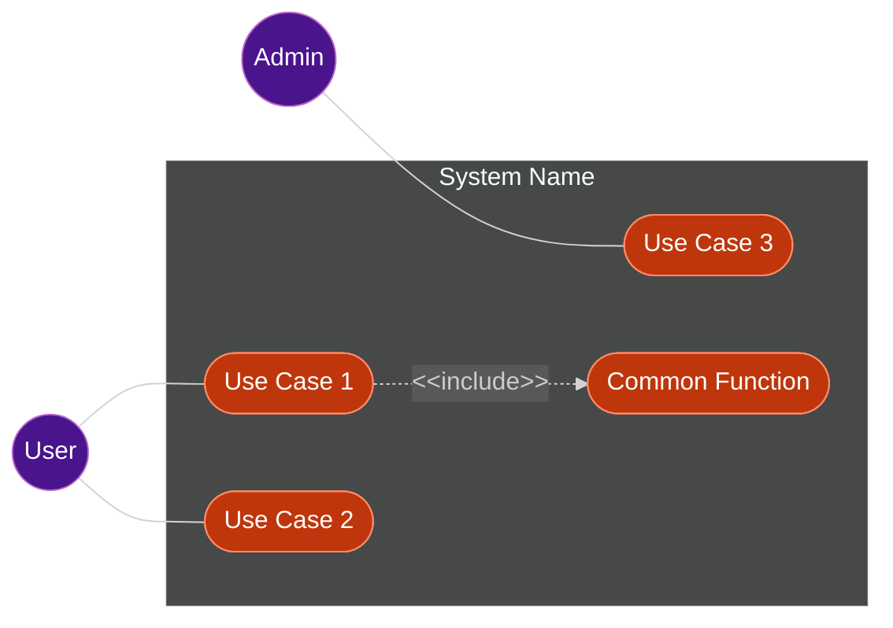

# Output Format Example

This shows the markdown structure to return when generating a use case diagram.

```markdown
## Use Case Diagram



## Actors

| Actor | Description |
|:------|:------------|
| User  | Logged-in user who performs main operations |
| Admin | Administrator with elevated privileges |

## Use Cases

| ID  | Use Case       | Description                        | Actor(s) |
|:----|:---------------|:-----------------------------------|:---------|
| UC1 | Use Case 1     | Brief description of use case 1    | User     |
| UC2 | Use Case 2     | Brief description of use case 2    | User     |
| UC3 | Use Case 3     | Brief description of use case 3    | Admin    |
| UC4 | Common Function| Shared function included by others | -        |
```
