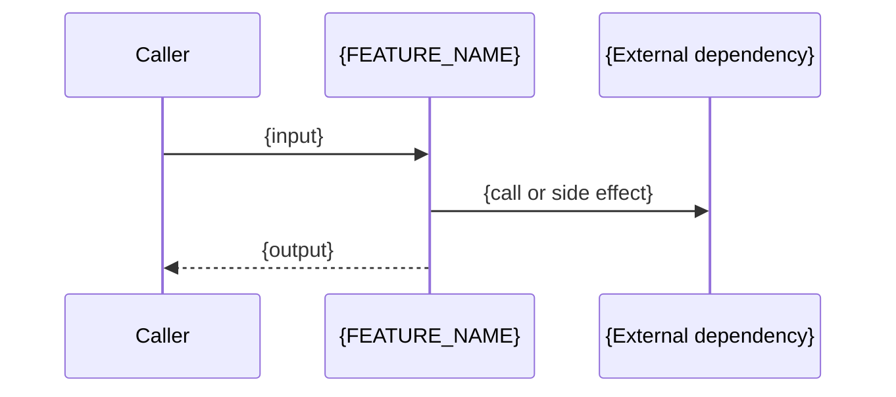

# {FEATURE_NAME} - Specification (Reverse Engineered)

> **⚠️ Note**: This specification was reverse-engineered from existing implementation on {DATE}.
> It may not reflect the original design intent. Please review and update as needed.

## Overview

**Current Implementation Summary:**

{BRIEF_DESCRIPTION_FROM_CODE}

**Original Purpose (Inferred):**

{INFERRED_PURPOSE}

## Functional Requirements

### Existing Implementation

The following requirements are extracted from the current codebase:

- **FR-001**: {Requirement extracted from implementation}
  - Implementation: `{file_path}:{line_number}`
  - Status: ✅ Implemented

- **FR-002**: {Another requirement}
  - Implementation: `{file_path}:{line_number}`
  - Status: ✅ Implemented

### Known Gaps or Inconsistencies

- **Gap-001**: {Describe any missing functionality or inconsistencies}
- **Gap-002**: ...

## Non-Functional Requirements

### Performance

{Current performance characteristics, if observable}

### Security

{Security measures currently in place}

### Reliability

{Error handling, fault tolerance observed in code}

## Interface Specifications

### Public API

{List public functions, classes, endpoints extracted from code}

### Internal Interfaces

{Internal module boundaries other code depends on — each boundary and the contract it offers, not the files
or components sitting behind it}

## Dependencies

{External libraries, services, databases used}

## Data Model

{Database schema, data structures if applicable}

## Behavior and Data Flow

**Externally observable flow only**: the entry points that accept input, the transformation the feature is
required to perform, the external calls and side effects it makes, and what it returns. The internal call
sequence between private components is not observable behavior — it stays in the ticket's design draft.

{Prose description of the flow, when a diagram adds nothing}

## Implementation Notes

**Key Files:**
- `{file_path}`: {Description}
- `{file_path}`: {Description}

**Architecture Pattern:**
{Observed pattern, e.g., MVC, layered architecture}

> The pattern name is the only structural fact this spec records. The component inventory, the directory
> layout and the per-component dependencies belong to the ticket's design draft and are discarded with it —
> see "Reverse-Engineered Analysis — What Persists and What Does Not" in the `plan-refactor` skill.

---

**Next Steps:**
1. Review this reverse-engineered specification for accuracy
2. Add missing requirements
3. Proceed to design draft creation or refactoring planning
