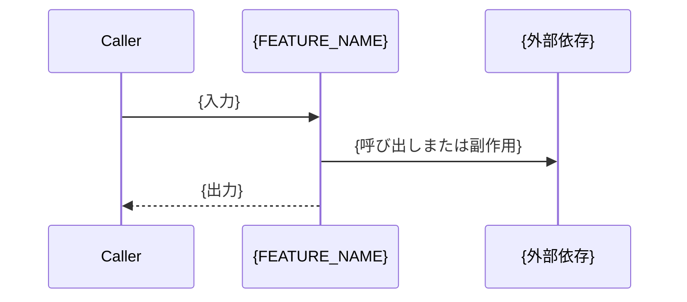

# {FEATURE_NAME} - 仕様書（既存実装からの逆生成）

> **⚠️ 注意**: この仕様書は{DATE}時点の既存実装から逆生成されたものです。
> 元々の設計意図を反映していない可能性があります。内容を確認の上、必要に応じて更新してください。

## 概要

**現在の実装の概要:**

{BRIEF_DESCRIPTION_FROM_CODE}

**推測される本来の目的:**

{INFERRED_PURPOSE}

## 機能要件

### 既存実装から抽出された要件

以下の要件は現在のコードベースから抽出されたものです:

- **FR-001**: {実装から抽出された要件}
  - 実装箇所: `{file_path}:{line_number}`
  - ステータス: ✅ 実装済み

- **FR-002**: {別の要件}
  - 実装箇所: `{file_path}:{line_number}`
  - ステータス: ✅ 実装済み

### 確認されたギャップや不整合

- **Gap-001**: {欠落している機能や不整合の説明}
- **Gap-002**: ...

## 非機能要件

### パフォーマンス

{観測可能な現在のパフォーマンス特性}

### セキュリティ

{現在実装されているセキュリティ対策}

### 信頼性

{コードで観測されるエラー処理、フォールトトレランス}

## インターフェース仕様

### パブリックAPI

{コードから抽出されたpublic関数、クラス、エンドポイントのリスト}

### 内部インターフェース

{他のコードが依存している内部モジュール境界 — 境界とそれが提供する契約のみを書く。境界の背後にある
ファイルやコンポーネントの内訳は書かない}

## 依存関係

{使用されている外部ライブラリ、サービス、データベース}

## データモデル

{該当する場合、データベーススキーマ、データ構造}

## 振る舞いとデータフロー

**外部から観測できるフローのみ**を書く: 入力を受け取るエントリポイント、この機能が行うべき変換、
外部への呼び出しと副作用、そして返す結果。内部の非公開コンポーネント間の呼び出し順序は観測可能な
振る舞いではないため、チケットの設計ドラフト側に残す。

{図にする意味がない場合は文章でフローを説明}

## 実装ノート

**主要ファイル:**
- `{file_path}`: {説明}
- `{file_path}`: {説明}

**アーキテクチャパターン:**
{観測されたパターン、例: MVC、レイヤードアーキテクチャ}

> この仕様書が記録する構造的な事実はパターン名だけである。コンポーネントの内訳・ディレクトリ構成・
> コンポーネント間の依存関係はチケットの設計ドラフトに属し、ドラフトとともに破棄される。
> `plan-refactor` スキルの "Reverse-Engineered Analysis — What Persists and What Does Not" を参照。

---

**次のステップ:**
1. この逆生成された仕様書の正確性を確認
2. 不足している要件を追加
3. 設計ドラフトの作成またはリファクタリング計画へ進む
