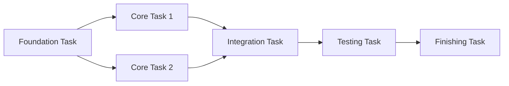

# Task Dependency Diagram Example

```mermaid
graph LR
    A[Foundation Task] --> B[Core Task 1]
    A --> C[Core Task 2]
    B --> D[Integration Task]
    C --> D
    D --> E[Testing Task]
    E --> F[Finishing Task]
```
